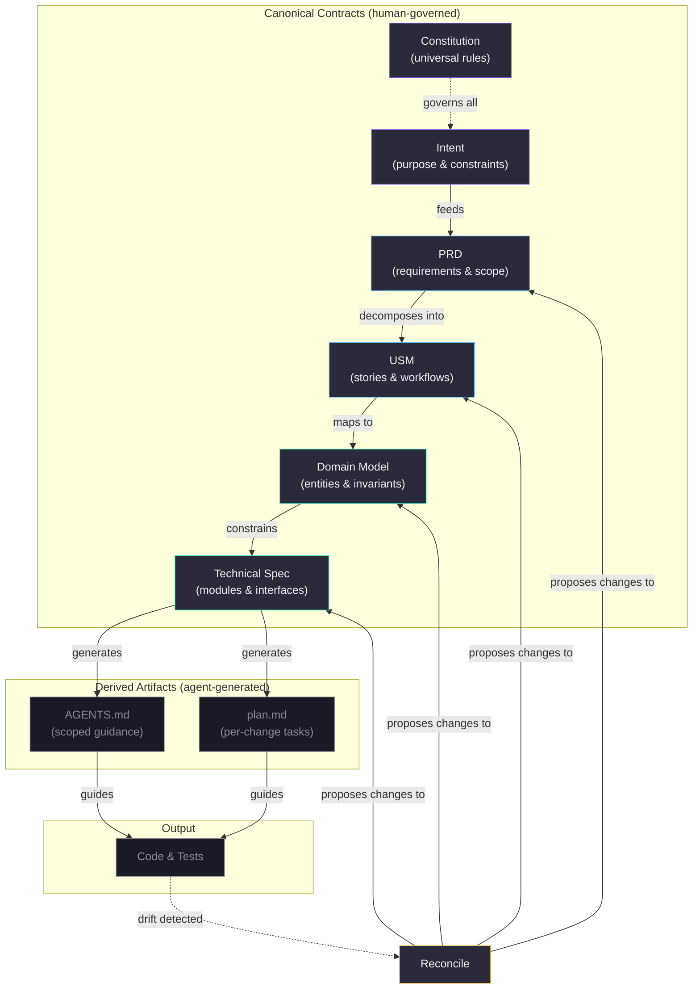
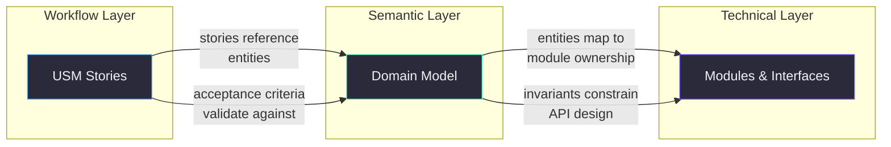
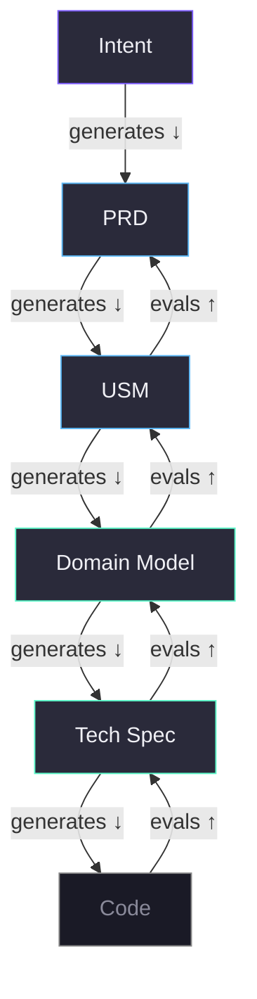
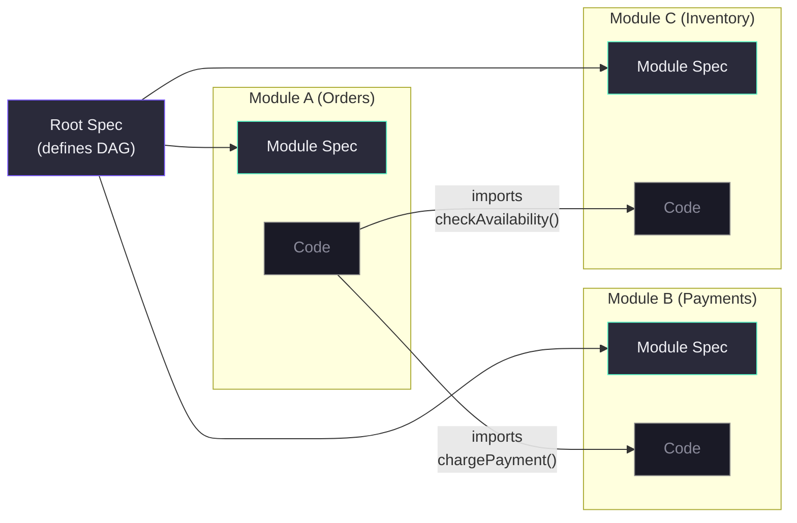

# VibeLoom Methodology

VibeLoom is a contract-driven methodology for long-lived vibe coding. It is designed for situations where a codebase must survive more than one generation step, more than one contributor, and more than one round of architectural change without losing semantic coherence.

---

## The Problem

AI code generation is powerful at producing working code from natural language prompts. But it has four systemic failure modes that emerge as projects grow:

1. **Semantic drift.** Without durable contracts, each generation step re-interprets the system's meaning from scratch. Concepts, naming, relationships, and invariants shift subtly with every prompt.

2. **Context fragmentation.** Large codebases exceed what any single agent can hold in context. Without explicit module boundaries and scoped guidance, agents guess at responsibilities and introduce duplication or contradiction.

3. **Invisible governance.** When the only record of product intent is a chat transcript, there is no reviewable surface for humans to audit. Changes accumulate without traceability, and the gap between what the system *should* do and what it *does* grows silently.

4. **Reconciliation failure.** Manual edits, bugfixes, and code drift have no principled path back to the specification layer. Specs and code diverge permanently.

VibeLoom addresses all four by treating structured specifications as the durable source of truth — not the code, not the prompt history, and not the agent's memory.

---

## Core Thesis

Five principles anchor the methodology:

1. **Specs are the source of truth.** Code is a downstream artifact. When specs and code disagree, the question is whether the spec should be updated — not whether the code should be silently accepted.

2. **AI economics favor structured contracts.** It is cheaper to review a 200-line domain model than to audit 10,000 lines of generated code. Structured specs are the highest-leverage review surface.

3. **Specs are eval surfaces.** The same contracts that govern generation also serve as the reference point for consistency checking. No separate test oracle is needed — the spec stack *is* the oracle.

4. **Modularization enables parallelism.** Bounded contexts from the domain model define natural module boundaries. Each module can be assigned to a separate agent with scoped guidance and explicit interface contracts.

5. **Humans govern, agents execute.** Agents generate, lint, reconcile, and propose. Humans review, approve, and resolve semantic ambiguity. This separation is non-negotiable.

---

## The Contract Stack

VibeLoom organizes project knowledge into a tiered stack of structured artifacts. Each tier has a distinct purpose and audience.

| Tier | Artifact | Purpose | Primary audience |
| --- | --- | --- | --- |
| 0 | Constitution | Universal rules and defaults | Methodology itself |
| 1 | Intent | What the system is for | Product owner |
| 2 | PRD | Goals, requirements, scope, NFRs | Product + engineering leads |
| 3 | USM | Epics, stories, acceptance criteria, workflows | Product owner + designers |
| 4 | Domain Model | Entities, relationships, invariants, bounded contexts | Domain experts + architects |
| 5 | Technical Spec | Modules, interfaces, data architecture, deployment | Engineers + agents |
| — | Derived (AGENTS, plan) | Scoped operational guidance | Agents only |



### Why each tier exists

**Constitution** — Universal defaults (TDD, error handling, naming conventions, lifecycle states) that would otherwise be repeated in every downstream artifact. Keeps the stack concise.

**Intent** — Anchors the system in *purpose*. Everything downstream must trace back to the intent. Without it, requirements drift toward whatever the last prompt asked for.

**PRD** — Makes product expectations explicit: who are the users, what must the system do, what is out of scope. This is the surface where product owners and engineers align before any design work.

**USM (User Story Map)** — Exposes the *workflow* dimension. Stories, acceptance criteria, and epic structure make it easy for non-technical stakeholders to validate that the system serves actual user needs. Going straight from PRD to domain model hides workflow mistakes.

**Domain Model** — Preserves the ubiquitous language: entities, relationships, invariants, bounded contexts. This is the most stable layer — domain concepts change less frequently than features, APIs, or UI. The domain model protects semantic coherence across changes.

**Technical Spec** — Turns domain semantics into safe implementation surfaces: modules, interfaces, data architecture, deployment. This is where engineering constraints (performance, security, scalability) get resolved.

**Derived artifacts** — AGENTS.md and plan.md are scoped execution guidance for agents. They are *regenerable* and *non-canonical*. They never carry semantic authority.

---

## The Domain Model as Semantic Anchor

The domain model plays a special role in the stack. It is the **semantic anchor** — the layer that all other layers reference for meaning.



Three properties make the domain model the natural anchor:

1. **Stability.** Domain concepts (User, Order, Payment, Workspace) change far less frequently than features, UI designs, or API endpoints.

2. **Vocabulary.** The domain model establishes the ubiquitous language. Every artifact — requirements, stories, specs, code — should use the same terms for the same concepts. This prevents the semantic drift that plagues prompt-driven development.

3. **Invariants.** Domain invariants (e.g., "an order cannot be shipped unless payment is confirmed") are the hardest constraints to recover when violated. The domain model makes them explicit and checkable.

---

## Bidirectional Consistency

The contract stack is not a one-way waterfall. VibeLoom maintains consistency in both directions:

### Top-down: Generation

Each tier generates the next tier down. Intent feeds the PRD, PRD feeds the USM, USM feeds the domain model, and so on. Every item in a downstream artifact traces back to an item in the upstream artifact.

### Bottom-up: Evaluation

Consistency checks run *upward* — from code back through specs. Every downstream artifact is evaluated against its upstream contracts. A technical spec that contradicts the domain model is flagged. Code that violates an invariant is caught.

### Change propagation

When an upstream contract changes, downstream artifacts are marked **stale**. The stale marker propagates through the dependency chain until every affected artifact is reviewed and reconciled.



---

## The Eval Framework

VibeLoom uses a three-tier evaluation framework. Evals are performed by agents, but results are presented to humans for judgment.

| Tier | Type | Nature | When run | Blocking? |
| --- | --- | --- | --- | --- |
| 1 | Structural | Mechanical verification | Before every approval | Yes — hard block |
| 2 | Semantic | Reasoning-based analysis | Before every approval | No — warnings for human review |
| 3 | Behavioral | Test generation from specs | On demand | No — separate workflow |

### Tier 1 — Structural checks

These verify the *form* of artifacts: ID format compliance, cross-reference integrity, frontmatter validity, required sections present, module structure matching spec. They are mechanically checkable. If any structural check fails, the artifact cannot be approved.

### Tier 2 — Semantic checks

These verify the *meaning* across artifacts: requirement coverage by stories, story coverage by entities, contradiction detection, boundary sanity, invariant preservation in API design. These require reasoning and produce warnings — not hard blocks. Humans decide whether to fix or proceed.

### Tier 3 — Behavioral checks

These generate test specifications and test code from the contract stack: scenario descriptions from stories, invariant tests from the domain model, interface contract tests from module specs. This is a separate step, not part of the approval flow.

---

## Rigid Traceability

Every normative item in the contract stack carries a stable ID with a standardized prefix. These IDs create an explicit trace chain:

```
Intent capability → PRD-FR-003 → STORY-E02-S01 → ENT-BC1-E07 → MOD-BILLING → IFACE-BILLING-API-05 → TEST-...
```

This chain enables:

- **Impact analysis.** When a requirement changes, follow the trace chain to find every affected story, entity, module, and interface.
- **Coverage verification.** Ensure every requirement has stories, every story has entities, every entity has a module owner.
- **Stale detection.** When an upstream artifact changes, mark all downstream artifacts that reference changed items as stale.

---

## Modularization and Multi-Agent Development

For projects with multiple bounded contexts, VibeLoom decomposes the codebase into modules. Each module:

- Owns a set of domain entities from a single bounded context
- Has its own technical spec (module spec)
- Has its own operational guidance (module AGENTS.md)
- Declares explicit interface contracts: what it exports, what it imports, shared types with ownership



This structure allows:

- **Parallel agent execution.** Each module can be assigned to a separate agent. The agent loads only its module spec, interface contracts, and the domain slice it owns — not the entire project.
- **Change isolation.** A change within one module's boundaries does not require loading or modifying other modules.
- **Interface discipline.** Cross-module dependencies are declared in an acyclic dependency graph. New cross-module imports require spec-level amendment and human approval.

---

## Asymmetric Reconciliation

Reconciliation is how VibeLoom handles drift — the inevitable divergence between specs and reality caused by manual edits, bugfixes, and incremental changes.

The key principle: **reconciliation is asymmetric.**

- Approved upstream contracts define the intended semantics of the system.
- Downstream artifacts and code can *reveal* drift, but they cannot *silently rewrite* approved contracts.
- When drift is detected, the agent proposes one of two paths:
  1. Amend the upstream spec (the real intent changed), then cascade stale markers downstream
  2. Preserve the upstream spec (the code is wrong), then fix downstream artifacts or code
- Humans choose the direction whenever the resolution is semantically meaningful.

This prevents the most dangerous failure mode in long-lived AI-assisted codebases: one incidental implementation change quietly mutating the meaning of the entire system.

### Bounded reconciliation

To prevent infinite loops, reconciliation is bounded: one upstream pass, one downstream pass, one final validation. If issues remain after the bounded protocol, they are documented and surfaced in every subsequent eval — not chased endlessly.

---

## Human Governance

VibeLoom enforces three governance rules:

1. **Only humans approve canonical contracts.** Agents may generate, lint, mark stale, and propose. But promoting an artifact from `draft` to `approved` requires human judgment.

2. **Humans have the right to edit.** Any canonical artifact can be manually edited at any time. Manual edits trigger reconciliation on the next eval pass.

3. **Escape hatches exist.** When issues are known but non-blocking, humans can approve with documented known issues. These issues are surfaced in every subsequent eval to prevent them from being forgotten.

---

## Change Classes

Every change is classified before execution:

| Class | Scope | Context needed |
| --- | --- | --- |
| `local` | Implementation detail only — no change to workflows, concepts, invariants, interfaces, or NFRs | Current module spec + constitution |
| `behavioral-in-module` | Behavior change inside one bounded context or module | Module spec + relevant stories + entities + invariants |
| `boundary-changing` | Change that affects actors, workflows, concepts, interfaces, or NFRs across boundaries | Full upstream chain + all affected modules |

If classification is uncertain, VibeLoom escalates upward to the broader class. This ensures agents never under-scope the context they need to make a safe change.

---

## Brownfield Import vs. Steady-State Bugfixes

VibeLoom treats these as fundamentally different concerns:

- **Import** is a bootstrap path for unmanaged or heavily drifted repos. It analyzes existing code bottom-up to infer specs, marking everything with confidence levels for human review.
- **Bugfixes** in governed repos start from repro, expected behavior, and the violated or missing contract. They resolve against the approved contract stack — not by reconstructing semantics from potentially wrong code.

The distinction matters because governed codebases have an authoritative contract stack to work from. Re-inferring semantics on every fix would undermine the entire purpose of maintaining specs.

---

## Context Loading

The methodology assumes agents have finite attention and finite context windows. VibeLoom therefore uses deterministic context scoping:

- **Always loaded:** Constitution, root spec, current module spec, derived AGENTS.md, trace entries for referenced IDs
- **Conditionally loaded:** PRD/USM/DM slices when the change touches workflows, domain concepts, or invariants; neighboring module specs when the change is cross-boundary
- **Never loaded:** Unrelated modules, unrelated epics or bounded contexts, historical superseded artifacts

This keeps contract discipline from turning into context-window bloat. When specs exceed the available budget, the furthest-upstream artifacts are summarized first (they change least frequently and carry the most stable information).

---

## Projection Restraint

To prevent the methodology itself from creating an artifact sprawl problem, VibeLoom allows only three durable machine-readable projections:

1. **Trace index** — maps IDs across tiers for impact analysis
2. **Dependency/stale graph** — tracks which artifacts depend on which and which are stale
3. **Interface/schema manifests** — declares module boundaries and contract shapes

All other analysis artifacts are generated on demand or held in agent memory during a session. Adding a new durable projection is a methodology-level change that requires amending the constitution and spec.

---

## What VibeLoom Is Not

- It is not a giant prose process manual. Specs are concise, structured, and tabular — not 200-page documents.
- It is not a replacement for engineering judgment. It provides the information needed to make good decisions, not the decisions themselves.
- It is not a promise that every task needs the full stack every time. Local changes load minimal context.
- It is not a permission slip for derived agent guidance to replace approved semantics. AGENTS.md and plan.md are execution aids, not truth.
- It is not a waterfall process. Specs are living documents that evolve with the codebase through bounded reconciliation.

---

## Design Principles

1. **Conciseness over completeness.** A 200-line domain model is better than a 2,000-line one. Capture what matters; omit what doesn't.
2. **Structure over prose.** Tables, ID references, and frontmatter are more checkable than paragraphs.
3. **Stability over flexibility.** Upstream artifacts should change infrequently. Frequent upstream changes indicate the wrong abstraction level.
4. **Asymmetry over democracy.** Upstream truth governs downstream work. Not the reverse.
5. **Scoping over loading.** Load the minimum safe slice. Never load everything.
6. **Explicit over implicit.** Every dependency, ownership, and invariant is declared. Nothing is "understood."
7. **Bounded over infinite.** Reconciliation, context loading, and projections all have hard limits.
8. **Separate concerns.** Workflow semantics (USM) and domain semantics (DM) are different things that change for different reasons. Keep them separate.
9. **Escape hatches over perfectionism.** Known issues can be documented and carried forward. The methodology should not block progress indefinitely.
10. **Human authority over agent autonomy.** Agents propose, humans approve. This is not a suggestion.
