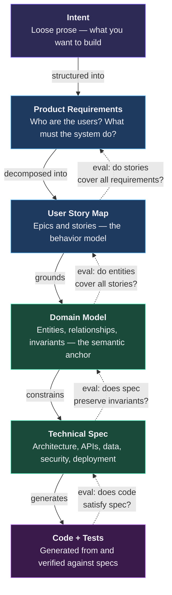
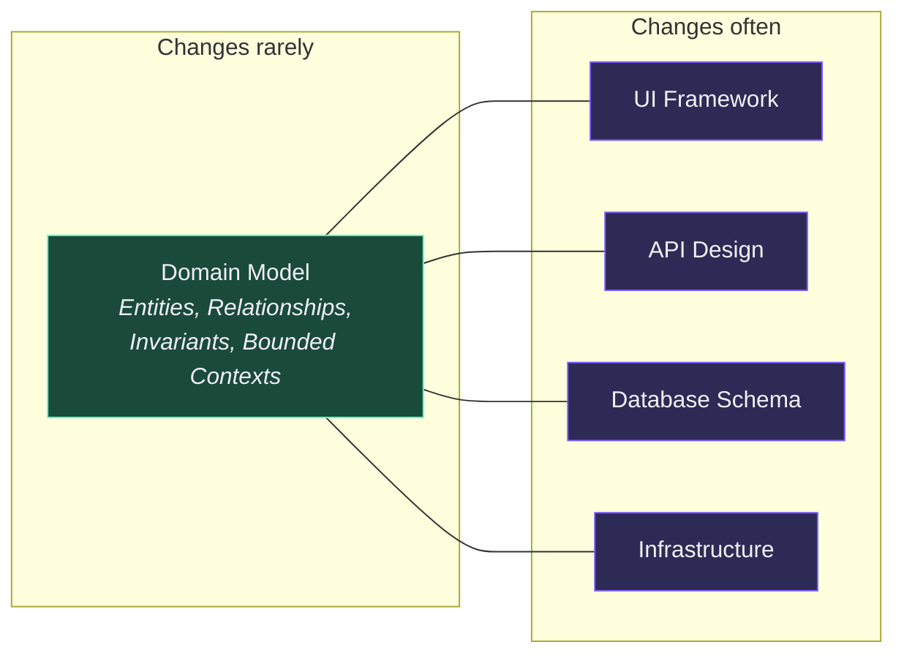
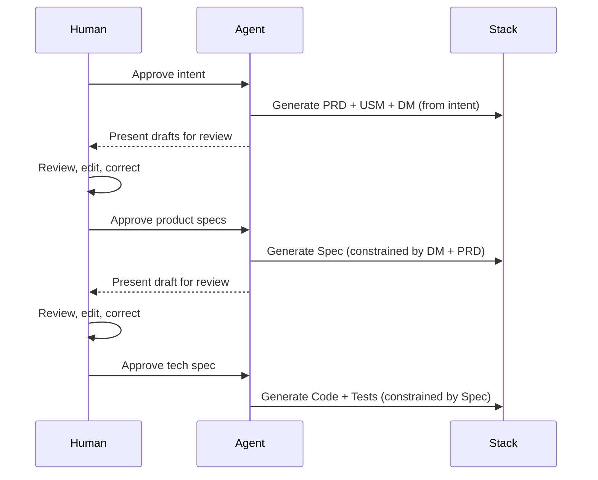
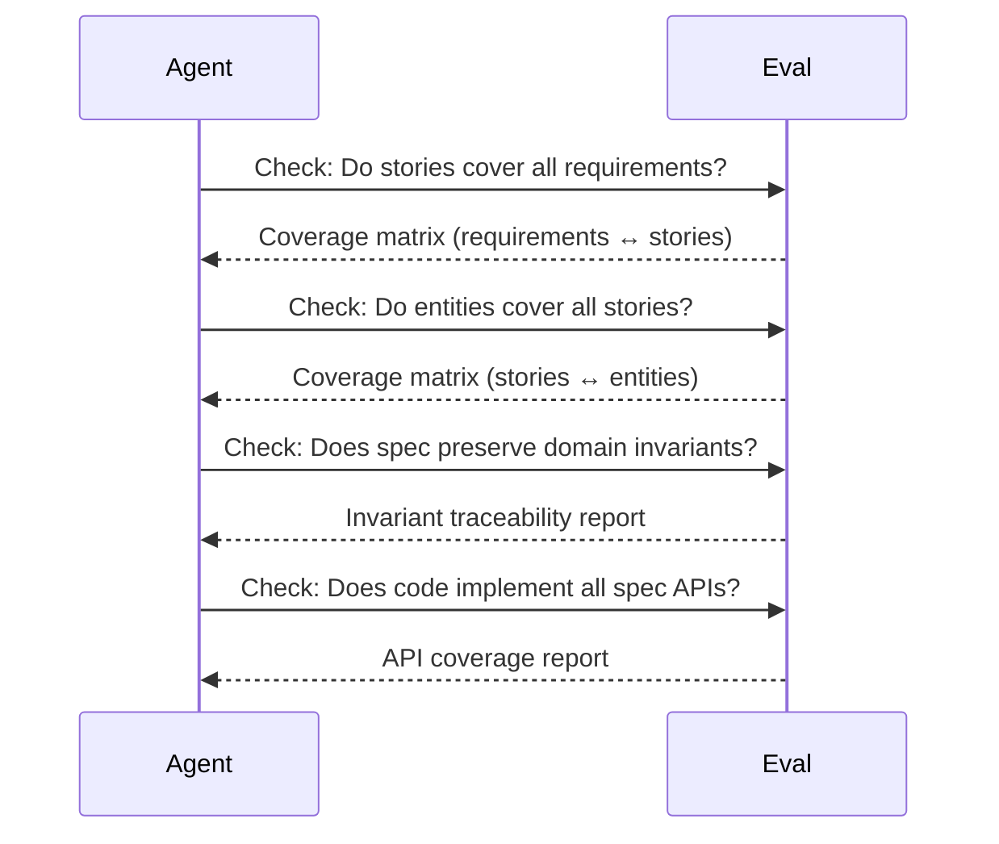
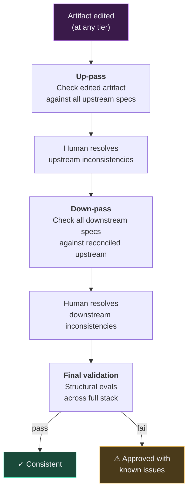
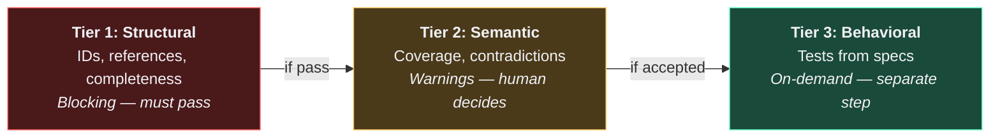
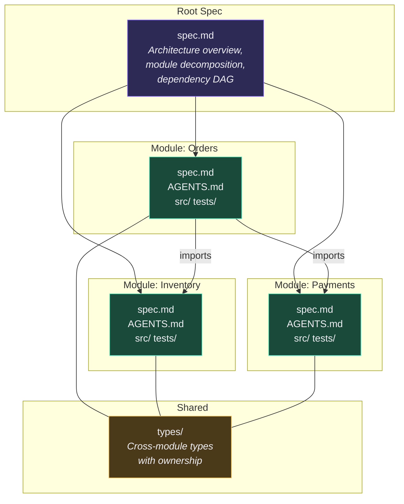
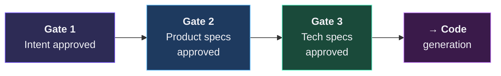
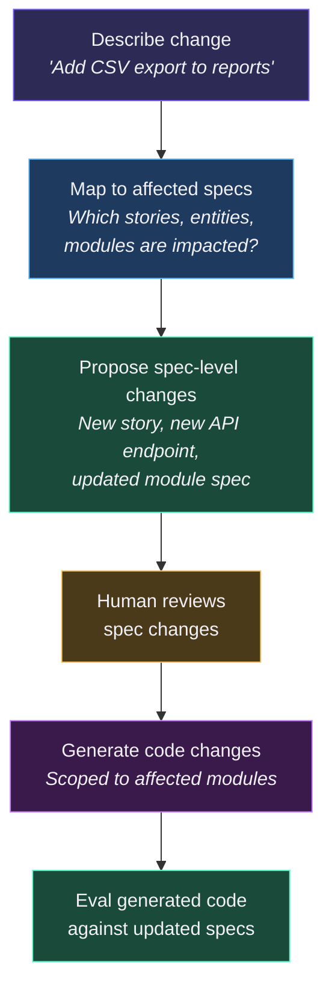

# The VibeLoom Methodology

## 1. The Problem

Prompt-driven code generation — "vibe coding" — works remarkably well for prototypes and small utilities. It breaks down when any of these are true:

- The system will be **maintained for months or years** and must stay architecturally coherent
- **Multiple agents or developers** need to work in parallel without corrupting each other
- A single change must propagate **consistently** through requirements, design, and code
- Stakeholders need to **verify** that what was built matches what was intended — not just "it runs"

The root cause is that a prompt is informal prose. It cannot serve as a contract. Between "build me an invoicing system" and working code, there are several layers of structured knowledge that never get written down: who the users are and what they need, how domain concepts relate to each other, what the architecture actually is. Without these layers, each code generation session reinvents the system from scratch, and each session's output is subtly inconsistent with the last.

---

## 2. The Core Thesis

VibeLoom rests on four principles:

1. **Specifications are the source of truth; code is a derivative.** Code is generated from specs and verified against them. If the spec and the code disagree, the spec wins and the code is regenerated.

2. **AI changes the economics of specification.** Historically, maintaining a full set of structured specs was too expensive — so teams cut corners. With AI agents, generating and maintaining concise, structured specs costs almost nothing. The question is no longer "can we afford to spec?" but "can we afford not to?"

3. **Upstream specs are evals for downstream work.** Every artifact is checked against the artifacts above it in the stack. This is not aspirational — it is a concrete enforcement mechanism with defined checks, pass/fail criteria, and blocking behavior.

4. **Modularization enables parallelism.** Breaking a system along domain boundaries creates independent units that fit in a single agent's context window, can be worked on simultaneously, and are connected by typed interface contracts.

---

## 3. The Contract Stack

VibeLoom organizes knowledge about a system into a **tiered stack of structured specifications** — each more concrete than the last, each verified against the tier above it.

**Every arrow is bidirectional.** Solid arrows represent the generation direction (top → down). Dashed arrows represent the eval direction (bottom → up). When you change something upstream, downstream artifacts are regenerated. When you change something downstream, upstream artifacts are checked for consistency.

### The Tiers

| Tier | Artifact | Role | Key contents |
|------|----------|------|-------------|
| 0 | **Intent** | Raw input | Loose prose describing what you want to build — the initial "vibe" |
| 1 | **PRD** | Requirements | Users & personas, functional requirements, non-functional requirements, scope boundaries |
| 2 | **User Story Map** | Behavior model | Epics, stories, acceptance criteria — what users actually do |
| 3 | **Domain Model** | Semantic anchor | Entities, relationships, aggregates, invariants, bounded contexts (DDD-style) |
| 4 | **Technical Spec** | Design authority | Architecture, APIs, data layer, security model, module decomposition, deployment |
| 5 | **Code + Tests** | Implementation | Source code and tests — generated from and verified against Tier 4 |

### Why This Particular Stack?

Each tier answers a question that the tier above leaves open:

- **Intent → PRD:** "Who are the users and what exactly must the system do?" (The intent says "build an invoicing system" — the PRD defines *which* invoicing capabilities, for *whom*, with *what* constraints.)
- **PRD → USM:** "What are the concrete user workflows?" (The PRD says "the system must support recurring invoices" — the USM defines the exact stories: create schedule, pause schedule, handle failed payment.)
- **USM → DM:** "What domain concepts underpin these workflows?" (The USM describes user actions — the DM reveals the entities, relationships, and business rules those actions operate on.)
- **DM → Spec:** "How do we implement this technically?" (The DM says "an Invoice belongs to a Customer and has line items" — the Spec defines the database schema, API endpoints, and module boundaries.)

---

## 4. The Domain Model as Semantic Anchor

The domain model (DDD-style) occupies a privileged position in the stack. It is the **semantic anchor** — the stable representation of what the system *means*, independent of how it is built.

Why this matters:

- **Stability.** You might swap your API framework, change your database, or restructure your deployment — but the core domain concepts (Customer, Order, Invoice) rarely change. The domain model provides continuity across rewrites and refactors.

- **Shared language.** The domain model defines the vocabulary that requirements, specs, and code all share. When a story says "customer places order" and the spec defines `POST /orders`, the domain model is what guarantees they mean the same thing.

- **Invariant enforcement.** Domain invariants (e.g., "an order cannot have a negative total", "a subscription must have at least one plan") are declared in the domain model and enforced at every downstream tier — in API validation, database constraints, and generated tests.

- **Module boundaries.** In complex systems, the domain model's bounded contexts define natural module boundaries. Each bounded context becomes a module with its own spec, its own code, and its own agent workspace.

---

## 5. Bidirectional Consistency

The defining feature of VibeLoom is that consistency is enforced in **both directions** across the stack.

### Top-Down: Generation

When a higher-tier artifact is approved, the next tier is generated from it. Each generation step is constrained by its upstream:

### Bottom-Up: Evaluation

Before any artifact is approved, it is **evaluated against its upstream contracts**. Each check answers: "does the downstream artifact faithfully represent its upstream?"

### Change Propagation

When something changes at any tier, consistency is restored through a bounded protocol:

**This protocol is bounded.** One up-pass, one down-pass, one validation — no infinite loops. If structural evals still fail after the final validation, the human can force-approve with documented issues (`approved-with-known-issues`), which are tracked and surfaced in every subsequent eval until resolved.

---

## 6. The Eval Framework

Specs are not just documentation — they are **evals**. VibeLoom defines three tiers of evaluation, each with different strictness and timing.

### Tier 1 — Structural Evals (Blocking)

Mechanical checks that can be verified by reading and cross-referencing artifacts:

| Check | What it verifies | Blocks on failure? |
|-------|-----------------|-------------------|
| **ID format compliance** | All items use rigid, defined ID formats (e.g., `PRD-001`, `DM-BC1-E05`) | Yes |
| **Cross-reference integrity** | Every ID referenced downstream exists upstream | Yes |
| **Artifact completeness** | All required sections are present with content | Yes |
| **Upstream-ref validity** | All referenced upstream artifacts exist and are approved | Yes |
| **Module structure** | Directories and files match the declared module decomposition | Yes |

Tier 1 failures are **hard blockers** — generation cannot proceed until they are resolved. These checks prevent the kind of drift where specs reference things that don't exist, or code implements APIs that aren't specified.

### Tier 2 — Semantic Evals (Warnings)

Reasoning checks that assess meaning, coverage, and consistency:

| Check | What it verifies |
|-------|-----------------|
| **Requirements → Stories** | Every requirement is covered by at least one story |
| **Stories → Entities** | Every story touches at least one domain entity |
| **Entity coverage** | No orphan entities (defined but never referenced in stories) |
| **Contradiction detection** | No logical contradictions between tiers |
| **NFR coverage** | Every non-functional requirement is addressed in the spec |
| **Invariant preservation** | Spec design cannot violate domain invariants |

Tier 2 results are **warnings**, not blockers. The human reviews them and decides whether to fix or proceed. Not every warning requires action — sometimes a warning reveals an intentional design decision.

### Tier 3 — Behavioral Evals (On-Demand)

Test-oriented checks that generate verification artifacts:

- **Scenario descriptions** — derived from user stories, describing expected system behavior in concrete terms
- **Domain invariant tests** — derived from domain model invariants, verifying business rules hold
- **Interface contract tests** — derived from module interface contracts, verifying modules honor their APIs

Tier 3 is a separate step, invoked explicitly. It produces test specifications and test code that verify the system behaves as its specs declare.

### How the Three Tiers Work Together

---

## 7. Rigid Traceability

Every item in every artifact has a **rigid ID** that follows a defined format. This enables mechanical cross-referencing — you can trace any piece of code back to the requirement that demanded it, through every intermediate layer.

This traceability chain serves multiple purposes:

- **Impact analysis.** When a requirement changes, you can trace exactly which stories, entities, APIs, and tests are affected.
- **Coverage verification.** Orphans — requirements with no stories, entities with no APIs — are automatically detected.
- **Audit trail.** For regulated environments, every line of code traces back to a business requirement.
- **Selective regeneration.** When something changes, only the affected downstream artifacts need updating — not the entire stack.

---

## 8. Modularization and Multi-Agent Work

For systems that exceed a single agent's effective context window, VibeLoom uses the domain model's **bounded contexts** as natural module boundaries.

### Interface Contracts

Modules communicate through **typed interface contracts** — explicit declarations of what each module exposes and what it consumes:

- **Exports** — APIs and events that other modules may depend on, with typed signatures
- **Imports** — Dependencies on other modules' exports
- **Shared types** — Cross-boundary types with a single owner module (only the owner can change the definition)
- **Dependency DAG** — The module dependency graph must be acyclic; adding a new cross-module dependency requires a spec amendment

### Why Bounded Contexts as Module Boundaries?

Bounded contexts from Domain-Driven Design are not arbitrary code organization boundaries. They represent natural seams in the domain — places where the business concepts change meaning or where different teams/processes operate independently. This makes them ideal module boundaries because:

- **Low coupling.** Entities within a bounded context are tightly related; entities across contexts interact through well-defined interfaces.
- **High cohesion.** Each module contains everything related to one business capability.
- **Independent deployment.** Bounded contexts can often be deployed independently (microservices, serverless functions, separate packages).
- **Agent-sized.** Each module's spec + code fits within a single agent's context window, enabling parallel work.

### Change Propagation Across Modules

When a module's interface changes:

1. The owning agent proposes the interface change in the module's spec
2. Structural eval identifies all downstream modules that import the changed interface
3. Those modules' specs are marked stale
4. Each downstream module's agent updates to the new interface
5. Contract tests are regenerated and run

This is the same top-down generation + bottom-up eval pattern that governs the entire contract stack, applied at the module level.

---

## 9. Human Governance

VibeLoom is designed for **human-in-the-loop** development. Agents generate; humans verify, edit, and approve.

### Approval Gates

The stack has defined gates where human review is required before proceeding:

No downstream artifact is generated until its upstream gate has been passed. This prevents the common failure mode of AI-generated systems: code that implements assumptions nobody verified.

### The Right to Edit

Humans can edit any artifact at any time. The methodology responds to manual edits with bounded reconciliation — checking consistency up and down the stack, reporting issues, and letting the human resolve them. The human's edits are always preserved; the agent adapts around them.

### The Escape Hatch

Sometimes perfect consistency isn't practical. The `approved-with-known-issues` status lets a human force-approve an artifact that has documented inconsistencies. These issues are tracked and surfaced in every subsequent eval — they don't disappear, but they don't block progress either.

---

## 10. Incremental Development

VibeLoom is not just for greenfield projects. The methodology supports incremental changes to existing systems:

The key insight: **changes flow through specs before reaching code.** Instead of editing code directly and hoping the architecture stays coherent, you describe the change, update the specs that govern it, and then generate the code from the updated specs. This keeps the contract stack consistent as the system evolves.

Existing codebases can also be brought under VibeLoom by generating specs bottom-up from existing code — the domain model is inferred from types and models, requirements are inferred from routes and UI, and the architecture spec captures the as-is design. These draft specs are then reviewed and corrected by a human, and the standard methodology applies from that point forward.

---

## 11. Design Principles

1. **Specs are concise.** Not 100-page enterprise documents — structured markdown that a human can scan in minutes. If a spec is too long, it's a signal that the module decomposition is too coarse.

2. **Humans verify, agents generate.** The agent produces artifacts; you review, edit, and approve. The methodology amplifies human judgment — it does not replace it.

3. **Upstream specs are evals.** Every generated artifact is mechanically checked against its contracts. This is the enforcement mechanism that makes the methodology more than aspiration.

4. **Modules are agent boundaries.** Each module fits in a context window and can be worked on independently. Module boundaries come from the domain, not from code organization convenience.

5. **Reconciliation is bounded.** One up-pass, one down-pass, one validation — no infinite loops. If consistency can't be achieved in one pass, the human resolves the remainder manually.

6. **Progressive formalization.** The stack moves from informal (intent) to formal (spec + code). You don't need to get everything right at the top — each tier adds precision, and evals catch gaps.

7. **The domain model is the anchor.** Technologies change; frameworks change; deployment targets change. The domain model — the entities, relationships, and invariants that define what the system *means* — changes least. Build around it.
