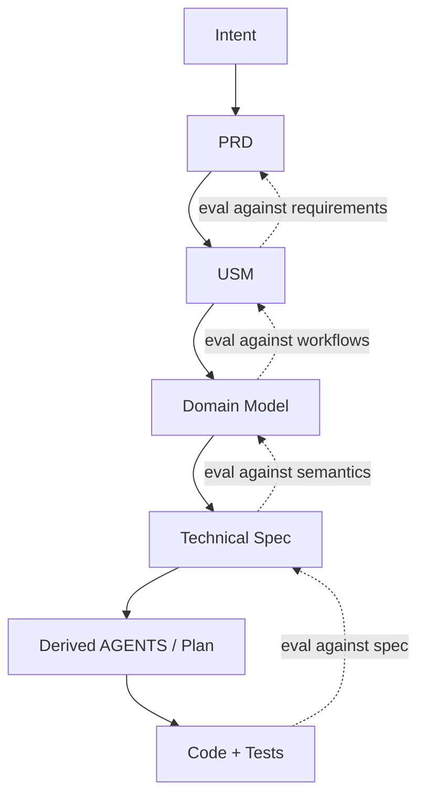
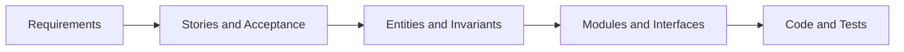
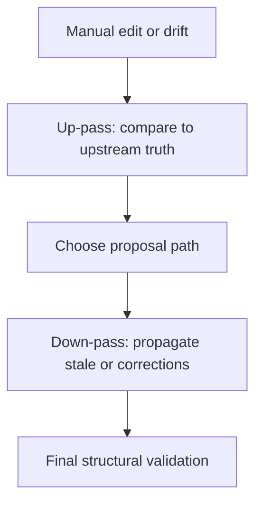

# VibeLoom Methodology

## 1. The Problem

Prompt-driven coding works well for local momentum and poorly for long-term coherence. The failure mode is not usually syntax or basic implementation. The failure mode is semantic drift:

- a workflow is implemented differently across sessions
- a domain concept changes meaning without anybody noticing
- one agent fixes code while another implicitly rewrites the contract
- parallel work collides because the system has no durable ownership boundaries

VibeLoom is designed for the opposite environment: a codebase that will live for a long time, accept incremental changes, and be touched by more than one agent or person.

## 2. Core Thesis

VibeLoom rests on five principles:

1. Intent should become contracts, not just prompts.
2. Contracts should be structured and concise enough for routine human review.
3. Upstream contracts should act as eval surfaces for downstream work.
4. Agents should execute from scoped, derived guidance rather than a giant context dump.
5. Workflow semantics and domain semantics must remain separate, which is why `USM` and `DM` are both mandatory.

## 3. The Contract Stack

| Layer | Purpose | Why it exists |
| --- | --- | --- |
| `constitution` | Universal defaults and quality rules | Keeps downstream artifacts concise |
| `intent` | Human goal, audience, constraints | Anchors the system in purpose |
| `prd` | Goals, requirements, NFRs, scope | Makes product expectations explicit |
| `usm` | Epics, stories, acceptance, flow | Surfaces user value and workflow semantics |
| `dm` | Concepts, relationships, invariants | Preserves ubiquitous language and semantic stability |
| `spec` | Architecture, modules, interfaces, policies | Turns semantics into safe implementation boundaries |
| Derived `AGENTS` / `plan` | Scoped execution guidance | Keeps implementation focused and regenerable |



Every downward step adds detail. Every upward check asks whether the lower layer still preserves the higher one.

## 4. Why `USM` And `DM` Stay Separate

`USM` and `DM` are not redundant.

- `USM` is the easiest place for humans to verify whether the system serves real user needs.
- `DM` is the best place to stabilize the concepts, relationships, and invariants that should survive implementation churn.

Going straight from PRD to DM tends to hide workflow problems. Going from PRD to USM to DM forces the methodology to surface actors, sequences, and acceptance before it settles on the semantic model.



## 5. Authority And Approval

Not every artifact carries the same authority.

- `constitution`, `intent`, `prd`, `usm`, `dm`, and `spec` are normative.
- `AGENTS.md` and `plan.md` are derived.
- derived artifacts may guide execution, but they never become semantic truth

That separation matters because a methodology stops being trustworthy when execution notes quietly become requirements.

Human approval is required whenever canonical semantics become authoritative. Agents may draft, lint, reconcile, and mark artifacts stale, but they do not self-approve canonical truth.

## 6. Profiles

VibeLoom has only two profiles:

| Profile | Meaning |
| --- | --- |
| `lite` | One cohesive semantic boundary or low coordination risk |
| `full` | Multiple bounded contexts or meaningful parallel execution risk |

Both profiles keep the full canonical stack. `lite` does not inline `usm.md` into `prd.md`, and it does not drop `dm.md`. The difference is decomposition depth, not whether semantics are recorded.

Read [profile-selection.md](profile-selection.md) for selection heuristics and upgrade/downgrade guidance.

## 7. Change Classes

Every change is classified before execution:

| Class | Meaning |
| --- | --- |
| `local` | No workflow, concept, invariant, interface, or NFR change |
| `behavioral-in-module` | Behavior changes inside one semantic or technical boundary |
| `boundary-changing` | Actors, workflows, concepts, interfaces, or NFRs change across boundaries |

If the classifier is uncertain, VibeLoom escalates upward.

## 8. Reconciliation

Reconciliation is asymmetric.

- upstream truth defines intent and semantics
- downstream artifacts and code can reveal drift
- drift triggers proposals; it does not silently rewrite approved contracts

Codex Plus keeps that asymmetry and adds a bounded procedure:

1. one up-pass against upstream truth
2. one down-pass across affected downstream artifacts
3. one final structural validation

That loop is intentionally bounded. The methodology should be deterministic, not self-recursive.



## 9. Traceability As Evals

The stack is useful only if traceability is real. VibeLoom requires a trace chain across the tiers:

```text
Intent capability -> PRD requirement -> USM story -> DM entity/invariant -> Spec module/interface -> Test
```

This is why the method is more than documentation. The contracts are eval surfaces.

Example:

| Tier | Example |
| --- | --- |
| `PRD` | `PRD-FR-004` workspace sharing must require explicit invite approval |
| `USM` | `STORY-018` owner approves a workspace invite |
| `DM` | `ENT-012` Invite, `INV-009` invite must be pending before approval |
| `spec` | `MOD-workspaces`, `IFACE-006` approve-invite API |
| `test` | `TEST-INVITE-003` approval flow regression |

## 10. Modules And Context Slices

Modules exist to make parallel work safe and to keep agent context bounded.

In `full` profile, module boundaries should come from domain seams, not arbitrary folders. Each module owns:

- a write surface
- a bounded context or coherent semantic slice
- explicit imports and exports
- interface contracts with single ownership

Context loading should mirror that structure. Always load the smallest safe slice:

- foundational rules
- the active technical boundary
- the relevant workflow and domain slice
- neighboring boundaries only when a dependency edge or change class requires them

The goal is not to load less at all costs. The goal is to load enough truth without drowning the task.

## 11. Import Vs. Bugfix

VibeLoom treats brownfield onboarding and routine defect handling as different paths.

- `import` is for unmanaged or heavily drifted repos
- `fix issue` is for governed repos and starts from repro, expected behavior, and regression coverage

Once a repo is governed, routine defects should be resolved against the approved contract stack rather than by reconstructing semantics from code every time.

## 12. What Codex Plus Adds

This package keeps the original Codex strengths:

- strict, validator-compatible skill packaging
- explicit invocation and deterministic command grammar
- mandatory `USM + DM`
- derived, non-canonical `AGENTS.md` and `plan.md`
- limited durable projections only

It also incorporates the best useful ideas from the Claude comparison:

- richer teaching docs and diagrams
- explicit profile-selection guidance
- stronger concrete spec and module-spec templates
- more procedural eval instructions
- clearer state and help affordances in the skill references

## 13. What VibeLoom Is Not

- It is not a giant prose process manual.
- It is not a replacement for engineering judgment.
- It is not a promise that every task needs the full stack every time.
- It is not permission for derived guidance to replace approved semantics.

## Summary

VibeLoom is strongest where the codebase is large enough, long-lived enough, or parallel enough that prompt-only generation stops being reliable. Its purpose is to let agents move fast without letting the system forget what it is supposed to mean.
