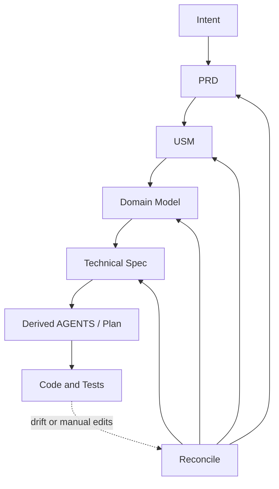
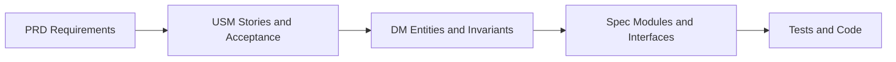

# VibeLoom Methodology

VibeLoom is a contract-driven methodology for long-lived vibe coding. It is designed for situations where a codebase must survive more than one generation step, more than one contributor, and more than one round of architectural change without losing semantic coherence.

The methodology is intentionally intent-first. It begins with what the system is for, not with a technical design or a prompt transcript. It also treats workflows and domain semantics as separate layers, which is why both `USM` and `DM` remain mandatory.

## Core Thesis

- Prompt-first generation is good at local momentum and weak at long-term governance.
- A durable codebase needs durable semantic contracts.
- Humans should review small, structured contracts instead of giant prose specs.
- Agents should execute from scoped, derived guidance instead of carrying the entire project in context.
- Upstream contracts should act as eval surfaces for downstream work.

## The Contract Stack

| Layer | Purpose | Why it exists |
| --- | --- | --- |
| `constitution` | Universal defaults and rules | Keeps downstream artifacts concise |
| `intent` | Human goal and constraints | Anchors the system in purpose |
| `prd` | Goals, requirements, scope, NFRs | Makes product expectations explicit |
| `usm` | Epics, stories, acceptance, flow | Exposes user value and workflow semantics |
| `dm` | Concepts, relationships, invariants | Preserves ubiquitous language and semantic stability |
| `spec` | Technical design and execution boundaries | Turns semantics into safe implementation surfaces |
| Derived `AGENTS` / `plan` | Scoped operational guidance | Keeps execution small, relevant, and regenerable |

## Why `USM` And `DM` Are Both Mandatory

`USM` and `DM` solve different problems.

- `USM` is the easiest layer for humans to validate against actual user needs.
- `DM` is the layer that protects ubiquitous language, invariants, and semantic consistency over time.

Going straight from PRD to DM often hides workflow mistakes. Going from PRD to USM to DM forces the methodology to surface value, sequence, and actors before it settles on the semantic model.

## Authority Model

Not every artifact has the same authority.

- `constitution`, `intent`, `prd`, `usm`, `dm`, and `spec` are normative.
- `AGENTS` and `plan` are derived.
- Derived artifacts may guide execution, but they do not become semantic truth.

That distinction matters because long-lived methodologies fail when execution notes quietly become requirements.

## Profiles

VibeLoom has only two profiles:

| Profile | When to use it |
| --- | --- |
| `lite` | Single bounded context or low coordination risk |
| `full` | Multiple bounded contexts or meaningful parallel execution risk |

Neither profile omits `USM` or `DM`. The difference is in decomposition depth and coordination overhead, not whether semantics matter.

## Change Classes

Every change is classified before execution.

| Class | Meaning |
| --- | --- |
| `local` | No change to workflows, concepts, invariants, interfaces, or NFRs |
| `behavioral-in-module` | A behavior change inside one semantic or technical boundary |
| `boundary-changing` | A change that affects actors, workflows, concepts, interfaces, or NFRs across boundaries |

If the classifier is uncertain, VibeLoom escalates upward.

## Reconciliation

Reconciliation is asymmetric.

- Upstream truth defines intent and semantics.
- Downstream artifacts and code can reveal drift.
- Drift triggers proposals; it does not silently rewrite approved contracts.

This prevents one incidental implementation change from mutating the meaning of the system.

## Brownfield Import And Steady-State Bugfixes

VibeLoom treats these as separate concerns.

- `import` is a bootstrap path for unmanaged or heavily drifted repos.
- routine bugfixes start from a repro, expected behavior, and regression coverage

The reason is simple: once a repo is already governed, defects should be resolved against the approved contract stack, not by reconstructing semantics from potentially wrong code on every fix.

## Context Loading

The methodology assumes agents have finite attention and finite context.

VibeLoom therefore loads:
- always-needed foundations
- the active technical boundary
- the relevant workflow and domain slice
- neighboring boundaries only when the change is cross-cutting

This keeps contract discipline from turning into context-window bloat.

## What VibeLoom Is Not

- It is not a giant prose process manual.
- It is not a replacement for engineering judgment.
- It is not a promise that every task needs the full stack every time.
- It is not a permission slip for derived agent guidance to replace approved semantics.

## Summary

VibeLoom is strongest where the project is large enough, long-lived enough, or parallel enough that prompt-only generation stops being reliable. Its purpose is to let agents move quickly without letting the codebase forget what it is supposed to mean.
