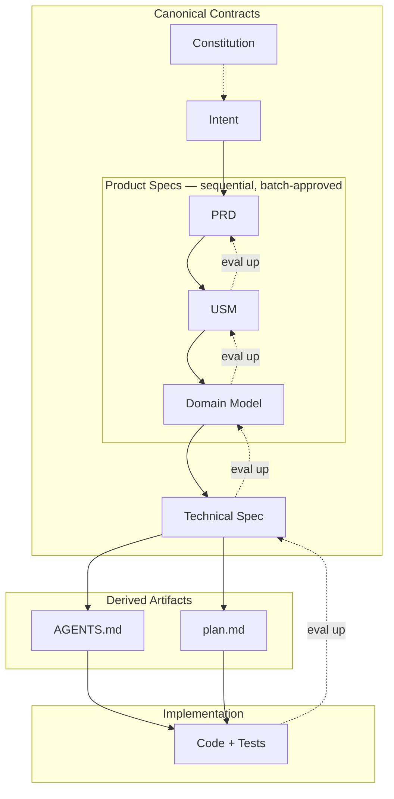
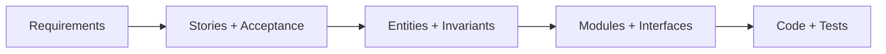
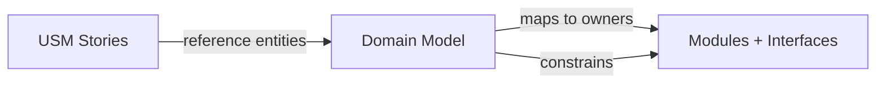
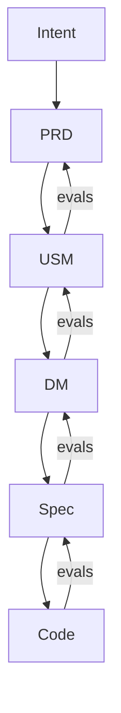
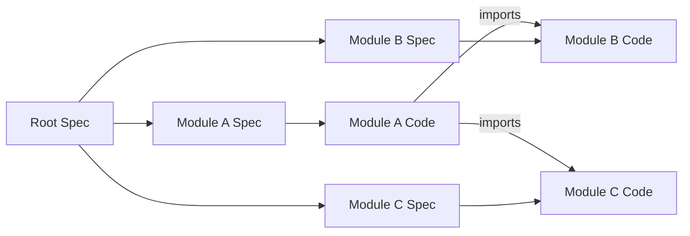
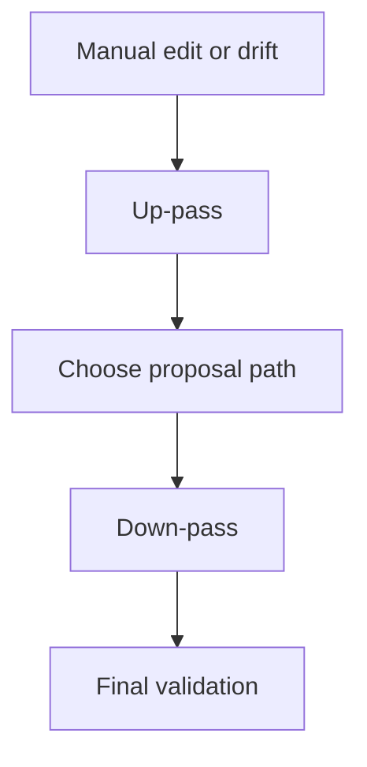

# VibeLoom Methodology

VibeLoom is a contract-driven methodology for long-lived vibe coding. It is built for codebases that must survive more than one generation step, more than one contributor, and more than one architectural revision without losing semantic coherence.

This file owns methodology truth and longer explanation. The runtime skill loads `references/` first during routine work and reaches into `docs/` mainly through `help` or explicit deeper-explanation flows.

## Canonical Layer Contract

This section is the canonical prose statement of repo layering and authority. Other docs should point here instead of restating the same boilerplate at length.

- `docs/` owns the canonical prose methodology truth.
- The root artifact stack is the structured package representation aligned to `docs/`.
- `references/` is the routine runtime operational layer and should stay narrow, structured, and low-context.
- `templates/` are generation inputs only and should provide shape rather than methodology prose.
- `site/` is derivative public documentation and marketing material.

---

## Dependency Contract

### Folder Roles

- `docs/` is the canonical prose methodology layer.
- `references/` is the distilled runtime execution layer.
- `templates/` is the artifact-generation input layer.
- `SKILL.md` is the runtime entrypoint and cross-layer orchestrator.

### Allowed Dependency Edges

Allowed:
- `docs/ -> docs/`
- `references/ -> references/`
- `references/ -> templates/`
- `templates/ -> templates/`
- `SKILL.md -> docs/`
- `SKILL.md -> references/`
- `SKILL.md -> templates/`

Disallowed:
- `docs/ -> references/`
- `docs/ -> templates/`
- `references/ -> docs/`
- `templates/ -> docs/`
- `templates/ -> references/`

### Layer Rules

- `docs/` may mention templates only by semantic name such as `intent template` or `technical spec template`.
- `references/` may duplicate methodology information from `docs/`, but only in a distilled and structured runtime form.
- `references/` may refer directly to `templates/` because template loading is part of runtime execution.
- `templates/` must not define independent methodology truth.
- `SKILL.md` owns bootstrap order, escalation, and exact cross-folder routing.

### Help Routing

`help` is the only command family allowed to load explanatory material outside `references/`.

Rules:
- `references/` may escalate only by topic name such as `help methodology` or `help evals`.
- `references/` must not contain direct `docs/*` paths.
- `SKILL.md` owns exact `help` topic routing.
- `commands` help may route to `references/`.
- `templates` help may route to `templates/`.

### Precedence

When layers overlap:
1. `docs/` owns methodology meaning
2. `references/` owns routine runtime behavior
3. `templates/` own generation shape
4. `SKILL.md` owns orchestration and topic routing

---

## The Problem

AI code generation is excellent at producing local momentum. It is weak at preserving long-term meaning.

Four systemic failure modes appear as projects grow:

1. **Semantic drift.** Concepts, workflows, and invariants shift subtly with every prompt.
2. **Context fragmentation.** Large codebases exceed what one agent can safely hold in context, so ownership and responsibilities become guesswork.
3. **Invisible governance.** If intent lives only in chat history, there is no durable review surface for humans.
4. **Reconciliation failure.** Manual edits, bugfixes, and drift have no principled path back to the specification layer.

VibeLoom addresses all four by treating structured specifications as the durable source of truth rather than relying on code, chat history, or agent memory.

---

## Core Thesis

Five principles anchor the methodology:

1. **Intent becomes contracts, not just prompts.**
2. **Structured contracts are cheaper to review than generated code.**
3. **The contract stack doubles as the eval stack.**
4. **Modularization is how agents scale safely.**
5. **Workflow semantics and domain semantics must remain separate, which is why `USM` and `DM` are both mandatory.**

---

## The Contract Stack

VibeLoom organizes project knowledge into a tiered stack of artifacts with distinct responsibilities and audiences.

| Tier | Artifact | Purpose | Primary audience |
| --- | --- | --- | --- |
| 0 | Constitution | Universal rules and defaults | Methodology itself |
| 1 | Intent | What the system is for, prose-first in draft | Product owner |
| 2 | PRD | Goals, requirements, scope, NFRs | Product + engineering leads |
| 3 | USM | Epics, stories, acceptance criteria, workflows | Product owner + designers |
| 4 | Domain Model | Entities, relationships, invariants, bounded contexts | Domain experts + architects |
| 5 | Technical Spec | Modules, interfaces, data architecture, deployment | Engineers + agents |
| - | Derived (`AGENTS`, `plan`) | Scoped execution guidance | Agents only |



### Why each tier exists

**Constitution** keeps universal defaults out of downstream artifacts.  
**Intent** anchors purpose and may stay prose-first until reconciliation needs explicit capability trace.
**PRD** defines product expectations.  
**USM** exposes workflows, value delivery, and acceptance.  
**DM** stabilizes the ubiquitous language and invariants.  
**Spec** turns semantics into safe implementation boundaries.  
**Derived artifacts** help execution but never become semantic truth.

---

## Why `USM` And `DM` Stay Separate

`USM` and `DM` are not redundant.

- `USM` is the easiest place for humans to verify whether the system serves real user needs.
- `DM` is the best place to stabilize concepts, relationships, and invariants that should survive implementation churn.

Going straight from PRD to DM hides workflow mistakes. Going from PRD to USM to DM forces the methodology to surface actors, sequence, acceptance, and value before the semantic model is finalized.



---

## The Domain Model As Semantic Anchor

The domain model is the semantic anchor of the methodology.

Three properties make it the natural center of gravity:

1. **Stability.** Domain concepts change less often than UI or API details.
2. **Vocabulary.** It establishes the ubiquitous language that every artifact should reuse.
3. **Invariants.** It makes the hardest-to-recover rules explicit and checkable.



If the domain model is weak, downstream technical structure becomes arbitrary. If it is strong, module boundaries and interface ownership become much easier to reason about.

---

## Bidirectional Consistency

The stack is not a one-way waterfall.

### Top-down generation

Each tier generates the next tier down:

`intent -> prd -> usm -> dm -> spec -> code`

Generation is sequential — each artifact uses all previously generated artifacts as input. Approval gates bracket logical groups rather than individual artifacts:

| Gate | Trigger | What it covers |
| --- | --- | --- |
| Intent approval | `approve intent` | `intent.md` alone |
| Product approval | `approve product` | `prd.md` + `usm.md` + `dm.md` as a batch |
| Spec approval | `approve spec` | root `spec.md` + module specs |

After intent approval, the agent generates `prd`, then `usm`, then `dm` sequentially without intermediate human approval. The full product batch is reviewed and approved together via `approve product`.

### Bottom-up evaluation

Consistency checks run upward. Every downstream artifact is evaluated against its upstream contracts.

### Change propagation

When an upstream contract changes, dependent downstream artifacts become stale through explicit dependency edges. The system does not rely on intuition or chat memory to decide what must be revisited.



---

## The Eval Framework

VibeLoom uses two runtime eval tiers plus one methodology-level tier that is not yet a dedicated runtime command. Evals are performed by agents, but results are presented to humans for judgment.

### Review vs eval

`review` and `eval` are related, but they are not the same operation.

- `review` is a target-scoped human-facing critique. It inspects one artifact or module in its proper layer and surfaces coherence gaps, unclear assumptions, contradictions, and judgment calls that a human should examine.
- `eval` is a check-driven validation pass. It runs the current formal checks against the selected scope and reports which checks fail, warn, or pass.

In short:
- `review` asks, "What should a human pay attention to here?"
- `eval` asks, "What does the current evaluation stack say about this scope?"

That distinction matters at larger scopes too. A command such as `eval repo` is a systematic repository-wide audit against the current eval stack, not an open-ended architecture critique.

| Tier | Type | Nature | When run | Blocking? | Runtime status |
| --- | --- | --- | --- | --- | --- |
| 1 | Structural | Mechanical verification | Before every approval | Yes | Shipped |
| 2 | Semantic | Reasoning-based analysis | Before every approval | No | Shipped |
| 3 | Behavioral | Test generation from specs | On demand | No | Methodology guidance |

### Tier 1 — Structural checks

These verify form: frontmatter validity, lifecycle correctness, ID grammar, cross-reference integrity, ownership declarations, and projection limits. A failing structural check blocks approval.

### Tier 2 — Semantic checks

These verify meaning: requirement coverage, workflow completeness, entity necessity, boundary sanity, and context-slice sufficiency. They produce warnings for human review rather than hard blocks.

### Tier 3 — Behavioral checks

These derive scenario tests, invariant tests, and contract tests from the approved stack. They validate runtime behavior, but they are not themselves a canonical source of truth.

Current package boundary: the shipped runtime references document structural and semantic eval flows directly. Behavioral checks remain methodology-level guidance and future-facing runtime direction rather than a dedicated current command in the skill surface.

---

## Authority And Human Governance

Not every artifact carries the same authority.

- `constitution`, `intent`, `prd`, `usm`, `dm`, and `spec` are normative.
- `AGENTS.md` and `plan.md` are derived, regenerable, and non-canonical.

Three governance rules follow:

1. **Only humans approve canonical contracts.**
2. **Humans may edit any canonical artifact at any time.**
3. **Lifecycle states stay limited to `draft`, `approved`, `stale`, and `superseded`. Known issues are surfaced in evals, not encoded as a fifth approval state.**

That last point matters. VibeLoom does not permit a fifth approval state for "known issues" because that would dilute approval semantics and create ambiguity about what is truly authoritative.

---

## Profiles

VibeLoom has only two profiles:

| Profile | Meaning |
| --- | --- |
| `lite` | One cohesive semantic boundary or low coordination risk |
| `full` | Multiple bounded contexts or meaningful parallel execution risk |

Both profiles keep the full canonical stack. `lite` does not inline `usm.md` into `prd.md`, and it does not drop `dm.md`. The difference is decomposition depth, not whether semantics are recorded.

Read [profile-selection.md](profile-selection.md) for selection heuristics and upgrade or downgrade guidance.

---

## Surface Modes

Profiles decide coordination depth. Surfaces decide what a user sees first.

| Surface | Meaning |
| --- | --- |
| `product-first` | Lead with intent, requirements, workflows, and domain semantics |
| `code-first` | Lead with `spec.md`, modules, interfaces, ownership, and implementation-safe technical scope |

Surface modes do **not** change:

- the canonical stack
- approval gates
- lifecycle states
- traceability rules
- reconcile asymmetry

`product-first` is the default surface. `code-first` is an advanced engineering surface for users who want to stay in architecture and module space during safe technical work.

### Shared Semantics, Personalized Surface

VibeLoom does not fork truth for different users. A PM and an engineer may look at different layers first, but they still share the same stored canonical contracts.

That means:

- surfaces are session-scoped, not repo-scoped
- product/domain artifacts remain real and reviewable in `code-first`
- explicit review and approval of product artifacts remain available in both surfaces

### Forced Escalation In `code-first`

`code-first` collapses upstream product/domain layers only while the task is safely technical. It must reveal the relevant `prd/usm/dm` slices when:

- the change is `boundary-changing`
- workflows or actors are touched or ambiguous
- concepts, entities, invariants, interfaces, or NFR boundaries are touched or ambiguous
- semantic drift appears during review, eval, or reconcile

Read [surface-modes.md](surface-modes.md) for the operational rules.

---

## Change Classes

Every change is classified before execution:

| Class | Scope | Context needed |
| --- | --- | --- |
| `local` | Implementation detail only; no workflow, concept, invariant, interface, or NFR change | current module spec + constitution |
| `behavioral-in-module` | Behavior change inside one bounded context or one technical boundary | module spec + relevant stories + touched entities and invariants |
| `boundary-changing` | Change affecting actors, workflows, concepts, interfaces, or NFRs across boundaries | full affected upstream chain + all affected modules |

If classification is uncertain, VibeLoom escalates upward. Agents should never under-scope the context they need to make a safe change.

---

## Modularization And Multi-Agent Development

In `full` profile, modules exist to make parallel work safe and to keep agent context bounded.

Each module should own:

- a write surface
- a bounded context or coherent semantic slice
- explicit exports and imports
- interface contracts with single ownership



This structure enables:

- **Parallel agent execution** with smaller context slices
- **Change isolation** inside one boundary
- **Interface discipline** through owned APIs, events, and schemas

---

## Asymmetric Reconciliation

Reconciliation is how VibeLoom handles drift.

The key rule is asymmetry:

- approved upstream contracts define intended semantics
- downstream artifacts and code may reveal drift
- drift triggers proposals; it does not silently rewrite approved upstream truth

When drift is detected, the agent proposes one of two directions:

1. amend upstream truth, then stale and reconcile downstream artifacts
2. preserve upstream truth, then correct downstream artifacts or code

Humans choose the direction whenever the resolution is semantically meaningful.

### Bounded reconciliation

To prevent infinite loops, reconciliation is bounded:

1. one up-pass against upstream truth
2. one down-pass across affected downstream artifacts
3. one final structural validation



---

## Rigid Traceability

Every traced normative item below draft intent carries a stable ID. Draft intent may remain prose-first until reconciliation introduces optional `CAP-*` capability IDs. Those IDs create an explicit chain:

```text
Reconciled CAP capability -> PRD requirement -> USM story -> DM entity/invariant -> Spec module/interface -> Test
```

This chain enables:

- **impact analysis** when an upstream item changes
- **coverage verification** across every tier
- **stale detection** through explicit dependency edges
- **eval grounding** so findings point to stable IDs, not loose prose

This is why the stack is more than documentation. The contracts are the eval surfaces.

Example:

| Tier | Example |
| --- | --- |
| `intent` | `CAP-004` upstream contracts act as evals |
| `PRD` | `PRD-FR-004` workspace sharing must require explicit invite approval |
| `USM` | `STORY-018` owner approves a workspace invite |
| `DM` | `ENT-012` Invite, `INV-009` invite must be pending before approval |
| `spec` | `MOD-workspaces`, `API-006` approve-invite API |
| `test` | `TEST-INVITE-003` approval flow regression |

---

## Context Loading

The exact routine loading behavior belongs in the runtime references. At the methodology level, the rule is simpler: agents have finite attention, so VibeLoom uses deterministic context scoping.

- **Start from the governing boundary:** the target artifact for artifact review, or the nearest owning technical boundary for technical change work
- **Bring trace and scoped execution guidance when they help:** trace entries when referenced IDs or stale impact matter, and derived `AGENTS.md` only when it exists and reduces ambiguity
- **Escalate product and domain slices when needed:** PRD, USM, or DM slices when workflows, concepts, invariants, interfaces, or NFR boundaries are implicated
- **Keep unrelated material out by default:** unrelated modules, unrelated epics or bounded contexts, historical superseded artifacts

The goal is not to load less at all costs. The goal is to load enough truth without drowning the task.

---

## Brownfield Import Vs. Steady-State Bugfix

VibeLoom treats these as different paths:

- **Import** is a bootstrap path for unmanaged or heavily drifted repos. It reconstructs candidate contracts from code and marks uncertainty explicitly for human review.
- **Bugfix** is the steady-state path for governed repos. It starts from repro, expected behavior, the violated or missing contract, and regression coverage.

Once a repo is governed, routine defects should be resolved against the approved stack rather than by re-inferring semantics from code on every fix.

---

## Projection Restraint

To avoid methodology-induced artifact sprawl, VibeLoom allows only three durable machine-readable projections:

1. trace index
2. dependency or stale graph
3. interface or schema manifests

All other analysis outputs should be generated on demand or held in memory during a session.

---

## What VibeLoom Is Not

- It is not a giant prose process manual.
- It is not a replacement for engineering judgment.
- It is not a promise that every task needs the full stack every time.
- It is not permission for derived guidance to replace approved semantics.
- It is not a waterfall process. The stack evolves through bounded reconciliation.

---

## Design Principles

1. **Conciseness over completeness**
2. **Structure over prose**
3. **Stability over flexibility**
4. **Asymmetry over democracy**
5. **Scoping over loading**
6. **Explicit over implicit**
7. **Bounded over infinite**
8. **Separate workflow semantics from domain semantics**
9. **Human authority over agent autonomy**

## Summary

VibeLoom is strongest where the codebase is large enough, long-lived enough, or parallel enough that prompt-only generation stops being reliable. Its purpose is to let agents move fast without letting the system forget what it is supposed to mean.
