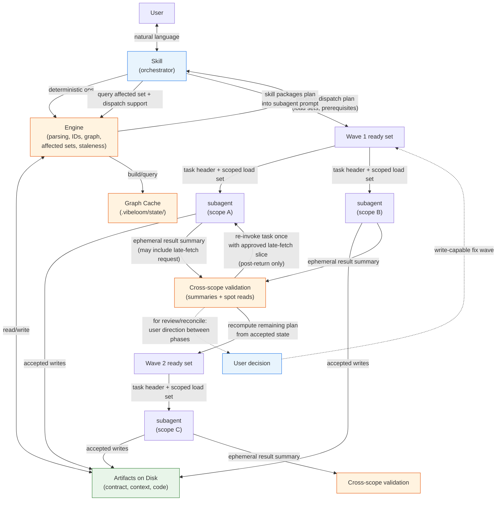

# VibeLoom Implementation

This document is the concrete implementation companion to `vibeloom-methodology.md`. The methodology defines WHAT and WHY. This document defines HOW — concretely enough that a skill builder can generate the skill without inventing rules. It specifies: artifact layout, metadata shape, ID schema, template inventory, runtime behavior, and engine boundary.

Every rule here either implements a methodology rule (with cross-reference) or adds an implementation-specific rule (clearly marked). When this document conflicts with the methodology, the methodology wins.

---

## How To Use This Document

A skill builder reading this as execution guidance does not need to load the full document at once. The sections below are grouped by when they matter:

**Essential (must-read for a minimal working skill):**

- `Authority, Package Shape, And Engine Boundary` — the architectural model: skill, engine, subagents, runtime loop
- `Governed Repo Layout` + `Artifact Mapping` — where artifacts live and which templates produce them
- `Metadata Format` — frontmatter shapes for contract and context artifacts
- `Stable ID Schema` — short typed `PREFIX-####` ID families and artifact IDs
- `Subagent Load Sets` + `Context Loading Protocol` — how to load the minimum sufficient slice per subagent
- `Generation And Runtime Behavior` — operation commands, smart orchestration, approval behavior, parallel dispatch
- `Template System` + `Validation Checklist` — the `assets/` tree and acceptance criteria

**Optional depth (read when implementing that piece):**

- `Context Graph Realization` internals — storage layout, dispatch-support indexes, inferred views
- `Upgrade Mechanics` — only when implementing vibe → full upgrade
- `Item Carriers And Template Rules` — only when authoring templates

**Skim-only reference:**

- `Mode × Command Matrix (Normal Flow)` — cross-reference when wiring mode-specific behavior
- `Next-Command Suggestions` — user-experience table, consulted at implementation time

This document does not replace the methodology. Cross-references like "methodology ## Generation ### Forward-Back Pass" point at conceptual truth. Always load the methodology first when a question is about *what* or *why*; load this document when the question is about *how*.

---

## Authority, Package Shape, And Engine Boundary

Authority flows downward: methodology → implementation → `assets/` templates → `SKILL.md`. This phase fully specifies contract and context artifacts plus code-generation orchestration, but it does not yet define concrete code templates or code-item carriers.

VibeLoom has two runtime layers:

- the **skill**, which is the natural-language and orchestration layer
- the **engine**, which is the deterministic substrate invoked by the skill



In v2, the skill runs as a single agent session. Subagents are spawned per task, each with its own context window. The engine shapes each scoped load set and the orchestrator packages it into the subagent prompt together with a task header. Subagents share the filesystem, but they do not communicate with each other directly. They communicate only through accepted artifact writes on disk plus orchestrator-mediated ephemeral result summaries. Late-fetch is task-local: when a subagent discovers one narrow missing dependency, it may request one approved additional slice and be re-invoked once for that same task.

### Runtime Loop

Each operation follows the same high-level loop:

1. load only the minimal planning state needed for the current operation
2. compute the affected set and build the initial dispatch plan from accepted state
3. dispatch the current ready set as scoped subagent tasks when decomposition is useful
4. validate subagent results from summaries plus allowed spot reads
5. if a task needs one narrow missing dependency, re-invoke that task once with an approved late-fetch slice
6. accept successful task results, retire superseded ones, recompute the remaining dispatch plan, and continue to the next ready set
7. finish any shared/root/orchestrator-local work and return target-level findings or outputs

### Skill Responsibilities

The skill owns:

- natural-language interface
- operation selection and parameter resolution
- mode selection and validation
- approval pauses and user interaction
- context loading decisions
- orchestration across tiers and scopes
- invoking the engine for deterministic work

### Engine Responsibilities

The engine owns:

- parsing artifacts and frontmatter
- assigning and validating stable IDs
- validating artifact schemas and required fields
- building and querying the context graph
- computing affected sets and staleness

The engine does **not** decide product meaning, semantic intent, or approval outcomes. Template materialization is subagent work invoked by the skill. Status reports are skill-composed views that query the engine. Semantic judgment remains with the agent and the approval-gated workflow.

### Engine State

The engine may maintain regenerable local state under:

```text
/.vibeloom/
  state/
    context-graph.json
    status.json
```

These files are derived runtime state. They are not contract, context, or code truth.

### Subagent Execution Contract

Subagents are a general execution primitive for scoped `import`, `generate`, `eval`, `review`, and `reconcile` work when decomposition is useful. Subagent decomposition is internal by default: the public skill surface remains operation-level, and low-level wave/subagent details appear only in concise progress summaries when useful.

Each subagent runs in one of two modes:

- **read-only analysis mode** — used for scoped `import` analysis, `eval`, advisory `review`, drift analysis inside `reconcile`, and other findings-only passes. Read-only tasks have no write scope. They may load templates only when a validation rule explicitly requires template shape awareness.
- **write-capable generation / reconciliation mode** — used for contract generation, context generation, code generation, bounded-fix phases of `review`, and fix phases of `reconcile`. Write-capable tasks have an explicit write scope and may load templates needed for materialization.

Every subagent invocation starts from a fresh prompt built from:

- the dispatch-plan task header
- the scoped load set for that task
- only the minimal accepted prior-wave summaries needed for prerequisites, validation context, or unresolved findings

**Task header obligations.** A task header must convey enough for a subagent to execute independently. At minimum it must communicate:

- which operation and target the task is part of
- the task's scope and objective
- whether the task may write, and if so, where
- what upstream prerequisites must hold
- how the subagent's result will be validated
- what shape the subagent's result summary must take

**Concrete example (v2 default schema):**

```yaml
operation: generate
target: code
scope: component:api/orders
objective: "Generate source and tests for component orders"
mode: write-capable
allowed_writes: ["api/orders/src/**", "api/orders/tests/**"]
prerequisites: ["component.md approved", "container.md approved"]
validation: ["interface contracts satisfied", "DEP references resolve"]
result_shape: code-task-summary
```

Implementations may adapt the exact field set as agent capabilities evolve, provided all obligations are met.

Subagents may read only:

- their dispatch-plan load set
- one approved late-fetch slice for the same task, when allowed

Subagents may not treat same-wave outputs as input, even if those files already exist on disk. Same-wave outputs become eligible inputs only after the wave is accepted and the remaining dispatch plan is recomputed.

`accepted` is an operation-local runtime state, not artifact metadata:

- for write-capable tasks, an accepted result is a validated set of writes retained in the active operation state
- for read-only tasks, an accepted result is a validated scoped findings/evidence package retained in the active operation state
- accepted is distinct from `approved`
- superseded accepted results are retired from the active plan, though an implementation may retain them in transient debug traces

Dispatch plans and subagent summaries are ephemeral by default. They are not governed repo truth and are not normal prompt inputs outside the current operation unless an implementation explicitly chooses to persist debug traces.

The orchestrator may write only:

- shared/root/runtime artifacts
- decision ledgers (`pdr`, `adr`)
- `.vibeloom/` runtime state

Component-owned outputs are changed only through subagent rerun/reconcile flow, not direct orchestrator patching.

### Runtime Vocabulary

- **dispatch plan** — the iterative runtime plan that maps remaining work into scoped tasks, prerequisites, and validation contracts
- **wave** — the semantic ready set of tasks whose prerequisites are satisfied and whose write scopes are mutually compatible. Numbered references ("Wave 1", "Wave 2") in diagrams or dispatch bookkeeping are orchestration-local identifiers for a given run; they are not artifact metadata and do not persist across operations.
- **load set** — the scoped input package for a subagent, built from scope base plus operation overlay
- **late-fetch** — one approved, task-local additional slice supplied to the same subagent after a narrow missing dependency is discovered
- **spot read** — an orchestrator reread triggered by explicit validation/failure rules, not by broad curiosity
- **accepted result** — a validated task result retained in the active operation state and eligible to influence later planning
- **read-only analysis task** — a subagent task that produces findings/evidence only and has no write scope
- **write-capable task** — a subagent task that may materialize bounded outputs within an explicit write scope

---

## Governed Repo Layout

### Full Layout (`pm`, `dev`, `expert`)

```text
/
  defaults.md
  intent.md
  prd.md
  usm.md
  dm.md
  system.md
  containers.md
  AGENTS.md
  CLAUDE.md
  context/
    pdr.md
    adr.md
  <container>/
    container.md
    AGENTS.md
    CLAUDE.md
    <component>/
      component.md
      AGENTS.md
      CLAUDE.md
      context/
        bdd/
          BDD-####-<behavior-slug>.md
  .vibeloom/
    state/
      context-graph.json
      status.json
```

### Compact Layout (`vibe`)

```text
/
  defaults.md
  intent.md
  system.md
  AGENTS.md
  CLAUDE.md
  .vibeloom/
    state/
      context-graph.json
      status.json
```

In `vibe`, there are no container directories, no `context/` directory, and no product-specs artifacts. All system-level information lives in the single flat `system.md`. Container and component directories appear only after upgrade to a full mode.

### Placement Rules

- root contract artifacts always live at repository root
- containers live as direct child directories of repository root (full modes only)
- components live as direct child directories of their container directory (full modes only)
- config artifacts (`AGENTS.md`, `CLAUDE.md`) are emitted directly into the scope they govern (root only in `vibe`)
- `pdr` and `adr` are standardized as repo-level ledger artifacts in `context/` (full modes only)
- `bdd` is standardized as a component-scoped multi-file context artifact under `/<container>/<component>/context/bdd/` (full modes only)
- context stays scope-local where possible; repo-level context is reserved for repo-wide decision ledgers (`pdr`, `adr`)

The authoritative inventory of containers and components lives in contract artifacts:

- In full modes: `containers.md` is the global container inventory; each `container.md` is the authoritative component inventory for that container
- In `vibe`: the flat `system.md` contains both the container and component inventories

The filesystem is a navigation aid and consistency check. It is not the semantic source of truth.

---

## Artifact Mapping

The concrete output and template mapping for contract and context artifacts:

#### Full Artifact Mapping (`pm`, `dev`, `expert`)

| Artifact Type | Output Path | Template Path | Scope |
| --- | --- | --- | --- |
| `intent` | `/intent.md` | `assets/intent-specs/intent.md` | root |
| `defaults` | `/defaults.md` | `assets/intent-specs/defaults.md` | root |
| `prd` | `/prd.md` | `assets/product-specs/prd.md` | root |
| `usm` | `/usm.md` | `assets/product-specs/usm.md` | root |
| `dm` | `/dm.md` | `assets/product-specs/dm.md` | root |
| `system` | `/system.md` | `assets/system-specs/system.md` | root |
| `containers` | `/containers.md` | `assets/system-specs/containers.md` | root |
| `container` | `/<container>/container.md` | `assets/system-specs/container.md` | container |
| `component` | `/<container>/<component>/component.md` | `assets/system-specs/component.md` | component |
| root `config` | `/AGENTS.md`, `/CLAUDE.md` | `assets/context/root-config.md` | root |
| container `config` | `/<container>/AGENTS.md`, `/<container>/CLAUDE.md` | `assets/context/container-config.md` | container |
| component `config` | `/<container>/<component>/AGENTS.md`, `/<container>/<component>/CLAUDE.md` | `assets/context/component-config.md` | component |
| `pdr` ledger | `/context/pdr.md` | `assets/context/pdr.md` | root |
| `adr` ledger | `/context/adr.md` | `assets/context/adr.md` | root |
| `bdd` | `/<container>/<component>/context/bdd/BDD-####-<behavior-slug>.md` | `assets/context/bdd.md` | component |

#### Compact Artifact Mapping (`vibe`)

| Artifact Type | Output Path | Template Path | Scope |
| --- | --- | --- | --- |
| `intent` | `/intent.md` | `assets/intent-specs/vibe-intent.md` | root |
| `defaults` | `/defaults.md` | `assets/intent-specs/defaults.md` | root |
| `system` | `/system.md` | `assets/system-specs/vibe-system.md` | root |
| root `config` | `/AGENTS.md`, `/CLAUDE.md` | `assets/context/root-config.md` | root |

The body shape of each generated contract or context artifact is defined by the corresponding template in `assets/`. This document defines the metadata, IDs, path rules, and runtime behavior that the templates must obey.

---

## Metadata Format

All generated Markdown artifacts use YAML frontmatter.

### Contract Artifact Frontmatter

Every contract artifact must include:

| Field            | Type     | Notes                                                                                             |
| ---------------- | -------- | ------------------------------------------------------------------------------------------------- |
| `artifact_id`    | string   | Stable artifact identifier                                                                        |
| `artifact_type`  | enum     | One of `intent`, `defaults`, `prd`, `usm`, `dm`, `system`, `containers`, `container`, `component` |
| `tier`           | enum     | One of `intent-specs`, `product-specs`, `system-specs`                                            |
| `scope_kind`     | enum     | One of `root`, `container`, `component`                                                           |
| `scope_id`       | string   | `root` or the governing container/component scope slug                                            |
| `status`         | enum     | One of `draft`, `approved`                                                                        |
| `timestamp`      | string   | ISO 8601 date/time of the last change                                                             |
| `approval_mode`  | enum     | One of `user`, `delegated`. Set at approval time only; absent on drafts.                          |
| `derives_from`   | string[] | Upstream short item IDs that materially constrain this artifact                                   |

`approval_mode` is provenance, not a declaration. Drafts do not carry `approval_mode`. At approval time, set `approval_mode: user` for explicit user approval or `approval_mode: delegated` for auto-advanced approval. (See methodology ## Generation ### Approval And Auto-Advance.)

Additional required fields:

- `container.md`
  - `container_id` corresponding to the governing `CONT-####` item
- `component.md`
  - `container_id` corresponding to the governing `CONT-####` item
  - `component_id` corresponding to the governing `CMP-####` item
  - `bounded_context` corresponding to the governing `BC-####` item
  - `owned_paths`
  - `owned_interfaces`

`owned_interfaces` and `owned_paths` in frontmatter are **summary indexes** for fast engine lookup. The body's `IF-####` interface table and the body's explicit path declarations are the source of truth; frontmatter is regenerated from body carriers. Interfaces remain structured content within component specs, not independent graph nodes (methodology ## Context Graph ### Boundary Principle).

### Context Artifact Frontmatter

Every context artifact must include:

| Field | Type | Notes |
| --- | --- | --- |
| `artifact_id` | string | Stable artifact identifier |
| `artifact_type` | enum | One of `config`, `pdr`, `adr`, `bdd` |
| `tier` | enum | Always `context` |
| `scope_kind` | enum | One of `root`, `container`, `component` |
| `scope_id` | string | `root` or the governing scope slug |
| `timestamp` | string | ISO 8601 date/time of the last change |
| `derives_from` | string[] | Upstream short item IDs that constrain this artifact |

Additional required fields:

- `config` artifacts
  - `assistant` — which assistant this config targets (e.g., `claude`, `codex`)

Context artifacts do **not** carry `status` or `approval_mode`. (See methodology ## Generation ### Lifecycle States.)

For ledger artifacts (`pdr`, `adr`): artifact-level `derives_from` in frontmatter is always empty (`[]`). Per-record `derives_from` inside each `PDR-####` / `ADR-####` section is the canonical derivation link. The engine builds graph edges from per-record `derives_from`, not from artifact-level frontmatter.

### Direct Edit Detection

When a user edits an approved contract artifact outside of skill operations:

1. The engine records each artifact's filesystem modification time at the moment of each approval and stores it in graph state alongside the artifact's `timestamp` frontmatter field.
2. At the start of any subsequent operation, the engine compares each approved artifact's current filesystem modification time to the recorded last-approved modification time. A mismatch means the artifact has been edited.
3. If an approved artifact has been edited, the engine automatically reopens it to `draft` before proceeding.
4. Users do not manually maintain `status` for this transition.
5. Confirmation is required only for semantic decisions that follow, not for the lifecycle bookkeeping itself. (See methodology ## Generation ### Lifecycle States.)

### Staleness

Staleness is never written into artifact frontmatter. It is a computed property: an artifact is stale when its approved upstream basis has changed since that artifact was last synchronized to the same approved basis. For contract artifacts, synchronization happens at approval. For `context` and `code`, synchronization happens at generation or reconciliation. The engine computes staleness from approved-basis mismatch in the context graph. Timestamps serve as implementation-level revision signals; the methodology definition of staleness is approved-basis mismatch rather than raw file freshness.

Unapproved drafts do not trigger downstream staleness. Downstream artifacts become stale only when an edited upstream artifact is re-approved. (See methodology ## Generation ### Staleness And Regeneration.)

---

## Stable ID Schema

Visible item IDs use short typed references:

```text
PREFIX-0001
```

Core rules:

- visible item IDs use uppercase prefix families plus fixed-width 4-digit numbers
- item IDs are globally unique by type across the repo
- numbering is append-only within each prefix family
- deleted IDs are never reused
- visible references use only short IDs; they do not encode artifact identity
- semantic meaning lives in adjacent labels, titles, and statements rather than in the ID itself

### Prefix Families

| Family | Meaning |
| --- | --- |
| `CAP-####` | intent capability |
| `CST-####` | hard constraint in defaults or intent |
| `OBJ-####` | objective |
| `KR-####` | key result |
| `MET-####` | metric |
| `FR-####` | functional requirement |
| `NFR-####` | non-functional requirement |
| `EPIC-####` | epic |
| `FLOW-####` | workflow or journey |
| `STORY-####` | story |
| `ACC-####` | acceptance criterion |
| `MS-####` | milestone |
| `TERM-####` | ubiquitous-language term |
| `BC-####` | bounded context |
| `AGG-####` | aggregate |
| `ENT-####` | entity |
| `VO-####` | value object |
| `INV-####` | invariant or business rule |
| `EXT-####` | external actor or system |
| `TB-####` | trust boundary |
| `SNFR-####` | system-wide NFR boundary |
| `CONT-####` | container inventory item |
| `CMP-####` | component inventory item |
| `IF-####` | owned interface (structured content within component spec) |
| `DEP-####` | component dependency (structured content within component spec) |
| `BEH-####` | local technical behavior (structured content within component spec) |
| `NOTE-####` | local test or runtime note (structured content within component spec) |
| `PDR-####` | product decision record item inside `pdr.md` |
| `ADR-####` | architecture decision record item inside `adr.md` |
| `BDD-####` | behavioral-scenario artifact |
| `SCN-####` | individual Gherkin scenario |

Prefixes `IF-####`, `DEP-####`, `BEH-####`, and `NOTE-####` are for structured content within component and container specs. They are addressable items but are not independent nodes in the derivation graph. (See methodology ## Context Graph ### Boundary Principle.)

### Artifact IDs

| Artifact | ID Shape |
| --- | --- |
| root contract artifacts | fixed name: `intent`, `defaults`, `prd`, `usm`, `dm`, `system`, `containers` |
| `container.md` | `container.<container-slug>` |
| `component.md` | `component.<container-slug>.<component-slug>` |
| root `AGENTS.md` | `config.root.codex` |
| root `CLAUDE.md` | `config.root.claude` |
| container config | `config.container.<container-slug>.<assistant-slug>` |
| component config | `config.component.<container-slug>.<component-slug>.<assistant-slug>` |
| `pdr` ledger | `pdr` |
| `adr` ledger | `adr` |
| `bdd` | `BDD-####` |

Root contract artifacts keep semantic IDs because there are few of them and they are not the hot path in derivation-heavy generation. Decision ledgers keep semantic artifact IDs because the record items inside them carry the addressable identity. `bdd` artifacts use short typed artifact IDs because each component-scoped behavior scenario collection is its own selectively loadable context artifact.

### Engine Identity Model

The engine resolves short visible IDs through ownership and index metadata rather than by qualifying the visible ID.

For each addressable item, the engine stores:

- `item_id`
- `artifact_id`
- `section`
- `tier`
- `scope`

The engine may derive an internal composite key for storage, but visible docs and templates never expose qualified forms such as `prd#FR-0001`.

### Item Ownership And `intent`

Every addressable item is owned by exactly one artifact where it is defined.

`intent` remains prose-first. Free prose in `intent` stays un-IDed. Structured `intent` entries use only:

- `CAP-####`
- `CST-####`

### Derivation References

The canonical relation name is `derives_from`.

Rules:

- visible `derives_from` references in docs and templates use short item IDs only
- artifact frontmatter records the smallest useful constraining set of upstream item IDs
- item-level derivation lives in the body carriers defined by the artifact template
- artifact ownership stays separate from item ID

### Brownfield Import And ID Lifecycle

Bootstrap commands are uniform across all modes:

- `init --mode <mode>` and `import --mode <mode>` are valid only before the repo becomes governed
- once bootstrap succeeds, later `init` or `import` calls are errors with guidance
- `--mode` is required on both bootstrap commands
- `init` always creates governed scaffolding, mode state, and draft `intent-specs` only
- `import` reconstructs candidate contract according to the chosen initial mode
- `init --upgrade --mode <pm|dev|expert>` is valid only when the repo is currently in `vibe` mode (see Upgrade Mechanics)

During brownfield import:

- preserve an existing ID if it already matches the short typed family rules
- otherwise assign one new short ID and record the mapping in engine state or import metadata
- never renumber imported items after the initial mapping
- never recycle deleted IDs

`import --mode vibe` reconstructs the compact stack bottom-up from code analysis:
1. Analyze existing code to infer compact system-specs (flat system context, components, interfaces, behaviors)
2. Infer compact intent-specs (capabilities, constraints, product-summary prose) from the reconstructed flat system

Import analysis may use scoped read-only subagents. Those subagents emit inferred structure, candidate IDs, evidence, and findings only. They do not write reconstructed draft artifacts directly; the orchestrator merges their accepted analysis results and synthesizes the draft artifacts centrally.

`system-specs` and `intent-specs` are marked `draft` after compact reconstruction. Review and approval proceed top-down: review/eval/approve intent against the inferred compact system and current code, auto-advance compact system-specs when structural blockers clear, then generate root config and reconcile against code. (See methodology ## Workflows ### Import Review Flow.)

`import --mode pm|dev|expert` reconstructs the full contract stack bottom-up from code analysis:
1. Analyze existing code to infer system-specs (components, containers, interfaces, behaviors)
2. Infer product-specs (requirements, stories, domain model) from the reconstructed system-specs
3. Infer intent-specs (capabilities, constraints) from the reconstructed product-specs

All three contract tiers are marked `draft` after full reconstruction. Review and approval proceed top-down: review `intent-specs` first, then `product-specs`, then `system-specs`, surfacing findings for user confirmation at each tier. Context is generated only after the full contract stack is approved. (See methodology ## Workflows ### Import Review Flow.)

---

## Item Carriers And Template Rules

Templates in `assets/` are authoritative for body shape. The engine parses addressable items (short IDs) from tables and structured lists inside each artifact. Each template defines which carriers it uses.

Key exceptions to the standard table-with-IDs pattern:
- `defaults`: compact rule lists that still use `CST-####` item IDs so downstream derivation can reference individual repo-wide constraints
- `pdr` / `adr`: ledger artifacts with repeated record sections (`PDR-####` / `ADR-####`), each carrying `recorded_at`, `derives_from`, `contract delta`, `impact`, `decision`, and `why`
- `bdd`: multi-file (each `BDD-####` is its own component-scoped context artifact under `/<container>/<component>/context/bdd/`) for selective loading during implementation

Templates are intentionally standalone. Small structural duplication between templates is allowed when it reduces context load at generation time.

### Table Column Conventions

Templates use these canonical column names across tiers:

| Column | Meaning | Used in |
| --- | --- | --- |
| `id` | Short typed item ID | all contract and context tables with addressable items |
| `derives_from` | Upstream short item IDs that constrain this item | all contract tiers, pdr, adr, bdd |
| `description` | What the item is or does | intent, prd, usm, dm, system, containers, container, component |
| `notes` | Additional context, rationale, or caveats | any table where supplementary commentary is useful |
| `priority` | Relative importance or sequencing | prd (FR, features, scope) |
| `measure` / `target` | Quantitative NFR specification | prd (NFR), system (SNFR) |

Domain-specific columns (e.g., `kind`, `runtime`, `rule`) are template-local and documented within the template that uses them.

---

## Context Graph Realization

The v2 context graph realization stores explicit forward-derivation edges across contract and derived context artifacts. Ownership, scope, and containment metadata are stored alongside the graph as indexes used for affected-set projection, load-set construction, dispatch planning, and status. Code does not yet participate in the explicit graph because concrete code-item carriers are not specified. In `vibe`, context/code drift is analyzed heuristically by the agent rather than through a fully materialized full-mode graph.

### Explicitly Stored

The engine stores:

- artifact metadata from contract and context frontmatter
- item IDs parsed from contract and context templates
- item-level `derives_from` references
- an index from short item IDs to owning artifact, section, tier, scope, and filesystem path
- dispatch-support indexes — the engine maintains indexes so it can answer affected-set, load-set, and validation queries without rescanning artifacts. The default set:
  - interface provider / consumer index for `owned_interfaces`, `IF-####`, and `DEP-####` carriers
  - dependency-target index for referenced components and containers
  - write-scope index derived from `owned_paths`
  - context-relevance index linking `bdd`, `pdr`, and `adr` records to affected scopes
  - scope summary records used to build targeted foreign slices and dispatch plans

Implementations may maintain additional indexes as query needs evolve.

Containment may be stored as parsing and navigation metadata, but it is not a graph-edge class.

### Inferred Views

See methodology ## Context Graph for conceptual definitions of traceability, staleness, loading, and artifact impact. In v2, the engine computes all four from contract and context artifacts only. Staleness is computed from approved-basis mismatch in the graph and is never written to artifact frontmatter. The loading view is used to compute agent load sets. Given a scope, the graph returns four layers: baseline, owned scope, referenced foreign slice, and relevant context slice. In `vibe`, affected-set and status views for `context` and `code` remain heuristic approximations derived from approved `intent`, compact `system`, and current code.

### Subagent Load Sets

The context graph computes a scope base for each subagent. The orchestrator (skill) queries the graph and applies an operation overlay so each subagent receives the minimum sufficient mix of config, contract, code, and relevant context for its scope and operation.

These load-set shapes govern steady-state subagent dispatch. If a subagent runs before a needed config artifact exists in the current run, the orchestrator substitutes the just-generated in-memory slice when available, or omits only the not-yet-generated config layer until context generation reaches that scope.

Intent is not part of subagent load sets. The methodology's "Intent As Persistent Context" is an orchestrator-level concept: intent informs the orchestrator's generation judgments at each tier. Once each tier is approved, it captures everything downstream needs. Subagents work from the approved contract slice, which already reflects intent through the approval chain. If a subagent would need intent directly to complete its task, that signals insufficient upstream capture — the fix is in the contract, not in the load set.

#### Full Modes (`pm`, `dev`, `expert`)

| Subagent scope | Baseline | Owned scope | Referenced foreign slice | Relevant context |
| --- | --- | --- | --- | --- |
| component | root config + `defaults` | component + container config, component spec, container spec, relevant `system` / `containers` summary | directly referenced interface / dependency snippets from sibling or cross-container scopes | component-scoped `bdd`, intersecting `pdr` / `adr` records |
| container | root config + `defaults` | container config, container spec, `system`, `containers`, affected component inventory summary | directly referenced cross-container interface / dependency snippets | intersecting `pdr` / `adr` records |
| root | root config + `defaults` | target root artifact(s), `system`, `containers` as needed | targeted downstream summaries only when required for planning or merge validation | intersecting `pdr` / `adr` records |

#### Compact Mode (`vibe`)

All subagents load root config + `defaults` + approved `intent.md` as baseline. If internal component-level dispatch is used, each subagent additionally receives the targeted component slice extracted from flat `system.md`, plus directly referenced compact interface / dependency excerpts. If the compact system inventory is too ambiguous for safe partitioning, the orchestrator falls back to single-agent execution.

#### Operation Overlays

Scope base is filtered by operation:

- **contract generation / eval / review** — load the contract target plus approved upstream basis; omit `bdd`; include config only when the validation or generation rule explicitly depends on it
- **context generation / eval / review** — load the governing contract slice plus only the context artifacts at the target scope
- **code generation / eval / review / reconcile** — load contract + config + relevant context + foreign dependency slice
- **import analysis** — load code plus inferred-scope hints and minimal reconstruction guidance; do not load generated context artifacts as inputs

#### Context Efficiency

The implementation does not promise a fixed token budget. Efficiency comes from four mechanisms:

- **targeted slices** — subagents receive only the contract + context artifacts intersecting their scope
- **one-template-at-a-time loading** — the agent loads one template per artifact, unloading between artifacts
- **bounded late-fetch** — at most one re-invocation per task, to limit context growth
- **dependency-aware waves** — subagents share a wave only when their write scopes are disjoint and their declared dependencies are already satisfied

### Context Loading Protocol

#### Orchestrator Load

The orchestrator loads: skill instructions, status snapshot, graph cache, and only the artifacts needed to compute the affected set and dispatch plan. It does **not** load all artifacts — only the minimal set required for planning. After dispatching subagents, the orchestrator retains the graph, status, dispatch plan, and subagent result summaries, and reopens artifacts or code only for targeted spot validation when allowed.

#### Subagent Load

Each subagent starts with a precomputed load set at dispatch time (see Subagent Load Sets above) plus its structured task header. A subagent may surface a late-fetch request in its result summary when it discovers a narrow missing dependency. The orchestrator evaluates the request: if a slice can be supplied without broadening the subagent's ownership or write scope, the orchestrator re-invokes the same task once with the additional slice added to its fresh prompt. If the re-invocation's result summary still requests missing slices, the orchestrator treats this as a finding and exits the task.

Prior-wave summaries are orchestration metadata only. Later-wave subagents load actual accepted artifacts/files when those artifacts are part of their normal load set. Summaries are included only when needed for prerequisites, validation context, or unresolved findings.

#### Subagent Result Summaries

**Result summary obligations.** Every subagent must return a compact structured summary that communicates enough for the orchestrator to validate the task, accept or reject its output, and plan subsequent waves. At minimum every summary conveys:

- target scope and task mode (`read-only` or `write-capable`)
- what the subagent read from its load set (for traceability)
- what the subagent wrote, if anything (for write-capable tasks)
- what findings or unresolved assumptions remain
- whether any late-fetch was requested and whether it resolved
- validation notes relevant to merge or cross-scope checks

The specific shape also depends on the task class:

- **contract task** — additionally: item IDs created/updated, referenced upstream basis
- **context task** — additionally: derived IDs emitted, referenced upstream basis
- **code task** — additionally: provided interfaces, consumed dependencies
- **read-only analysis task** — additionally: findings, evidence, referenced artifacts/files, candidate IDs or inferred structure (when relevant to import analysis)

**Concrete example (v2 default schema for a code task):**

```yaml
target_scope: component:api/orders
task_mode: write-capable
read_from: ["api/orders/component.md", "api/containers.md", "defaults.md", ...]
files_written: ["api/orders/src/order.ts", "api/orders/tests/order.test.ts"]
provided_interfaces: ["IF-0042", "IF-0043"]
consumed_dependencies: ["IF-0007", "IF-0019"]
findings: []
unresolved_assumptions: []
late_fetch: null
validation_notes: "DEP-0003 resolved against provider in wave 1"
```

Implementations may adapt the exact field set as agent capabilities evolve, provided all obligations are met.

The orchestrator uses these summaries plus targeted spot reads for cross-scope validation and merge planning.

Spot reads are targeted rereads of specific files, triggered by a concrete validation need. Typical triggers include:

- verifying a reported interface/provider match
- inspecting a file implicated by a failed validation
- inspecting a file in a declared write set
- inspecting a file or artifact referenced by an unresolved finding

Implementations may add narrow triggers when a concrete validation need justifies it. Broad rereads of whole scopes or entire waves are not part of normal execution. If a broad reread seems necessary, the orchestrator should surface findings and stop rather than silently expand context.

#### Template Loading

During generation, the agent loads one template at a time for the artifact being generated. After the artifact is written, the template may be unloaded before loading the next. This keeps peak context usage minimal even when generating multiple artifacts in sequence.

### Graph Cache

The engine materializes a regenerable graph cache at:

```text
/.vibeloom/state/context-graph.json
```

The cache is rebuilt whenever:

- a contract artifact changes
- a context artifact is regenerated
- status or derivation metadata changes

If the cache is missing, unreadable, or fails validation, the engine regenerates it from ground truth (contract + context artifacts) before proceeding.

### Status Snapshot

The engine may materialize a derived status view at:

```text
/.vibeloom/state/status.json
```

This file summarizes:

- contract-tier lifecycle state (`draft` | `approved` | not yet generated)
- for `context` and `code`: generated/not yet generated and current/stale
- stale downstream artifacts
- affected tiers and scopes
- coverage gaps
- current mode

In full modes, stale artifacts, affected scopes, and coverage gaps are graph-backed. In `vibe`, the same fields are heuristic approximations derived from approved `intent`, compact `system`, root config, and current code.

(See methodology ## Operations ### `status` for the full report specification.)

---

## Generation And Runtime Behavior

### Tier Order

See methodology ## Generation ### Tier Order for tier semantics and derivation rules. The concrete tier order depends on mode:

Full tier order (`pm`, `dev`, `expert`):
```text
intent-specs -> product-specs -> system-specs -> context -> code
```

Compact tier order (`vibe`):
```text
intent-specs -> system-specs -> context (root config only) -> code
```

Within a contract tier, artifacts are generated in three phases (see Parallel Dispatch for details):

1. root artifacts in the tier (sequential forward-back)
2. affected `container.md` files in a single parallel wave (full modes only)
3. affected `component.md` files in a single parallel wave (full modes only), after the container wave completes

### Scope Of Regeneration

Within a tier, only artifacts whose derivation basis includes changed upstream items are regenerated. Artifacts with unchanged upstream bases are not regenerated. When the back-pass identifies cross-artifact effects within the tier, those additional artifacts enter the regeneration set. (See methodology ## Generation ### Scope Of Regeneration.)

### Forward-Back Pass Generation

See methodology ## Generation ### Forward-Back Pass for the conceptual model. The concrete steps per contract tier are:

1. generate artifacts in dependency order (forward pass)
2. check whether later artifacts constrain earlier artifacts (back pass)
3. if back pass finds issues, re-enter affected earlier artifacts into the regeneration set and repeat until stable
4. structural eval + semantic eval
5. emit as `draft`, surface any remaining findings
6. pause or auto-advance for review, eval, and approval according to mode and delegated-approval rules

### Operation Commands

See methodology ## Operations for authoritative operation definitions (purpose, parameters, flags, preconditions, postconditions). The table below maps methodology operations to implementation commands with engine-internal details:

| Command | Methodology operation | Engine inputs | Engine output |
| --- | --- | --- | --- |
| `init` | `init` | optional seed, `--mode`, optional `--upgrade` | governed scaffolding, mode state, draft `intent-specs` (or full stack on upgrade) |
| `import` | `import` | optional source repo path, `--mode` | candidate contract artifacts in `draft` |
| `generate <target>` | `generate` | optional target tier, mode, approved upstream basis | regenerated tier artifacts; eval runs automatically on contract tiers |
| `eval <target>` | `eval` | optional target, mode | structural and semantic findings (no modifications) |
| `review <target>` | `review` | optional target, mode | interactive loop: eval → findings → fixes → user exit choice |
| `reconcile <target>` | `reconcile` | optional target scope, approved upstream affected set | interactive loop: detect drift → propose → fix → validate target → user exit choice |
| `approve <target>` | `approve` | optional approval unit, approval mode | approved approval unit with provenance |
| `status` | `status` | optional scope filter | read-only lifecycle and staleness report |

For `eval` and `review`, the target can be any layer: `intent-specs`, `product-specs`, `system-specs`, `context`, or `code`.

- For contract targets, `eval` validates both internal consistency within the target tier and conformance to approved upstream truth. Structural checks are blocking for approval.
- For `context` and `code`, `eval` validates only the target against approved upstream truth. It never walks downstream from the target.
- `review` is the interactive shell on `eval` for any target. For contract targets, draft artifacts may exit to `Proceed to approve`, while already-approved contract artifacts remain findings-only. For `context` and `code`, the exit choices are `Loop`, `Eval only`, or `Accept`.
- `approve` remains contract-only. (See methodology ## Generation ### Eval.)

### Standard Operation Parameters

Implementations should standardize these parameter names even if the user-facing skill phrasing differs:

| Parameter | Meaning |
| --- | --- |
| `target` | One of `intent-specs`, `product-specs`, `system-specs`, `context`, `code` |
| `scope` | One of `root`, `container:<container-slug>`, `component:<container-slug>/<component-slug>` |
| `mode` | One of `vibe`, `pm`, `dev`, `expert` |
| `review_style` | One of `advisory`, `bounded`. `advisory` surfaces findings without modifying artifacts. `bounded` surfaces findings and applies fixes within the target that do not change approved upstream meaning. |
| `approval_mode` | One of `user`, `delegated` |
| `affected_set` | Items, artifacts, tiers, and scopes reachable by walking derivation edges forward from every changed item in the context graph |
| `dispatch_plan` | Planner-produced wave, load-set, write-set, prerequisite, and validation contract for subagent tasks in the current run |

These parameters are the internal engine vocabulary behind the methodology-level operations. Public skill commands may expose a narrower surface than the engine, especially in `vibe`.

### Scoped Operation Execution

Subagents are a general execution primitive for scoped `import`, `generate`, `eval`, `review`, and `reconcile` work when decomposition is useful.

- **`eval`** may use scoped read-only analysis tasks. Their accepted results are merged into one target-level read-only report.
- **`review`** is two-phase. First, scoped read-only analysis tasks produce accepted findings. Second, if the user chooses bounded fixes, only the affected scopes are redispatched as write-capable tasks. Findings are merged and deduplicated into one target-level report, ordered by severity and grouped by scope.
- **`reconcile`** is two-phase. First, scoped read-only drift analysis produces accepted drift cases with evidence and candidate directions. Second, after the user chooses direction per case or scope, only the affected scopes are redispatched as write-capable reconcile tasks. Conflicting drift choices must be surfaced before fixes are applied.
- **`import`** may use scoped read-only analysis tasks, but draft artifact synthesis remains orchestrator-local.

In all cases, user interaction remains target-level rather than subagent-level.

### Mode-Driven Approval Behavior

Implementations must enforce the stop behavior described in methodology ## Generation ### Approval And Auto-Advance:

| Mode | Contract depth | Approval unit | Normal user contract stop | Delegated auto-advance by default |
| --- | --- | --- | --- | --- |
| `pm` | full (3 tiers) | each affected contract tier | `product-specs` | `system-specs` |
| `dev` | full (3 tiers) | each affected contract tier | `system-specs` | `product-specs` |
| `expert` | full (3 tiers) | each affected contract tier | every contract tier | none |
| `vibe` | compact (2 tiers) | each affected contract tier | `intent-specs` only | `system-specs` |

In `pm` and `dev`, delegated auto-advance is allowed only when:

- structural eval passes
- no **breaking semantic change** is detected against approved truth
- no flagged issue requires human judgment

If a delegated approval unit is blocked or flagged in `pm` or `dev`, explicit user review and approval of that tier become required before the run can complete.

In `vibe`, compact `system-specs` uses the same safety tests. Structural blockers halt downstream generation and are surfaced through the intent-centric UX. Non-blocking advisory findings may still allow best-effort continuation, with findings surfaced prominently and upgrade recommended when appropriate. Compact `system-specs` never becomes its own public approval stop.

### Public Skill Surfaces

Full modes (`pm`, `dev`, `expert`) expose one uniform public surface:

- `generate <target>`
- `review <target>`
- `eval <target>`
- `reconcile <target>`
- `approve <target>`
- `status`
- `help`

`vibe` v2 exposes a simplified public surface:

- `approve intent-specs`
- `generate code`
- `review intent-specs`
- `eval intent-specs`
- `review context`
- `eval context`
- `reconcile code`
- `review code`
- `eval code`
- `status`
- `help`

In `vibe`, contract-facing UX remains intent-centric. `review intent-specs` is a heuristic interactive review of compact intent/defaults using downstream compact system and current code as evidence, while `eval intent-specs` is the read-only counterpart. Compact `system-specs` remains internal and never becomes a public target. Downstream `review` / `eval` targets remain target-bounded: `context` validates root config against approved compact intent/system, and `code` validates code against approved compact contract plus root config. Unsupported compact-system targets return a mode-aware explanation and, when useful, an upgrade suggestion.

### Smart Orchestration

In full modes, `generate <target>` orchestrates the full path from the current state to the target tier, following mode rules:

1. Check all upstream tiers are approved.
2. For any upstream tier in draft: if it is **delegated** in the current mode → auto-advance (eval, approve, continue).
3. For any upstream tier in draft: if it is a **user stop** in the current mode → stop and ask for review/approval before continuing.
4. Generate the target tier.
5. If the target tier is a user stop → stop for review/approval.
6. If the target tier is delegated → auto-advance and continue toward the original target.

Concrete behavior for full-mode public targets:

| Command | `pm` | `dev` | `expert` |
| --- | --- | --- | --- |
| `generate intent-specs` | reshape intent (preserving user's semantic intent), regenerate defaults, stop for approval | same | same |
| `generate product-specs` | generate, stop (user) | auto-advance product (delegated) | generate, stop (user) |
| `generate system-specs` | auto-advance system (delegated) | auto-advance product if needed (delegated), generate system, stop (user) | generate, stop (user) |
| `generate context` | auto-advance downstream, generate context, stop (explicit target) | auto-advance downstream, generate context, stop (explicit target) | generate context, stop (explicit target) |
| `generate code` | auto-advance system (delegated), generate context + code | auto-advance product if needed (delegated), generate system (stop, user), after approval generate context + code | generate context + code (all upstream must be approved) |

Intent-specs are never delegated. `generate intent-specs` uses the user's current `intent.md` content as authoritative semantic input, reshapes it for structural consistency (IDs, table formatting), and regenerates `defaults.md` to stay aligned. The user's semantic intent is never overridden by generation. Always stops for explicit user approval regardless of mode. In `vibe`, the public skill does not expose `generate intent-specs`; the same normalization step runs implicitly during bootstrap and before approving draft intent.

In `vibe`, compact `system-specs` never becomes a public user stop. During `generate code` or `reconcile code`, the engine regenerates compact `system-specs` from approved intent. Structural blockers halt before downstream generation and are surfaced through the intent-centric UX. Non-blocking advisory findings may still allow continuation from the refreshed compact system, with findings surfaced prominently and upgrade recommended when appropriate.

`vibe` public command behavior:

| Command | Behavior |
| --- | --- |
| `generate code` | if `intent-specs` is still draft, stop for explicit `approve intent-specs`; otherwise regenerate delegated compact `system-specs`, then generate root config and code. If compact system auto-advance hits a structural blocker, halt before downstream generation, surface findings prominently, and recommend `review intent-specs` or upgrade. If only advisory findings remain, continue and surface them prominently |
| `review context` | interactive bounded review of generated root config against approved compact intent/system. May propose or apply bounded fixes within root config only |
| `eval context` | read-only validation of generated root config against approved compact intent/system. No downstream inspection |
| `reconcile code` | auto-regenerate compact `system-specs` from approved intent as the first step, halt if structural blockers remain, then run interactive downward drift review between refreshed system and current code. If `intent-specs` is draft, normalize if needed and stop for explicit `approve intent-specs` before proceeding. If refreshed system implies breaking changes, surface them prominently and recommend `review intent-specs` or upgrade |
| `review code` | interactive bounded review of code against approved compact contract plus root config. May propose or apply bounded fixes inside code only. If findings suggest upstream truth is wrong or drift should be preserved, recommend `review intent-specs` or `reconcile code` |
| `eval code` | read-only validation of code against approved compact contract plus root config. No downstream walk |
| `review intent-specs` | heuristic interactive review of compact intent/defaults against downstream compact system and current code drift; uses agent reasoning over filesystem layout, exported interfaces, routes or commands, tests, key strings, and owned-path comparisons; may propose or apply bounded fixes within draft `intent` / `defaults` only |
| `eval intent-specs` | heuristic read-only eval of compact intent/defaults against downstream compact system and current code drift; runs structural checks on the compact contract plus lightweight non-graph code-drift checks |

### Next-Command Suggestions

After every stop (approval, escalation, explicit `generate context` in full modes), the skill suggests the next forward command:

| After | `vibe` | `pm` | `dev` | `expert` |
| --- | --- | --- | --- | --- |
| approve intent-specs | `generate code` | `generate product-specs` | `generate system-specs` | `generate product-specs` |
| approve product-specs | — | `generate code` | — | `generate system-specs` |
| approve system-specs | — | — | `generate code` | `generate code` |
| explicit `generate context` | — | `generate code` | `generate code` | `generate code` |

### Mode × Command Matrix (Normal Flow)

| Step | `vibe` | `pm` | `dev` | `expert` |
| --- | --- | --- | --- | --- |
| Bootstrap | `init --mode vibe` | `init --mode pm` | `init --mode dev` | `init --mode expert` |
| Shape intent | `review intent-specs` | `review intent-specs` | `review intent-specs` | `review intent-specs` |
| Approve intent | `approve intent-specs` | `approve intent-specs` | `approve intent-specs` | `approve intent-specs` |
| Forward to product | — | `generate product-specs` | (automatic) | `generate product-specs` |
| Approve product | — | `approve product-specs` | (auto or escalated) | `approve product-specs` |
| Forward to system | (automatic) | (automatic) | `generate system-specs` | `generate system-specs` |
| Approve system | (automatic) | (auto or escalated) | `approve system-specs` | `approve system-specs` |
| Forward to code | `generate code` | `generate code` | `generate code` | `generate code` |

`(automatic)` = handled by the forward `generate` command via smart orchestration / delegation. `(auto or escalated)` = normally delegated, but escalates to explicit approval if breaking change detected. `—` = tier does not exist in this mode.

### Utility Commands

These are skill-level commands that do not correspond to methodology operations:

| Command | Purpose |
| --- | --- |
| `help` | Explain any VibeLoom concept, operation, or workflow by referencing methodology and implementation docs. Does not modify artifacts or state. |

Bootstrap-specific command rules:

- `init --mode <mode>` and `import --mode <mode>` are the only valid bootstrap entrypoints
- `init --upgrade --mode <pm|dev|expert>` is the only valid upgrade entrypoint (see Upgrade Mechanics)
- `--mode` is required on bootstrap and upgrade commands
- bootstrap commands are valid only before the repo becomes governed
- upgrade is valid only when the repo is currently in `vibe` mode
- after bootstrap or upgrade succeeds, later `init` or `import` calls return an error with guidance

### Context Generation

Context generation happens only after the required contract tiers are approved. `generate system-specs` never materializes context on its own.

#### Full Context Generation (`pm`, `dev`, `expert`)

Generation order inside context:

1. config artifacts for affected scopes (root, container, component)
2. decision records if the change introduced product or architecture decisions
3. component-scoped `bdd` scenarios for affected components

Generated config follows the shape defined by the corresponding template in `assets/context/`. Templates ensure subagents can orient within their scope without loading the full context graph. Component-scoped `bdd` is emitted under the owning component's `context/bdd/` directory and loaded only for subagents whose affected set intersects that component.

#### Compact Context Generation (`vibe`)

In `vibe`, context generation produces only root-level config (`AGENTS.md`, `CLAUDE.md`). No decision records or BDD scenarios are generated. These become available after upgrade to a full mode.

Context is treated as derived execution truth by default. When context is the explicit target (`generate context`), generation stops after context in all full modes. When the target is `generate code`, context is generated implicitly and the run continues into code. In `vibe`, context is generated only implicitly during `generate code` or during compact import.

### Parallel Dispatch

Contract generation stays sequential across tiers, but parallelizes inside a tier:

1. **Root forward-back pass** — root artifacts in the tier generate in dependency order (e.g., `prd` → `usm` → `dm`), with back-pass reopening as needed until stable.
2. **Container wave** — all affected `container.md` files generate in parallel. Writes are disjoint by directory. Each `container.md` derives only from approved upstream contract, not from peer container specs.
3. **Component wave** — all affected `component.md` files generate in parallel after the container wave completes. A `component.md` reads its own `container.md` as part of its derivation basis (per the DAG), which is why the component wave follows container wave rather than running concurrently. Writes are disjoint by directory.

Container and component contract tasks use the same dispatch-plan, structured-task-header, and result-summary model as code tasks. The back pass reopens only the affected contract tasks rather than forcing a whole-tier sequential rerun.

Context generation runs as a single parallel wave of explicit task units:

- one task for root config
- one task per affected container config
- one task per affected component — generates both component config and any component-scoped `bdd` artifacts in a single invocation, since they share load set and write scope

Context tasks use the same dispatch-plan, structured-task-header, and result-summary model as other subagent work. Decision-ledger writes (`pdr`, `adr`) are orchestrator-local rather than subagent tasks. Each context task derives only from approved contract entities at its scope and above — no context task derives from a peer context task — so there is no inter-wave dependency. Writes are disjoint by scope.

Code generation parallelizes at the component level in dependency-aware waves. Components may share a wave only when their write scopes are disjoint and their declared dependencies are already satisfied. See Code Generation Dispatch below for the wave computation rule.

After each wave completes, the orchestrator validates cross-scope consistency from accepted subagent summaries plus targeted spot reads:
- interface contracts declared in component specs are satisfied by generated code
- dependency references resolve to actual generated outputs
- no conflicting file writes or write-scope violations occurred

If validation fails and the failing outputs can be localized, only the affected tasks are reopened and rerun. Unaffected accepted task results stay active. If the failure is cross-cutting or ownership-ambiguous, the orchestrator surfaces findings and stops rather than guessing.

In `vibe`, the public UX remains a single flow, but the orchestrator may still use internal component-level dispatch when the compact system has a stable enough component inventory. If the compact inventory is too ambiguous, the orchestrator falls back to single-agent execution.

### Code Generation Dispatch

The orchestrator computes the affected component set from the graph, uses dispatch-support indexes derived from `DEP-####` / `IF-####` carriers to partition it into dependency-aware waves, and emits an initial dispatch plan for the run.

**Wave computation.** A component can join the current wave when:
- all its `DEP-####` references resolve to components in already-completed waves (or to no components)
- its `owned_paths` are disjoint from every other component's `owned_paths` in the same wave

Components with no remaining prerequisites and disjoint write scopes form the semantic ready set for the current wave. Runtime batching or concurrency caps are implementation-defined. Once the wave completes, the orchestrator accepts successful task results, retires superseded ones, recomputes the remaining dispatch plan from the updated accepted state, and dispatches the next ready set.

**Dispatch-plan task obligations.** Each task record must carry enough for the orchestrator to dispatch the task and validate its result. At minimum a task record conveys:

- target scope and the operation it implements
- its wave position in the current run
- the load set shape (baseline + owned scope + foreign slice + relevant context)
- its allowed write set (if write-capable)
- upstream prerequisites that must hold before dispatch
- the validation contract the result will be checked against
- which result-summary shape the subagent must return

Implementations may adapt the exact schema as agent capabilities evolve, provided all obligations are met.

Each subagent receives:
- its structured task header
- its load set
- the component spec as the primary generation target
- the relevant template(s) for source/test scaffolding
- its explicit write scope

Subagents generate source code and component-local tests for their component independently. Cross-component interface contracts are defined in component specs and treated as stable inputs by each subagent. A subagent may surface a late-fetch request in its result summary when it discovers a narrow missing dependency (see Context Loading Protocol for the one-re-invocation cap). Subagents may write only within `owned_paths` plus component-local tests and may not treat same-wave outputs as input.

Each subagent returns the structured summary defined in Context Loading Protocol ### Subagent Result Summaries.

After each wave completes, the orchestrator:
1. Validates that generated code satisfies the interface contracts declared in component specs
2. Validates that dependency references resolve to actual generated outputs
3. Validates that write scopes remained disjoint for the wave
4. Generates or updates shared `runtime` artifacts (packaging, deployment, migrations) as orchestrator-level work when required

In `vibe`, code generation may use the same wave planner internally when the compact system has a stable component inventory. In that case, each subagent receives root config + `defaults` + approved `intent`, the targeted component slice extracted from flat `system.md`, and directly referenced compact dependency snippets. If the compact system is too ambiguous for safe partitioning, code generation falls back to a single agent.

### Upgrade Mechanics

When the user runs `init --upgrade --mode <pm|dev|expert>` while in `vibe` mode, the agent performs a one-way upgrade:

1. **Snapshot:** Copy vibe artifacts (`intent.md`, `defaults.md`, `system.md`) to `.vibeloom/vibe-snapshot/` as read-only reference.
2. **Generate full contract stack** from the compact artifacts:
   - Vibe `intent` (product summary section) → regular `intent` (narrowed to vision + capabilities + constraints) + `prd` + `usm` + `dm`
   - Vibe `system` (flat) → regular `system` + `containers` + per-container `container` + per-component `component`
   - `defaults` stays as-is.
3. **Mark all new artifacts as `draft`.** Normal approval flow for the target mode takes over.
4. **Optionally rearrange source code** into the container/component directory structure defined by the generated system-specs, but only after explicit user confirmation. Rearrangement is heuristic and best-effort; if ambiguous or unsafe, skip code moves and direct the user into `reconcile code` or manual follow-up. If the user declines rearrangement when prompted, skip code moves entirely and suggest `reconcile code` or manual follow-up.
5. **Generate full context** (config at all scopes, decision records, BDD scenarios as applicable).
6. The agent informs the user that the upgrade is complete and suggests the next command for the target mode.

The transition is one-way. `init --upgrade --mode vibe` is rejected. Attempting to downgrade from any full mode to `vibe` is rejected with an explanation.

(See methodology ## Vibe-to-Full Upgrade for additional context.)

---

## Template System

The v2 `assets/` tree is:

```text
assets/
  intent-specs/
    intent.md            # full modes
    vibe-intent.md       # vibe mode
    defaults.md          # all modes
  product-specs/
    prd.md               # full modes only
    usm.md               # full modes only
    dm.md                # full modes only
  system-specs/
    system.md            # full modes
    vibe-system.md       # vibe mode
    containers.md        # full modes only
    container.md         # full modes only
    component.md         # full modes only
  context/
    pdr.md               # full modes only
    adr.md               # full modes only
    bdd.md               # full modes only
    root-config.md       # all modes
    container-config.md  # full modes only
    component-config.md  # full modes only
```

Template rules:

- templates are split by artifact type and scope
- templates are standalone and loadable in isolation
- templates contain required sections, optional sections, and brief local guidance
- templates do not contain runtime logic
- templates may duplicate small structural fragments when that materially reduces context load
- code templates are out of scope in this phase

---

## Validation Checklist

The implementation is valid only if all of the following hold:

- every contract and context artifact in scope for this phase has a concrete output path and template mapping
- every templated artifact has a YAML frontmatter shape
- every visible addressable item uses a short typed `PREFIX-####` ID
- every visible derivation reference uses short item IDs only
- item numbering is fixed-width, append-only, and non-recycling within each family
- root contract artifact IDs remain semantic where specified
- every contract artifact has stable artifact IDs and item carriers
- every context artifact has stable artifact IDs and short derivation references
- `bdd` is context, not contract
- config is assistant-specific and scope-specific
- contract approval follows the mode-defined approval unit and delegated-auto-advance rules
- `eval` and `review` can target any layer (`intent-specs` through `code`); structural checks are blocking only for contract tiers
- `reconcile` remains downstream only
- `vibe` remains intent-centric: compact `system-specs` never becomes a public user stop
- full-mode import generates context only after the contract stack is approved
- import review proceeds top-down even though reconstruction is bottom-up
- the context graph can be rebuilt from artifact metadata and item carriers without hidden prompt-only state
- brownfield import preserves compatible short IDs and records one-time remaps for incompatible legacy IDs
- bootstrap commands require an initial mode and are rejected once the repo is already governed
- upgrade uses `init --upgrade --mode` and is valid only from `vibe`
- full modes expose one uniform public command surface while `vibe` exposes the restricted compact surface
- the skill can load one narrow template at a time rather than one large combined template
- no `version` or `draft_revision` fields in any frontmatter definition

This document is sufficient to author the `SKILL.md`, `references/`, and the v2 contract/context engine without inventing new artifact rules. Concrete code templates and code-item carriers remain out of scope in this phase.
