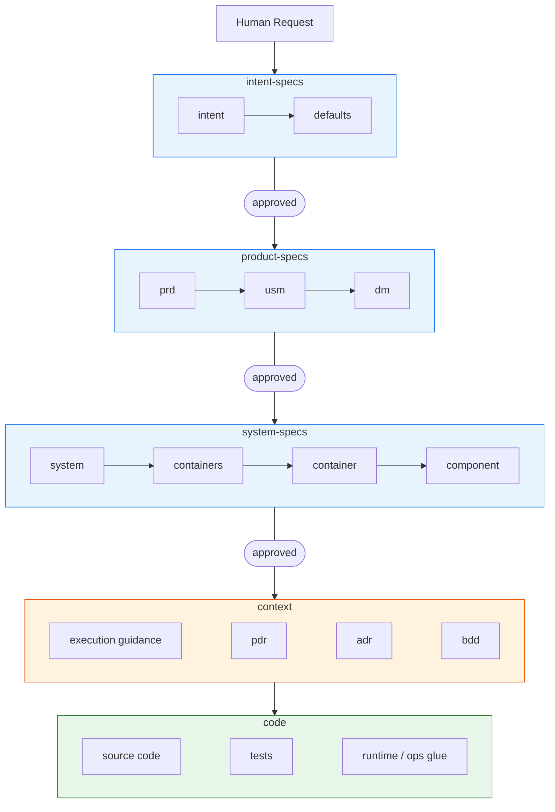
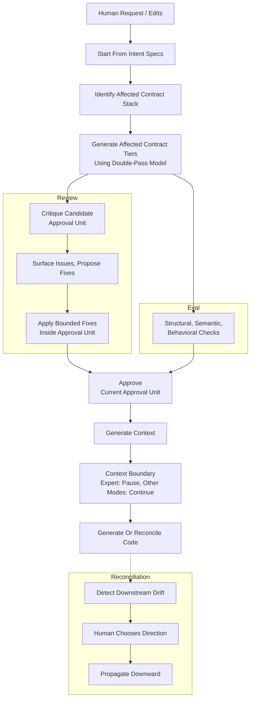
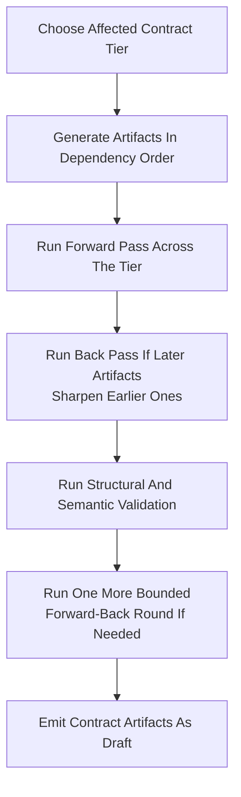
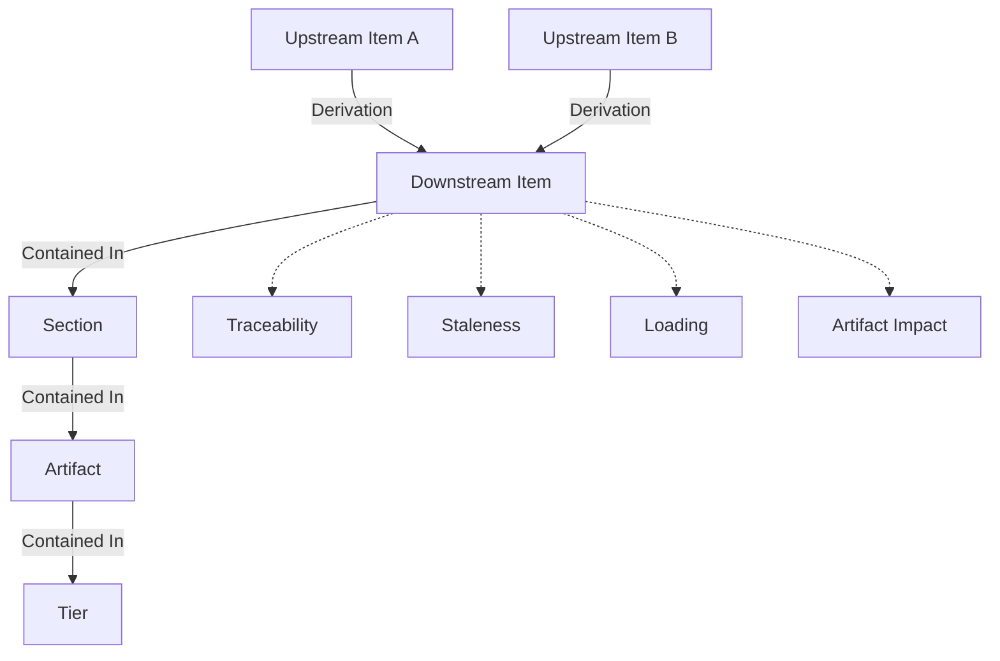
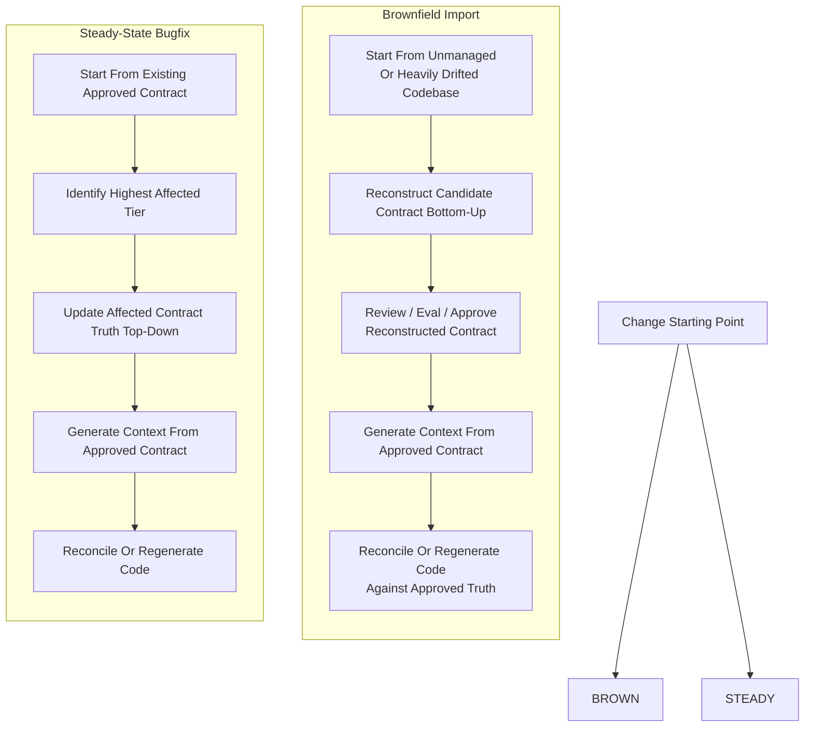

# VibeLoom Methodology

VibeLoom is a contract-driven methodology for long-lived vibe coding. It is built for codebases that must survive more than one generation step, more than one contributor, and more than one architectural revision without losing semantic coherence. It uses a **contract** - a tiered set of specifications validated for consistency and coherence - to code-generate an application.

This file is the source of truth for the methodology and artifact structure. Concrete templates, exact file names, CLI surface, and runtime behavior belong to implementation and must conform to this document.

---

## The Problem

AI code generation produces local momentum but fails to preserve consistency and coherence long-term. As a project grows, it suffers from:

- **Semantic drift** — concepts and invariants shift subtly with every prompt
- **Invisible governance** — intent lives only in chat history with no durable review surface
- **Context fragmentation** — large codebases exceed one agent's context, making ownership guesswork
- **Reconciliation failure** — manual edits and drift have no principled path back to specifications

---

## The Solution

VibeLoom generates a multi-tiered contract of structured specifications and treats it as both the durable source of truth and the eval system. Agents do the heavy lifting of generating, reviewing, and validating the entire contract/context/code stack for internal consistency and coherence. Humans keep approval authority.

---

## Principles

The core principles of VibeLoom methodology are:

1. **The system is defined as a contract stack, not a set of stale one-off specs**
2. **The contract stack doubles as eval stack.**
3. **Agents are responsible for generation and validation, gated by humans.**
4. **Scoped context enables agent scaling.**

---

## When To Use VibeLoom

VibeLoom is strongest where prompt-only generation stops being reliable. Use it when:

- The codebase must survive more than one generation step, more than one contributor, or more than one architectural revision
- Multiple bounded contexts, non-trivial workflows, or meaningful technical boundaries are present
- Multiple agents or humans may work in parallel and need consistent context
- Semantic coherence matters more than raw generation speed

VibeLoom adds ceremony. For a weekend prototype, single-file utility, or throwaway script, prompt-only generation is likely faster and sufficient. For anything that will be maintained, extended, or shared, VibeLoom pays for itself through reduced drift and explicit traceability.

---

## Overview
Here is an overview of developing a system using VibeLoom:
- Human defines a **contract** for the system. Contract is generated interactively through a human-edits <-> agent-generation loop.
- To make the contract both consistent and coherent, the human validates specs through **review** (a critique loop over the current candidate approval unit against approved upstream truth) and **eval** (more formal structural and semantic validation). Specs are checked against other artifacts inside the current approval unit and against approved upstream truth.
- Every run starts with **intent-specs** by iteratively shaping a high-level description of the system (`intent`) and the repo-wide defaults (`defaults`) that will govern the rest of the generation process.
- The run then proceeds downward through **product-specs** (`prd`, `usm`, `dm`) and **system-specs** (`system`, `containers`, `container`, `component`) as needed.
- Generation and validation of the **contract** use one of four modes that control approval units, delegated progression, and context-boundary behavior:
  - `lite` treats the affected contract stack as one approval unit and delegates contract approval by default so the skill can run end-to-end in one go unless a blocking or flagged issue requires a human stop
  - `pm` treats each affected contract tier as its own approval unit; `product-specs` are the normal human stop and `system-specs` auto-advance by default unless blocked or flagged
  - `dev` treats each affected contract tier as its own approval unit; `system-specs` are the normal human stop and `product-specs` auto-advance by default unless blocked or flagged
  - `expert` treats each affected contract tier as its own approval unit and stops for explicit human approval at every contract tier
- Review and structural/semantic eval may loop inside the current candidate approval unit before approval is recorded.
- The normal forward command surface is mode-specific:
  - `lite`: `generate code`
  - `pm`: `generate product-specs`, `generate code`
  - `dev`: `generate system-specs`, `generate code`
  - `expert`: full targeted operation surface
- **context** (execution guidance artifacts, `pdr`, `bdd`, `adr`, and similar artifacts) is generated from the approved contract to help agents work effectively. Context artifacts appear in two ways:
  - **Automatic:** execution guidance is generated for all affected scopes after contract approval. Decision records (`pdr`, `adr`) are generated when contract evolution introduces product or architecture decisions. Behavioral scenarios (`bdd`) are generated when system-specs produce behavior items.
  - **On-demand:** any context artifact can also be explicitly generated or regenerated via the appropriate operation (e.g., behavioral eval produces `bdd` scenarios on request).
- Context artifacts do not carry lifecycle metadata; they are assumed correct by default. `expert` pauses at the context boundary before code. `lite`, `pm`, and `dev` normally continue into code unless a blocking or flagged issue requires a human stop.
- If context generation is poor, the recommended fix is to edit upstream **contract** and regenerate context. Direct human edits to **context** are an exceptional fallback, not the primary workflow.
- After the **context** is ready, the swarm of agents can generate the **code** - meaning the system itself that can be built and executed.

## The Contract Stack

### Overview

VibeLoom governs application development through a compact contract stack.
The application artifacts play the following roles:
- **contract**: human-gated, normative semantic truth. These artifacts - whether human-authored or generated - belong to human-gated tiers, are generated tier-by-tier as batches, and are approved through the current approval unit defined by mode.
- **context**: normative execution truth for agents. These artifacts are required primarily for code generation agents. They do not carry approval-state metadata and do not require human approval, although humans may review or edit them in exceptional cases.
- **code**: the executable result. Humans are not expected to edit it directly.

In this document:
- **human-gated** means downstream work may not rely on a tier until a human approves it.
- **normative** means it is a source of truth that downstream generation, execution, review, or eval in its scope must follow.
- **executable** means it can be run or checked directly.
- **approval unit** means the set of draft contract artifacts reviewed, evaled, and approved together at one checkpoint. In `pm`, `dev`, and `expert`, each affected contract tier is its own approval unit. In `lite`, the affected contract stack is one approval unit.

The contract stack separates semantic truth, execution truth, and executable result.



### Generation Tiers

The artifact stack also groups into generation tiers. These tiers are the primary orchestration model for users and agents.

| Tier          | Content                                                                         | Artifacts                                                                    |
| ------------- | ------------------------------------------------------------------------------- | ---------------------------------------------------------------------------- |
| intent-specs  | Capture user intent and normalize repo-wide defaults                            | `intent`, `defaults`                                                         |
| product-specs | Formally traceable product and domain contracts produced from approved intent   | `prd`, `usm`, `dm`                                                           |
| system-specs  | Technical contracts produced from approved product and domain semantics         | `system`, `containers`, per-container `container`, per-component `component` |
| context       | Distill execution guidance, decision records, and long-term agent memory        | execution guidance artifacts, `pdr`, `bdd`, `adr`, and similar |
| code          | This tier consists of executable implementation and verification artifacts      | source code, tests, runtime / ops glue                                       |

Tiers are a generation abstraction. Modes determine approval units: per affected contract tier in `pm`, `dev`, and `expert`, or across the affected contract stack in `lite`. Fine-grained derivation should be represented in a context graph, and traceability, staleness, and loading should be inferred from that graph.
Governance binds to the tier semantics, not to a fixed list of specs inside the tier. A tier may gain or lose specs over time without changing the review, eval, and approval model.

---

### Contract Specs

A governed application owns the following contract specs:

The tier descriptions below define artifact structure and intent. Concrete document templates, field schemas, and formatting conventions belong to implementation.

| Spec         | Tier          | Role                                                                                                                                      | Primary audience    |
| ------------ | ------------- | ----------------------------------------------------------------------------------------------------------------------------------------- | ------------------- |
| `intent`     | intent-specs  | Vision-like prose description of the system; may include both product and implementation wishes                                           | PMs                 |
| `defaults`   | intent-specs  | Minimal repo-wide constitution: binding global rules, technology baseline, and quality guardrails | Tech leads + agents |
| `prd`        | product-specs | Functional requirements and non-functional requirements                                                                                   | PMs + Tech leads    |
| `usm`        | product-specs | Epic/story/workflow structure and acceptance framing                                                                                      | PMs + UX designers  |
| `dm`         | product-specs | Domain model: bounded contexts, aggregates, invariants, ubiquitous language                                                               | PMs + Tech leads    |
| `system`     | system-specs  | System context, external actors/systems, high-level trust and NFR boundaries                                                              | Tech leads          |
| `containers` | system-specs  | Global runtime/deployment topology, container inventory, communication paths, hosting/runtime choices                                     | Tech leads          |
| `container`  | system-specs  | per-container: local runtime boundary, resident bounded contexts, authoritative component inventory, local constraints                    | Tech leads          |
| `component`  | system-specs  | per-component: full contract for one owned technical boundary                                                                             | Tech leads          |

### Context Artifacts

Context artifacts are generated from contract specs and are the default execution surface for agents, but they never outrank contract specs semantically.

| Artifact | Tier | Role | Primary audience |
| --- | --- | --- | --- |
| execution guidance artifacts | context | Scoped execution guidance distilled from contract specs | Agents |
| `pdr` | context | Product decision record that preserves product-level decision history without becoming contract truth | PMs + agents |
| `adr` | context | Architecture decision record that preserves technical decision history without becoming contract truth | Tech leads + agents |
| `bdd` | context | Generated non-executable behavioral scenarios used by humans and agents during implementation | PMs + tech leads + agents |

All semantic truth lives in contract specs. Context artifacts carry execution truth for agents and may be regenerated or, in exceptional cases, human-edited, but if a context artifact conflicts with a contract spec, the contract spec wins semantically. Context artifacts do not normally have approval-state metadata and are assumed correct by default. `expert` pauses at the context boundary before code. `lite`, `pm`, and `dev` normally continue into code unless a blocking or flagged issue requires a human stop. Code is the executable result, although validation may run upward from code against every upstream tier.

---

### `intent-specs` tier
Captures user intent and normalizes repo-wide defaults.

| Spec | Contract entities | Key rules |
| --- | --- | --- |
| `intent` | capabilities, wishes | Prose-first; may include both product and implementation wishes. Preferences become `defaults` only when repo-wide and always-on. |
| `defaults` | constraints | Minimal repo-wide constitution. Only always-on, globally binding constraints. Downstream tiers treat `defaults` as binding. |

---

### `product-specs` tier
Turns approved intent into formally traceable product and domain contracts.

| Spec | Contract entities | Derives from | Key rules |
| --- | --- | --- | --- |
| `prd` | functional requirements, non-functional requirements | capabilities, wishes | Every functional requirement and NFR traces to at least one capability or wish. |
| `usm` | epics, flows, stories, acceptance criteria, milestones | functional requirements | Every story traces to at least one functional requirement. Every epic has at least one flow; every flow has at least one story. Acceptance framing stays behavior-focused. |
| `dm` | ubiquitous language terms, bounded contexts, aggregates, entities, value objects, invariants | functional requirements, non-functional requirements | `dm` is the semantic source for technical boundary derivation. Components come from domain semantics, not folder shape. |

---

### `system-specs` tier
Translates approved product and domain semantics into technical contracts.

| Spec | Contract entities | Derives from | Key rules |
| --- | --- | --- | --- |
| `system` | external actors, trust boundaries, system-wide NFR boundaries | bounded contexts, non-functional requirements | Defines system purpose, external actors, trust boundaries, system-wide NFRs. Deployment topology does not live here. |
| `containers` | containers, communication paths | bounded contexts, system context | Global runtime topology. Every container appears in the topology. Communication paths reference valid container endpoints. |
| `container` | (references parent container, lists component inventory) | containers | Authoritative component inventory for one runtime boundary. Components are discovered here, not inferred from folders. |
| `component` | components, interfaces, behaviors, dependencies | bounded contexts, containers | Smallest owned technical boundary. Each component belongs to exactly one bounded context and one container. |

**Technical boundary rules:**
- Bounded context defines semantic home
- Component defines owned technical change boundary
- Container defines runtime and deployment home
- A bounded context must not span multiple containers
- Components from the same bounded context must be co-located in the same container

---

### `context` tier
Agent-facing operational truth generated from approved contract. Context artifacts do not carry lifecycle metadata and are assumed correct by default.

| Artifact | Purpose | Key entities |
| --- | --- | --- |
| execution guidance | Scoped guidance for repo, container, or component work | (prose guidance, no addressable items) |
| `pdr` | Product decision history | product decision records |
| `adr` | Architecture decision history | architecture decision records |
| `bdd` | Generated non-executable behavioral scenarios | behavior files, Gherkin scenarios |

- Context is generated from contract. If context conflicts with contract, contract wins.
- Humans may review or eval context against upstream contract.
- The normal fix path for poor context is to amend contract and regenerate.
- Gherkin belongs to context until it becomes executable test code.

---

### `code` tier
Executable implementation and verification artifacts.

| Artifact | Description |
| --- | --- |
| `source code` | Implements approved behavior and technical structure. |
| `tests` | Provide executable verification of behavior, contracts, and regressions. |
| `runtime / ops glue` | Handles configuration, packaging, deployment, and operational wiring. |

#### `source code`
`source code` implements approved behavior and technical structure.

#### `tests`
`tests` provide executable verification of behavior, regressions, and contract compliance.

- unit tests, integration tests, and executable BDD tests belong here
- if runnable tests are generated from a `bdd` scenario, they become part of the executable test suite

#### `runtime / ops glue`
`runtime / ops glue` handles configuration, packaging, deployment, migrations, and operational wiring.

- Code is executable, not human-gated.
- Code is produced from contract, usually through context.
- Validation may run upward from code against all upstream tiers.

---

## Workflow

VibeLoom workflow governs how change moves from human request to approved contract, generated context, and executable code.

At a conceptual level, the workflow is:

1. Start from `intent-specs` and identify the affected contract stack for the current run.
2. Generate the affected contract tiers as batches from approved upstream truth.
3. In `pm`, `dev`, and `expert`, each affected contract tier is its own approval unit. `pm` and `dev` auto-advance delegated approval units when safe; `expert` always stops for explicit approval.
4. In `lite`, the affected contract stack is treated as one approval unit and may proceed end-to-end with delegated contract approval by default.
5. Generate context from approved contract.
6. Only `expert` pauses at the context boundary by default. `lite`, `pm`, and `dev` continue into code unless blocked or flagged.
7. Generate or reconcile code from approved contract and context.

Modes control approval units, delegated progression, and pause topology. They do not change artifact semantics or the contract/context/code ontology.



### Modes

Modes are run-time-switchable workflow settings that control approval units, delegated progression, and context-boundary behavior. All modes use the same contract stack.

| Mode | Approval unit | Normal human contract stop | Delegated auto-advance by default | Context pause | Normal forward surface | Typical use |
| --- | --- | --- | --- | --- | --- | --- |
| `lite` | affected contract stack | none before code | affected contract stack | no | `generate code` | Simple systems: one bounded context, limited business logic, modest complexity |
| `pm` | each affected contract tier | `product-specs` | `system-specs` | no | `generate product-specs`, `generate code` | PM driving requirements, workflows, acceptance intent |
| `dev` | each affected contract tier | `system-specs` | `product-specs` | no | `generate system-specs`, `generate code` | Dev driving technical boundaries, dependencies, executable impact |
| `expert` | each affected contract tier | every contract tier | none | yes | full targeted operation surface | Lead owning the full contract stack end-to-end |

`lite` is intentionally one-shot and relies most heavily on delegated approval, not a different ontology. `pm`, `dev`, and `expert` are progressively more explicit, not semantically different.

Default to `lite` only when the system is clearly simple: one semantic bounded context, limited business logic, and modest technical complexity. Typical examples include a desktop utility, small internal tool, or simple SMB website. Default to `pm` otherwise. Use `dev` when the current human is driving architecture rather than product. Use `expert` when full human oversight of every tier is needed.

Regardless of mode, `intent-specs` stay explicitly human-authored and every run still begins from `intent-specs`.

Modes may change default prompts, context emphasis, stop behavior, or suggested operations, but they do not change the contract stack or the contract/context/code ontology.

#### Delegated auto-advance and breaking-change escalation

In `lite`, `pm`, and `dev`, delegated auto-advance is allowed only when:

- structural eval passes
- no **breaking semantic change** is detected against approved truth
- no flagged issue requires human judgment

If a delegated approval unit is blocked or flagged, explicit human review and approval become required before the run can complete.

A **breaking semantic change** is a change to existing approved meaning, not simple addition of new material consistent with approved truth.

Examples:

- product-side: changed scope, workflow meaning, acceptance semantics, NFR target, or domain meaning
- system-side: changed bounded-context placement, ownership, interface semantics, dependency semantics, or other approved technical meaning

### Lifecycle And Approval

Contract artifacts have two lifecycle states:

- `draft` — generated or regenerated, awaiting review and approval
- `approved` — human or delegated approval recorded

Staleness is not an artifact state. It is a computed property of the context graph, inferred by comparing each downstream artifact's derivation basis against the latest approved upstream versions. Staleness detection surfaces stale artifacts; reconciliation resolves it by regenerating affected artifacts (which return to `draft`). Supersession is implicit in version history.

Only contract artifacts are approved. Context does not carry lifecycle metadata, and code is judged against approved upstream truth rather than approved in the same way.

`intent-specs` are always explicitly human-owned. Contract approval units follow mode (see Modes above). Delegated approval is mode-driven provenance — it does not change the lifecycle model, remove explicit human ownership of `intent-specs`, or override the breaking-change escalation rule.
`pm`, `dev`, and `expert` still use per-tier approval units. `lite` treats the affected contract stack as one delegated approval unit by default.

---

## Generation

Generation is the contract-driven engine of the methodology. It works in two dimensions:

- **down** through the tiers
- **across** the artifacts inside one affected tier

### Tier Order

Every run starts from `intent-specs` and proceeds downward. Each tier is produced from approved upstream truth:

| Tier | Primary upstream basis | Output |
| --- | --- | --- |
| `intent-specs` | human request, edits, and prior repo intent | `intent`, `defaults` |
| `product-specs` | approved `intent-specs` | `prd`, `usm`, `dm` |
| `system-specs` | approved `product-specs` | `system`, `containers`, `container`, `component` |
| `context` | approved contract stack | execution guidance artifacts, decision records, behavioral projections, and other execution artifacts |
| `code` | approved contract plus relevant context | executable implementation and tests |

### Within-Tier Generation

Each affected tier is generated as a batch using a bounded double-pass cycle. `expert` pauses after every affected contract tier. `pm` and `dev` pause at the human-owned approval unit and auto-advance delegated approval units when safe. `lite` may carry the whole affected contract stack through delegated approval in one run when safe.



### Intent As Persistent Context

`intent` persists as generation context across every lower tier, not only when producing `product-specs`.

This is deliberate: user wishes and constraints may survive all the way into system design and code, even when they were not fully normalized into later specs.

### Generation And Staleness

When approved upstream truth changes, dependent downstream artifacts become stale as computed by the context graph. Generation is therefore not only a bootstrap mechanism; it is also the way the stack is kept coherent over time. Staleness is never written into artifact frontmatter — it is inferred from version comparisons in the graph and surfaced through staleness detection.

---

## Review, Eval, And Reconciliation

These are three distinct conceptual activities:

- `review` critiques and frames the current candidate approval unit against approved upstream truth
- `eval` checks structure and semantics
- `reconciliation` realigns lower layers after approved truth changes or downstream drift is detected

Review and structural/semantic eval use the current candidate approval unit, even though the underlying graph remains fine-grained: per affected tier in `pm`/`dev`/`expert`, or across the affected contract stack in `lite`. Reconciliation uses the same tier model to propagate approved truth downward.

Review, eval, and reconciliation are shown together in the Workflow diagram above.

### Review

Review is the human-facing critique loop for the current candidate approval unit against approved upstream truth and internal coherence.

It may:

- surface contradictions, ambiguity, and missing links
- propose upstream or same-tier corrections
- apply bounded fixes within the currently reviewed approval unit

Review does not propagate approved changes downward; that belongs to reconciliation.
Review may not silently change semantically meaningful upstream truth. When meaning changes, the human chooses the direction and later approves the updated tier.

### Eval

VibeLoom uses three named eval types:

| Eval Type | Purpose | Blocking |
| --- | --- | --- |
| `structural eval` | Validate lifecycle rules, references, required fields, declared relationships, and basic stack integrity | Yes |
| `semantic eval` | Analyze coverage, contradiction with upstream truth, componentization fit, and context sufficiency | No |
| `behavioral eval` | Produce on-demand Gherkin acceptance scenarios from approved contract for later implementation | No |

Structural eval and semantic eval normally run against the approval unit currently under review or approval. Behavioral eval produces context artifacts rather than new contract truth.

### Reconciliation

Reconciliation is downstream realignment after approved truth changes or downstream drift becomes visible.

It is asymmetric:

- approved upstream contract defines intended meaning
- downstream artifacts and code may reveal drift
- drift triggers proposals, not silent rewriting of approved truth

When drift appears, the human chooses one of two semantic directions:

1. Amend upstream truth, then regenerate and reconcile downstream.
2. Preserve upstream truth, then correct downstream context or code.

To prevent loops, reconciliation stays bounded:

1. Review identifies and frames the drift.
2. Human chooses semantic direction when needed.
3. Reconciliation propagates the approved direction downward.
4. Eval validates the resulting state.

---

## Operations

VibeLoom defines eight methodology-level operations. Implementations may expose them through different commands or interfaces, but the logical operations stay the same.

| Operation | Direction | Meaning |
| --- | --- | --- |
| `init` | top-down | Bootstrap a governed repo and produce the first draft contract stack |
| `generate` | top-down | Generate one affected tier from approved upstream truth using the forward-pass / back-pass model |
| `review` | current + up | Critique the current candidate approval unit against approved upstream truth and optionally apply bounded fixes within that approval unit |
| `eval` | up | Run structural, semantic, or behavioral evaluation for the current approval unit |
| `reconcile` | down | Propagate approved upstream changes downward into stale downstream tiers, context, or code |
| `approve` | gate | Move a reviewed contract approval unit from `draft` to `approved` and record approval provenance |
| `status` | read-only | Show lifecycle state, graph health, stale propagation, and coverage gaps |
| `import` | bottom-up | Reconstruct candidate contract from an unmanaged or heavily drifted codebase |

Exact parameters, flags, file formats, and CLI surfaces belong to implementation, not to methodology.

---

## Context Graph

VibeLoom relies on an explicit context graph rather than on implicit chat memory.

The graph connects addressable items defined inside contract, context, and code artifacts so humans and agents can answer:

- what is produced from what
- what becomes stale if something changes
- what must be loaded for a given task
- how downstream work can be traced back to upstream truth

The context graph combines item derivation with containment and derives traceability, staleness, loading, and artifact impact.



The only item-to-item relationship in the graph is the primary relation `derivation`.

### Derivation

Each downstream item records the set of upstream inputs it is produced from:

```text
downstream_item <- [input1, input2, ... inputn]
```

This allows one downstream section or entity to depend on multiple semantic inputs without forcing the methodology into artificial `1:n` or `n:n` terminology.

For root intent capture, `n` may be `0`. For downstream items, `n` is usually one or more.

### Containment And Ownership

Items are owned by the artifact in which they are defined.

Conceptually:

```text
item -> section -> artifact -> tier
```

Ownership therefore comes from containment, not from a separate item-to-item graph relation.

### Derived Views

Several useful views are inferred from derivation plus containment:

- **traceability:** walk derivation upward or downward to explain where an item came from and what it influences
- **staleness:** if an upstream item changes, flag all reachable downstream items and their containing artifacts as stale in the graph (not in artifact frontmatter)
- **loading:** load the smallest artifact or scope that contains the required downstream item and its upstream inputs
- **artifact impact:** summarize item-level derivations upward into affected sections, artifacts, and tiers

### Context Loading

Context loading is graph traversal, not guesswork.

The conceptual rules are:

- always start from the smallest scope that still preserves the required truth
- load governing contract before relying on context artifacts
- use context artifacts to accelerate execution, never to override contract
- escalate upward when it is unclear whether a change stays within one component, bounded context, or container
- keep generation and review aware of persistent intent when that intent still constrains the change

### Why The Graph Matters

The context graph is what makes VibeLoom scalable for swarms of agents and long-lived repos.

It supports:

- minimal safe context loading
- impact analysis
- stale detection
- eval grounding
- ownership clarity through containment
- parallel work allocation

---

## Defaults vs Execution Guidance

- `defaults` is **contract** — always-on, globally binding repo-wide constraints
- `execution guidance` is **context** — scope-specific operational guidance generated from approved truth

If they conflict, contract wins.

---

## Brownfield Import vs. Steady-State Bugfix

VibeLoom treats these as different conceptual paths.

- **Brownfield import** is the bootstrap path for unmanaged or heavily drifted repos. It reconstructs candidate contract from existing code and marks uncertainty explicitly for human review.
- **Steady-state bugfix** is the governed path for repos already under VibeLoom. It starts from repro, expected behavior, the violated or missing contract, and regression coverage.

Once a repo is governed, routine defects should be resolved against approved contract truth rather than by re-inferring semantics from code on every fix.

Brownfield import reconstructs contract bottom-up; steady-state bugfix updates approved truth top-down.



---

## Summary

VibeLoom is strongest where prompt-only generation stops being reliable.

It works by:

- turning intent into a durable contract stack
- generating that stack tier-by-tier with human gating at tier boundaries
- using context as agent-facing execution truth without letting it outrank contract
- reconciling downstream artifacts when approved truth changes
- relying on an explicit context graph instead of chat-memory guesswork

The methodology is intentionally stricter than ad hoc AI coding because safe speed requires explicit boundaries, explicit authority, explicit generation flow, and explicit context management.
