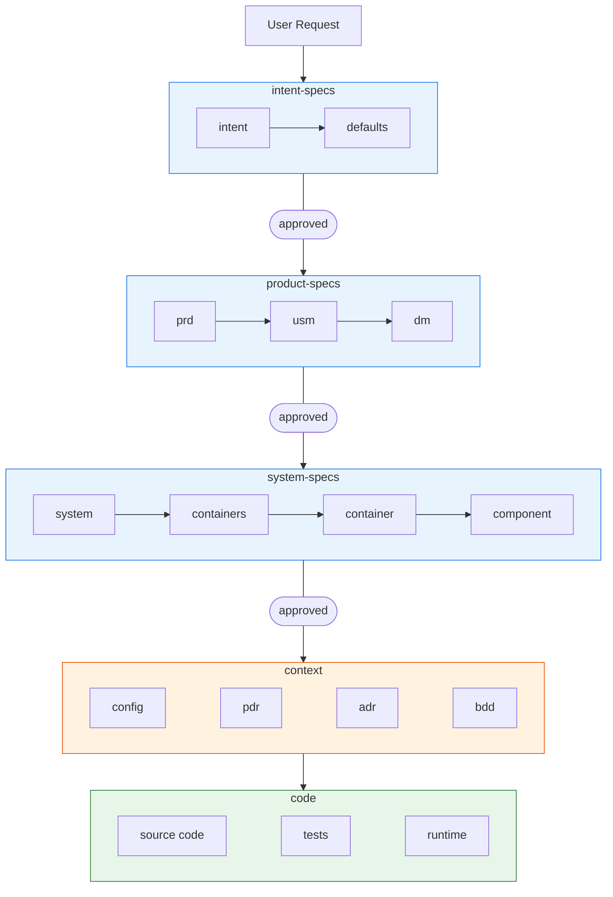
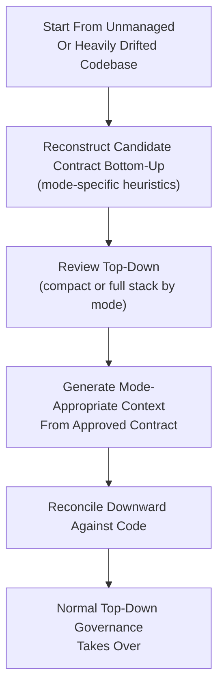
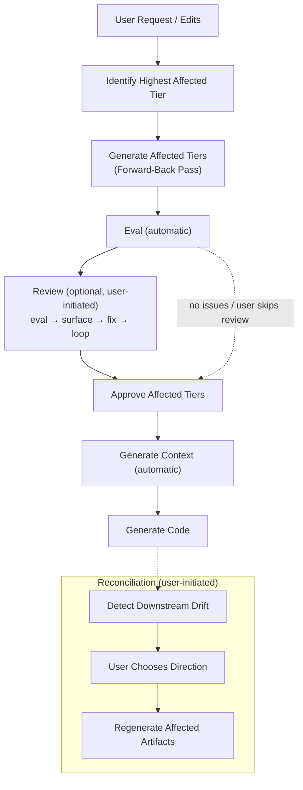

# VibeLoom Methodology

VibeLoom is a contract-driven methodology for long-lived AI-assisted coding. It is built for codebases that must survive more than one generation step, more than one contributor, and more than one architectural revision without losing semantic coherence. It uses a **contract** - a tiered set of specifications validated for consistency and coherence - to code-generate an application.

This file is the source of truth for the methodology and artifact structure. Concrete templates, exact file names, CLI surface, and runtime behavior belong to implementation and must conform to this document.

---

## The Problem

AI coding agents generate local momentum but fail to preserve consistency and coherence long-term. As a project grows, it suffers from:

- **Semantic drift** — concepts and invariants shift subtly with every prompt
- **Invisible governance** — intent lives only in chat history with no durable review surface
- **Context fragmentation** — large codebases exceed one agent's context, making ownership guesswork
- **Reconciliation failure** — manual edits and drift have no principled path back to specifications

---

## The Solution

VibeLoom generates a multi-tiered contract of structured specifications and treats it as both the durable source of truth and the eval system. Agents do the heavy lifting of generating, reviewing, and validating the entire contract/context/code stack for internal consistency and coherence. Users keep approval authority — directly for tiers the mode exposes, and through delegation rules they chose when selecting a mode.

---

## Principles

The core principles of VibeLoom methodology are:

1. **The system is defined as a contract stack, not a set of stale one-off specs**
2. **The contract stack doubles as the eval stack**
3. **Agents are responsible for generation and validation, gated by the user**
4. **Scoped context enables agent scaling**

---

## When To Use VibeLoom

VibeLoom is strongest where prompt-only generation stops being reliable. Use it when:

- The codebase must survive more than one generation step, more than one contributor, or more than one architectural revision
- Multiple bounded contexts, non-trivial workflows, or meaningful technical boundaries are present
- Multiple agents or users may work in parallel and need consistent context
- Semantic coherence matters more than raw generation speed

VibeLoom adds ceremony. For a weekend prototype, single-file utility, or throwaway script, prompt-only generation is likely faster and sufficient. For anything that will be maintained, extended, or shared, VibeLoom pays for itself through reduced drift and explicit traceability.

---

## Overview

### Contract, Context, And Code

VibeLoom has a three-layer architecture: **contract → context → code**

- **`contract`** — governed semantic truth. The user seeds the intent and retains approval-policy authority. Depending on mode, some tiers are explicit user stops while others may auto-advance under delegated rules. The agent generates, validates, and refines the tiered `intent-specs` → `product-specs` → `system-specs` stack through `generate`/`reconcile` and `eval`/`review` loops. Each tier derives from and is checked against approved upstream truth.

- **`context`** — definitive execution config for agents as well as read-only change records. These artifacts do not require approval. They are generated only from approved contract truth, although users may inspect, eval, review, and edit them when needed. From the approved contract, the agent generates execution config for orchestrating worker agents inside their scopes. Context is derived, not primary truth. If it is wrong, the normal fix path is upstream in the contract.

- **`code`** — the executable result. Users are not expected to edit the `code` directly. The orchestrator agent reads the contract and the context, identifies affected scopes, and dispatches the team/swarm of scoped worker agents. Each worker agent receives only the slice of context (execution config) and the slice of the contract pertinent to its scope. Worker agents generate code independently. The orchestrator agent validates cross-scope consistency and coherence.

### High-Level Architecture

In short:
- `contract` is governed under user-selected approval policy
- `context` is generated from approved contract as execution truth for worker agents plus change records
- `code` is the executable result generated and checked against approved upstream truth

## Modes

### Definition

A mode controls three things:
- which contract tiers the user explicitly co-authors and approves
- which contract tiers are delegated to the agent for auto-advance
- whether the contract stack is full or compact

### Full Modes

`pm`, `dev`, `expert` are "full" modes of operations. They all maintain the full set of specs/artifacts. They mainly differ in validation and approval rules.

- In `expert` mode, the user co-authors and approves each contract tier - intent-specs, product-specs, system-specs.
- In `pm` mode, in addition to co-authoring and approving `intent-specs`, the user co-authors and approves `product-specs`. `system-specs` is generated, validated and approved automatically, w/o HITL - emphasizing the PM focus.
- In `dev` mode, in addition to co-authoring and approving `intent-specs`, the user co-authors and approves `system-specs`. `product-specs` is generated, validated and approved automatically, w/o HITL - emphasizing the dev focus.

### Vibe Mode

`vibe` mode is a realization of the need for reduced ceremony for simple applications and applications that are just being started. `vibe` mode features a "collapsed" contract stack that is only comprised of `intent`, `defaults` and `system`. `intent` serves as an all-inclusive summary "product" spec, whereas `system` serves as an all-inclusive summary "technical" spec. `vibe` mode is a compromise - it maintains a UX surface almost as minimal as pure vibe coding, yet it also maintains an internal scaffold/structure that enables some degree of semantic validation for consistency and coherence across tiers and layers.

## Contract Specs

A governed application owns the following tiered contract specs:

### Intent-Specs Tier
Captures user intent and normalizes repo-wide defaults.

| Spec | Purpose | Generated from | Rules |
| ---- | ------- | -------------- | ----- |
| `intent` | Prose-first description of the system; includes both product requirements and implementation constraints | — | Constraints become `defaults` only when repo-wide and always-on. In `vibe`, also includes a product summary section that seeds future product-specs. |
| `defaults` | Minimal repo-wide constitution: binding global rules, technology baseline, and quality guardrails | `intent` | Downstream tiers treat `defaults` as binding. |

#### `intent` entities

| Entity | Semantic Role |
| ------ | ------------- |
| capability | A high-level functionality that achieves a goal or an observable user-facing outcome |
| constraint | Hard requirement or binding preference |

#### `defaults` entities

| Entity | Semantic Role |
| ------ | ------------- |
| default | Always-on globally binding repo-wide constraint normalized from intent |

### Product-Specs Tier
Turns approved intent into formally traceable product and domain contracts. This tier exists only in `pm`, `dev`, and `expert` modes. In `vibe`, product concerns are captured as narrative prose in the intent's product summary section.

| Spec | Purpose | Generated from | Rules |
| ---- | ------- | -------------- | ----- |
| `prd` | Product requirements: objectives, key results, metrics, and functional/non-functional requirements | `intent` | Every functional requirement traces to at least one objective or capability. Every objective traces to at least one capability or constraint. |
| `usm` | Epic/story/workflow structure and acceptance framing | `intent` + `prd` | Every story traces to at least one functional requirement. Every epic has at least one flow; every flow has at least one story. Acceptance framing stays behavior-focused. |
| `dm` | Domain model: bounded contexts, aggregates, invariants, ubiquitous language | `intent` + `prd` + `usm` | `dm` is the semantic source for technical boundary derivation. Components come from domain semantics, not folder shape. |

#### `prd` entities

| Entity | Semantic Role |
| ------ | ------------- |
| objective | Business goal the system serves |
| key result | Measurable outcome for an objective |
| metric | Quantitative measure for a key result |
| functional requirement | Testable behavior the system must exhibit |
| non-functional requirement | Quality, performance, or security boundary |

Scope notes, assumptions, risks, and open questions may appear in `prd` as prose, but they are not first-class graph entities unless the methodology later promotes them.

#### `usm` entities

| Entity | Semantic Role |
| ------ | ------------- |
| epic | Coarse delivery grouping |
| flow | User journey or workflow |
| story | Smallest deliverable behavior unit |
| acceptance criterion | Observable pass/fail condition |
| milestone | A delivery checkpoint that groups a subset of stories/flows/epics into a larger-scope coherent product increment |

#### `dm` entities

| Entity | Semantic Role |
| ------ | ------------- |
| ubiquitous language term | Shared vocabulary entry |
| bounded context | Semantic boundary for domain logic |
| aggregate | Invariant-owning state cluster |
| entity | Identity-bearing domain object |
| value object | Immutable attribute cluster |
| invariant | Business rule that must always hold |

### System-Specs Tier

| Spec | Purpose | Generated from | Rules |
| ---- | ------- | -------------- | ----- |
| `system` | System context, external actors/systems, high-level trust and NFR boundaries | `product-specs` | Defines system purpose, external actors, trust boundaries, system-wide NFRs. Deployment topology does not live here. |
| `containers` | Global runtime/deployment topology, container inventory, inter-container communication paths (structured content, not graph entities), hosting/runtime choices | `product-specs` + `system` | Global runtime topology. Every container appears in the topology. Communication paths reference valid container endpoints. |
| `container` | Per-container: local runtime boundary, resident bounded contexts, authoritative component inventory, local constraints | `product-specs` + `system` + `containers` | Authoritative component inventory for one runtime boundary. Components are discovered here, not inferred from folders. |
| `component` | Per-component: full contract for one owned technical boundary | `product-specs` + `system` + `containers` + `container` | Smallest owned technical boundary. Each component belongs to exactly one bounded context and one container. |

#### `system` entities

| Entity | Semantic Role |
| ------ | ------------- |
| external actor/system | Outside entity the system interacts with |
| trust boundary | Security or permission line |
| system-wide NFR boundary | Global quality constraint |

#### `containers` entities

| Entity | Semantic Role |
| ------ | ------------- |
| container | Runtime/deployment unit |

#### `container` entities

| Entity | Semantic Role |
| ------ | ------------- |
| component | Smallest owned technical boundary |

Container specs also define local dependency edges and local constraints that describe intra-container structure (see Boundary Principle).

#### `component`

Component is the terminal contract node in the derivation graph. Component specs define interfaces, dependencies, behaviors, and notes as structured content (see Boundary Principle).

### Metadata
Each artifact has at least the following metadata (the rest will be detailed in other documents):
- `timestamp` - the date/time of the last change
- `status` - could be either `draft` or `approved`.
  - `draft` means needs to be reviewed and ultimately approved - either by the user or by the agent, but it needs approval.
  - `approved` means that the spec has been approved as a source of truth and generation/validation can proceed.

### Rules
- Container defines runtime and deployment home
- A bounded context must not span multiple containers
- Components from the same bounded context must be co-located in the same container

### Vibe Mode
In the `vibe` mode, the contract stack is simplified/reduced to the minimal meaningful form. It is only comprised of `intent`, `defaults` and `system`.
- `intent` serves as an all-inclusive "intent+product" spec. It consists of what usually constitutes the `intent` plus a succinct structured semantic summary of what would normally be in `prd` + `usm` + `dm`. Entity types: `capability` and `constraint` only — product-level detail is prose, not structured entities.
- `defaults` remains the same. Entity types: `default`.
- `system` serves as an all-inclusive summary "technical" spec — a succinct structured semantic summary of what would normally be in `system` + `containers` + a set of per-container `container` + a set of per-component `component`. Entity types: `container` and `component` only.

## Context Artifacts

Context artifacts are generated from contract specs and are the default execution surface for agents.

### Context Tier
Agent-facing operational truth generated from approved contract. Context artifacts do not carry lifecycle metadata and are treated as derived execution truth by default.

| Artifact | Purpose |
| -------- | ------- |
| `config` | Scoped configuration for repo, container, or component work. Generated at repo, container, and component scopes, derived from the contract entities owned by artifacts at that scope and above. Follows the format of CLAUDE.md/AGENTS.md and semantically similar agent configuration instructions. Carries no addressable entities and does not participate in the derivation graph. |
| `bdd` | Non-executable behavioral Gherkin scenarios generated from contract. Each scenario is derived from one or more acceptance criteria, invariants, or stories, scoped to the component that owns the behavior. Could be used by users and agents to generate executable behavioral tests. |
| `pdr` | Read-only product decision record that preserves product-level decision history without becoming contract truth. |
| `adr` | Read-only architecture decision record that preserves technical decision history without becoming contract truth. |

#### `bdd` entities

| Entity | Semantic Role |
| ------ | ------------- |
| scenario | Individual Gherkin scenario |

#### `pdr` entities

| Entity | Semantic Role |
| ------ | ------------- |
| product decision record | Product-level decision (append-only) |

#### `adr` entities

| Entity | Semantic Role |
| ------ | ------------- |
| architecture decision record | Technical decision (append-only) |

### Defaults vs Config

- `defaults` is **contract** — always-on, globally binding repo-wide constraints
- `config` is **context** — scope-specific execution config generated from approved truth

### Rules
- Context is generated from approved contract. If context conflicts with contract, contract wins.
- Users may review or eval context against upstream contract.
- The normal fix path for poor context is to amend contract and regenerate.
- Gherkin belongs to context until it becomes executable test code.

### Vibe Mode
In the `vibe` mode
- `bdd` is not generated because there is no `usm` and therefore no detailed breakdown into epics/use cases and stories - the typical units of BDD validation
- `pdr` remains the same in spirit, but in fact is a record of change for `intent`
- `adr` remains the same in spirit, but in fact is a record of change for `system`

---

## Code Artifacts

### Code Tier
Executable implementation and verification artifacts.

| Artifact | Description |
| -------- | ----------- |
| `source` | Source code for the application, structured into /\<container\>/\<component\> folders as defined by `system-specs` |
| `tests` | Provides executable verification of behavior, regressions, and contract compliance. Unit tests, integration tests, and executable BDD tests (in the future) belong here. Tests should reside in a /test subfolder in each container and each component folder |
| `runtime` | Configuration, packaging, deployment, migrations, and operational wiring |

### Rules
- Code is executable, not approval-gated.
- Code is generated from contract, with the use of context.
- Validation may run upward from code against all upstream tiers. Validation may run at the level of a component, a container, or the entire application.

---

## Context Graph

VibeLoom relies on an explicit context graph rather than on implicit chat memory. The graph connects addressable entities defined inside contract and context artifacts. Code may still be analyzed heuristically by the coding agent, but it does not yet participate in the explicit graph because concrete code-level entity carriers are not specified.

The graph exists to answer:

- what is generated from what
- what becomes stale if something changes
- how downstream work can be traced back to upstream truth

The only entity-to-entity relationship in the graph is **derivation**.

Each downstream entity records the set of upstream entities it is derived from.
For root intent capture, that set may be empty.
For downstream entities, it is one or more.

### Derivation DAG

- The derivation graph is a DAG — no cycles are allowed.
- The derivation DAG defines the complete set of typed forward-derivation edges between graph entity types.
- A derivation reference that does not follow one of these edges is a structural eval failure.
- `capability` and `constraint` are the only root entity types.

Each row reads:
"an instance of the entity may derive from instances of the listed upstream entity types."

| Entity | Derives from |
| ------ | ------------ |
| capability | — |
| constraint | — |
| default | constraint |
| objective | capability, constraint |
| key result | objective |
| metric | key result |
| functional requirement | objective, capability |
| non-functional requirement | objective, capability, constraint |
| epic | functional requirement |
| flow | functional requirement |
| story | functional requirement |
| acceptance criterion | functional requirement, non-functional requirement, story |
| milestone | story, epic |
| ubiquitous language term | capability, functional requirement, story |
| bounded context | functional requirement, story, flow, ubiquitous language term |
| aggregate | story, bounded context |
| entity | story, bounded context |
| value object | acceptance criterion, story |
| invariant | functional requirement, acceptance criterion, bounded context |
| external actor/system | functional requirement, non-functional requirement, capability |
| trust boundary | non-functional requirement |
| system-wide NFR boundary | non-functional requirement |
| container | bounded context, non-functional requirement, system-wide NFR boundary |
| component | aggregate, entity, bounded context, container, flow, value object |
| scenario | acceptance criterion, invariant, component, story |
| product decision record | any changed product-side entity |
| architecture decision record | any changed technical-side entity |

### Ownership Mapping

- Each entity is defined in exactly one artifact.
- Each artifact belongs to exactly one tier and one scope.
- A scope is the governance boundary an artifact belongs to: **repo** (global), **container** (one runtime unit), or **component** (one technical boundary).
- Repo-scoped: `intent`, `defaults`, `prd`, `usm`, `dm`, `system`, `containers`, `pdr`, `adr`. Container-scoped: `container`, container-level `config`. Component-scoped: `component`, component-level `config`, `bdd`.
- Affected artifacts, tiers, and scopes are computed from the affected set by ownership lookup.

### Boundary Principle

- `component` is the terminal contract node and the methodology's smallest owned technical boundary.
- The full explicit graph may still continue into derived context artifacts below `component`.
- Entities defined within component and container specs, such as interfaces, behaviors, dependencies, local edges, and local constraints, are part of structured spec content but are not independent nodes in the derivation graph. This prevents false-positive staleness churn from implementation-level changes within a boundary.

### Code-Level Tracing

- Component specs define owned paths, which form the bridge from the derivation graph to the filesystem. Code is analyzed heuristically but does not carry graph-addressable entities.
- In a future version, code-level carriers linked to their owning component may participate in staleness detection and impact analysis. That is tooling work, not methodology work.

### Vibe Mode

In `vibe` mode, the explicit derivation graph is not materialized.
Validation is heuristic rather than graph-backed:
- the agent checks compact `system` against `intent` capabilities and constraints
- the agent may inspect current code as additional heuristic evidence

Sections below that rely on graph traversal or graph-grounded eval apply to full modes only unless stated otherwise.

### Affected Set

In full modes, the affected set for a change is computed by walking derivation edges forward from every changed entity in the graph and collecting all reachable entities.

Affected artifacts, tiers, and scopes are then computed from the affected set by ownership lookup.

In `vibe`, there is no explicit graph traversal. The affected scope is inferred heuristically from changed `intent` clauses, the current compact `system`, and current code when relevant.

### Why The Graph Matters

The context graph is what makes VibeLoom scalable for swarms of agents and long-lived repos.

It supports:

- minimal safe context loading
- agent load-set computation
- impact analysis
- stale detection
- eval grounding
- ownership clarity
- parallel work allocation

---

## Operations

VibeLoom defines eight methodology-level operations. Implementations may expose them through different commands or interfaces, but the logical operations stay the same. The `Parameter` and `Flags` fields below are conceptual operation inputs and behavior modifiers; the `--` notation is illustrative shorthand rather than mandated CLI syntax.

The operations below describe the logical engine surface. Public user-facing surfaces may expose a narrower subset by mode. In particular, `vibe` keeps the explicit contract UX intent-centric even though the engine may still materialize compact `system-specs` internally.

`eval` and `generate` are the two primitives. `review` is an interactive shell on top of `eval`; `reconcile` is an interactive shell on top of `generate`. An approval unit is one contract tier expressed concretely as the affected artifact set within that tier.

### `init`

- **Purpose:** Bootstrap an ungoverned repo with a new VibeLoom-governed project.
- **Parameter:** Optional seed — a prose artifact (file path or inline text) describing the intended system. When omitted, the agent interactively interviews the user for capabilities and constraints (planning-mode style).
- **Flags:** `--mode` (`pm` | `dev` | `expert` | `vibe`) — required. `--upgrade` — when used with `--mode` (`pm` | `dev` | `expert`), promotes a `vibe` repo to the specified full mode (see Vibe-to-Full Upgrade).
- **Precondition:** Repo has no existing VibeLoom governance, OR (with `--upgrade`) repo is currently in `vibe` mode.
- **Postcondition:** Mode set. Draft `intent` and `defaults` generated from the seed or interview. With `--upgrade`: full contract stack generated from compact artifacts in `draft`; mode changed to target.
- Bootstrap-only (without `--upgrade`): valid only as the first successful command in an ungoverned repo.

### `import`

- **Purpose:** Bootstrap from existing code by reconstructing candidate contract bottom-up.
- **Parameter:** Optional source repo path. When omitted, imports from the current repo's own code. When provided, reads source code from the specified repo but sets up governance in the current repo.
- **Flags:** `--mode` (`pm` | `dev` | `expert` | `vibe`) — required.
- **Precondition:** Current repo has no existing VibeLoom governance; source repo contains existing source code.
- **Postcondition:** Candidate contract artifacts reconstructed in `draft` in the current repo; mode set.
- Bootstrap-only: valid only as the first successful command in an ungoverned repo.

### `generate`

- **Purpose:** Generate one or more affected tiers from approved upstream truth using the forward-back pass model. `generate` is idempotent and does not inspect existing downstream artifacts for drift.
- **Parameter:** Optional target (`intent-specs` | `product-specs` | `system-specs` | `context` | `code`). When omitted, starts at the highest affected tier and follows the normal mode-specific forward path until the next required explicit user stop or flow completion.
- **Flags:** None.
- **Precondition:** Upstream tier(s) approved. For `intent-specs`, a governed repo must exist (initial creation is handled by `init`).
- **Postcondition:** For contract tiers: target tier artifacts in `draft` state; `eval` runs automatically on generated artifacts. If `eval` surfaces blocking findings, the generated artifacts remain in `draft` and findings are reported. The tier cannot advance to `approved` until blocking findings are resolved via `review` or out-of-band edits followed by `eval`. Context and code artifacts are generated directly without lifecycle state.
- `context` is generated only from approved contract state.
- When target is `code`, `context` is generated implicitly first from the approved contract stack.
- When target is `context`, generation stops after context.
- In `vibe`, the engine may target `intent-specs` | `system-specs` | `context` | `code`. The public contract surface keeps compact `system-specs` internal and centers explicit contract work on `intent-specs`.

### `eval`

- **Purpose:** Run structural and semantic validation on a target against its approved upstream basis. For contract tiers, `eval` also validates internal consistency inside the target tier. This is the validation primitive.
- **Parameter:** Optional target (`intent-specs` | `product-specs` | `system-specs` | `context` | `code`). When omitted, evaluates the next target requiring attention in top-down forward order.
- **Flags:** None.
- **Precondition:** Target exists.
- **Postcondition:** Structural findings (blocking) and semantic findings (non-blocking) reported. No artifacts modified.
- Runs automatically as part of `generate` and `approve` for contract tiers. Explicit invocation is the targeted read-only check outside the normal flow.
- `eval` is always target-bounded: it validates the target against approved upstream truth and never inspects downstream artifacts.
- In `vibe`, the public contract eval surface is `intent-specs`. Implementations may additionally expose downstream `eval context` and `eval code`; compact `system-specs` remains an internal engine target even if surfaced diagnostically.

### `review`

- **Purpose:** Interactive validation of a target. `review` is an interactive shell on top of `eval` — each review cycle starts by running `eval`, then surfaces findings, proposes fixes, and applies bounded edits within the target.
- **Parameter:** Optional target (`intent-specs` | `product-specs` | `system-specs` | `context` | `code`). When omitted, reviews the next target requiring attention in top-down forward order.
- **Flags:** None.
- **Precondition:** For contract targets, the target exists in `draft`; if it is already `approved`, `review` is findings-only and does not reopen it automatically. For `context` and `code`, the target exists.
- **Postcondition:** Findings surfaced; bounded fixes applied within the target. Contract targets remain subject to separate `approve`; `context` and `code` never gain lifecycle state through `review`.
- Does not propagate changes downward; that belongs to `reconcile`.
- In `vibe`, the public contract review surface is `intent-specs`. Implementations may additionally expose downstream `review context` and `review code`; compact `system-specs` remains an internal engine target.

### `reconcile`

- **Purpose:** Detect and resolve downstream drift from approved upstream changes. `reconcile` inspects existing downstream artifacts against approved truth, surfaces conflicts, and selectively regenerates after user direction. Use `reconcile` when existing artifacts may contain manual edits or drift worth preserving. `reconcile` is an interactive shell on top of `generate` — each cycle detects drift, gets user-selected fix direction, then invokes `generate` on affected artifacts.
- **Parameter:** Optional target scope (`product-specs` | `system-specs` | `context` | `code`). When omitted, reconciles from the highest changed tier downward through `code`.
- **Flags:** None.
- **Precondition:** Approved upstream truth has changed; downstream artifacts may be stale or drifted.
- **Postcondition:** Drift resolved; affected artifacts regenerated via `generate`.
- Interactive: user chooses fix direction for each conflict before generation proceeds.
- The agent never auto-invokes `reconcile` — it is always user-initiated. The default forward path is `generate`.
- In `vibe`, `reconcile code` is the standard public downstream target. Implementations may additionally expose `reconcile context`; compact `system-specs` remains an internal engine target.

### `approve`

- **Purpose:** Advance a reviewed contract approval unit from `draft` to `approved`.
- **Parameter:** Optional approval unit (`intent-specs` | `product-specs` | `system-specs`). When omitted, approves the next required approval unit in top-down forward order whose structural eval passes.
- **Flags:** None.
- **Precondition:** Approval unit exists in `draft` and structural `eval` passes (all blocking checks clear).
- **Postcondition:** Approval unit status set to `approved`; approval provenance recorded (who approved — user or delegated agent — and timestamp).
- In `vibe`, the public approval surface is `intent-specs` only. Compact `system-specs` may auto-advance internally after approved intent when structural blockers clear.

### `status`

- **Purpose:** Show current methodology state: lifecycle where it exists, downstream freshness, coverage, affected scope, and mode.
- **Parameter:** Optional scope filter (`intent-specs` | `product-specs` | `system-specs` | `context` | `code` | a specific container or component scope).
- **Flags:** None.
- **Precondition:** Governed repo exists.
- **Postcondition:** Read-only report; no state changes. The report includes:
  - Contract-tier lifecycle state (`draft` | `approved` | not yet generated)
  - For `context` and `code`: generated/not yet generated and current/stale
  - Stale artifacts
  - Affected tiers and scopes
  - Coverage gaps
  - Current mode
- In full modes, staleness, affected scope, and coverage are graph-grounded. In `vibe`, they are heuristic approximations inferred from `intent`, compact `system`, and code.

### Operation Summary

| Interactive (user-guided, iterative) | Formal (automated, deterministic) | Scope |
| --- | --- | --- |
| `review` — interactive shell on `eval` | `eval` — structural and semantic validation | target artifact or tier |
| `reconcile` — interactive shell on `generate` | `generate` — produce artifacts via forward-back pass | downstream artifacts |

---

## Generation

Generation is the contract-driven engine of the methodology. It works in two dimensions:

- **down** through the tiers
- **across** the artifacts inside one affected tier

### Tier Order

Tiers are ordered top-down. Each tier is generated from approved upstream truth:

#### Full Tier Order (`pm`, `dev`, `expert`)

| Tier | Primary upstream basis | Output |
| --- | --- | --- |
| `intent-specs` | user request, edits, and prior repo intent | `intent`, `defaults` |
| `product-specs` | approved `intent-specs` | `prd`, `usm`, `dm` |
| `system-specs` | approved `product-specs` | `system`, `containers`, `container`, `component` |
| `context` | approved contract stack | execution config artifacts, decision records, BDD scenarios, and other execution artifacts |
| `code` | approved contract plus relevant context | executable implementation and tests |

#### Compact Tier Order (`vibe`)

| Tier | Primary upstream basis | Output |
| --- | --- | --- |
| `intent-specs` | user request, edits, and prior repo intent | `intent` (with product summary), `defaults` |
| `system-specs` | approved `intent-specs` (including product summary) | `system` (flat) |
| `context` | approved contract | root-level execution config |
| `code` | approved contract plus execution config | executable implementation and tests |

### Forward-Back Pass

Within a tier, generation uses a two-pass model:

1. **Forward pass** — generate artifacts in dependency order. For `intent-specs`: generate `intent` from user input → generate `defaults` from `intent` (no back pass applies). For `product-specs`: generate `prd` from `intent` → generate `usm` from `intent` + `prd` → generate `dm` from `intent` + `prd` + `usm`. For `system-specs`: generate `system` from `product-specs` → generate `containers` from `product-specs` + `system` → generate each `container` from upstream + `containers` → generate each `component` from upstream + its `container`.

2. **Back pass** — check whether later artifacts constrain earlier ones. For example: `dm` may generate a bounded context that reveals `usm` stories are grouped incorrectly, or a `component` may generate a behavior that should refine its `container`'s component inventory. When the back pass finds such issues, the affected earlier artifacts re-enter the regeneration set and the pass repeats until stable.

The forward-back pass is also the basis for `eval`: eval runs the same two passes but reports findings instead of regenerating (see Eval below).

Mode-specific pause and auto-advance behavior during generation is described in Approval And Auto-Advance below.

### Intent As Persistent Context

`intent` persists as generation context across every lower tier, not only when producing `product-specs`.

This is deliberate: user requirements and constraints may survive all the way into system design and code, even when they were not fully normalized into later specs. In `vibe`, the product summary section of intent is especially important as the primary product-level input for system-specs generation.

### Scope Of Regeneration

Within a tier, only artifacts whose derivation basis includes changed upstream items are regenerated. When the back-pass identifies cross-artifact effects within the tier, those additional artifacts enter the regeneration set. Artifacts with unchanged upstream bases are not regenerated.

### Drift

Drift is any divergence between the current state of the stack and its approved-upstream basis. Three forms are recognized, each with its own detection mechanism defined below:

- **Structural drift** — approved upstream basis has changed since a downstream artifact was last synchronized to it. Detected by the staleness computation (see Staleness And Regeneration below).
- **Lifecycle drift** — an approved contract artifact has been edited outside the flow. Detected by direct-edit detection on `status: approved` artifacts (see Staleness And Regeneration ### Direct Edits).
- **Semantic drift** — downstream content no longer faithfully represents upstream meaning even when the structure matches. Detected by the semantic portion of `eval` (see Eval below).

`reconcile` is the user-initiated remediation loop for all three forms. `generate` handles structural drift on the forward-only path. Lifecycle drift is handled automatically by reopening the edited artifact to `draft`; the reopen is lifecycle bookkeeping, and any further resolution depends on what the edit contained.

### Staleness And Regeneration

When approved upstream truth changes, dependent downstream entities enter the affected set and the owning downstream artifacts become stale. Generation is therefore not only a bootstrap mechanism; it is also the way the stack is kept coherent over time.

Staleness is a computed property over current state, never a persisted flag, and never written into artifact frontmatter. An implementation derives it by comparing the current state of approved upstream entities against their last-approved state.

#### Kinds Of Change

Change detection recognizes four kinds of change on an entity between its last-approved state and its current state:

- **Add** — a new entity appears. Nothing downstream depends on it yet, so it does not contribute to staleness.
- **Remove** — a previously approved entity has disappeared. Downstream derivations now dangle; this is both a staleness trigger and a structural finding (reference integrity, see Eval).
- **Modify** — an entity's content, fields, or `derives_from` edges have changed.
- **Rename** — an entity's ID has changed. Treated at detection as remove + add.

Additions do not propagate staleness; modifications and removals do.

#### Propagation

Staleness propagates node-level through the derivation graph. For each modified or removed upstream node, every node reachable forward through `derives_from` edges becomes stale. The owning artifacts of those nodes form the affected artifact set for regeneration or reconciliation.

Staleness propagates only from changes to approved upstream truth. Unapproved drafts do not trigger downstream staleness; the downstream remains coherent against its last-approved upstream basis until that basis is re-approved with changes.

#### Invariant

False positives are acceptable; false negatives are not. An over-marked stale set causes unnecessary review; an under-marked set lets drift leak silently past approval gates. When in doubt, mark stale.

#### Regeneration Versus Reconciliation

Both `generate` and `reconcile` consume the stale set and operate at node-level in principle — only stale entities need to be reproduced or repaired. The difference is intent:

- `generate` reproduces downstream artifacts from approved upstream truth. It does not attempt to preserve manual edits on downstream.
- `reconcile` inspects existing downstream artifacts before touching them, surfaces drift the user may want to preserve, and applies fixes per user direction.

Whether an implementation regenerates an entire owning artifact or only the affected nodes within it is an implementation choice; both are consistent with the methodology as long as the resulting artifact is coherent and its downstream closure is itself re-evaluated for staleness.

#### Direct Edits

A direct edit is any change to an approved contract artifact outside the normal flow — a manual edit, an out-of-band tool, or any change not gated through `generate` or `reconcile`. Any such change reopens the artifact to `draft` automatically (see Lifecycle States). Staleness does not propagate until the artifact is re-approved, at which point the kinds of change above apply and downstream propagation follows Propagation above.

### Review

Each review cycle:

1. Run `eval` on the current target against approved upstream truth.
2. Surface findings — structural (blocking) and semantic (non-blocking) — with specific item references.
3. Propose fixes for each finding.
4. Apply fixes within the target (bounded style) or surface findings only (advisory style).

For contract targets, `review` may run on `draft` artifacts, or in findings-only mode on already approved artifacts. It does not reopen approved truth automatically.

At the end of each cycle, the user chooses one of three options:

- **Contract targets:** `Loop`, `Eval only`, or `Proceed to approve`
- **Context/code targets:** `Loop`, `Eval only`, or `Accept`

Review may not silently change semantically meaningful upstream truth. When meaning changes, the user chooses the direction and later approves the updated tier.

In `vibe`, review and eval use heuristic evidence rather than graph-backed validation: filesystem layout, exported interfaces, route or command names, tests, key strings, and owned-path comparisons. Unresolved findings may lead to further intent revision, downstream review, reconciliation, or upgrade.

### Eval

`eval` validates the target against its approved upstream basis and reports findings instead of regenerating.

For contract tiers, `eval` also validates internal consistency among the artifacts inside the current tier and therefore uses the forward-back pass (see above).

For `context` and `code`, `eval` validates only the target against approved upstream truth and never inspects downstream artifacts.

**Contract-target structural checks** (blocking for approval) — the approval unit cannot advance until all pass:

| Check | Pass criterion | Fail criterion |
| --- | --- | --- |
| Lifecycle consistency | Draft/approved states consistent across the approval unit | Mismatched states |
| Reference integrity | All `derives_from` point to existing items | Dangling references |
| Required fields | Every artifact has all required frontmatter fields per template | Missing fields |
| Declared relationships | Items owned by correct artifacts, scopes, tiers | Misplaced items |
| Stack integrity | Tiers in correct dependency order | Out-of-order dependencies |
| Coverage | Every non-terminal upstream item in the derivation basis has at least one downstream item whose `derives_from` includes it | Orphaned non-terminal upstream IDs — report them |
| Contradiction | No downstream item asserts a constraint, behavior, or boundary that conflicts with any item in its `derives_from` set | Downstream narrows, widens, or reverses upstream meaning — report both IDs and conflicting statements |
| Componentization fit *(full modes only)* | Every component maps to exactly one bounded context; every bounded context is fully contained in exactly one container | Component references multiple BCs, or BC's items appear in components belonging to different containers — report misplaced items |
| Context sufficiency *(full modes only)* | Every component with non-empty `owned_paths` has execution config; every container with at least one component has container-level config | Code-owning component or populated container lacks execution config — report the scope |

Coverage exempts entity types that are terminal by type, as well as items that are intentionally terminal for now.

**Semantic checks** (non-blocking) — require agent judgment, inform review decisions:

- Does the downstream artifact faithfully represent the *intent* of its upstream basis, not just reference it?
- Are naming conventions consistent with the ubiquitous language in the domain model?
- Are there implicit dependencies not captured in `derives_from`?
- Are there capability gaps — things the intent describes that no downstream artifact addresses, even though no formal derivation edge is missing?

For `context` and `code`, the exact diagnostics are implementation-defined but must remain target-bounded and must validate the target against approved upstream truth rather than against downstream artifacts.

### Reconciliation

Reconciliation is asymmetric: approved upstream contract defines intended meaning. Downstream drift triggers proposals, not silent rewriting of approved truth. In practice, `generate code` is the 90% path; `reconcile` is the surgical review path for when you want to detect, inspect, and resolve drift before regenerating.

In `vibe`, `reconcile code` remains the standard downstream repair path. If `intent-specs` is draft when reconciliation begins, the agent may normalize the draft intent for structural consistency but must stop for `approve intent-specs` before propagating changes into compact system-specs or code. When reconciling in vibe, the agent auto-regenerates compact system-specs from approved intent as the first step, then reconciles code against the refreshed system. If auto-regen generates breaking changes in system-specs, surface them prominently and recommend `review intent-specs`.

Each reconciliation cycle:

1. Detect downstream drift from approved upstream changes. Surface conflicts with specific item references.
2. Propose fix directions for each conflict:
   - Amend upstream truth, then regenerate and reconcile downstream.
   - Preserve upstream truth, then correct downstream context or code.
   - A user-specified alternative direction.
3. User selects direction for each conflict.
4. Apply fixes and run `eval` on the reconciled target to validate the result.

At the end of each cycle, the user chooses one of three options:

- **Loop** — run another detect → propose → fix → eval cycle on remaining drift.
- **Eval only** — user made an out-of-band edit, re-run eval to check resolution.
- **Accept** — user judges remaining drift acceptable and exits reconciliation. If a contract tier remains in `draft`, `approve` is still a separate step.

### Lifecycle States

Contract artifacts have two lifecycle states:

- `draft` — generated or regenerated, awaiting review and approval
- `approved` — user or delegated approval recorded

Editing an approved contract artifact, whether manually or through generation, automatically reopens it to `draft`.

Staleness is not an artifact state; it is a computed property (see Staleness And Regeneration above).

Only contract artifacts are approved. Context does not carry lifecycle metadata, and code is judged against approved upstream truth rather than approved in the same way.

### Approval And Auto-Advance

`intent-specs` are always explicitly user-owned. Contract approval units follow mode (see Modes above). Delegated approval is mode-driven provenance — it does not change the lifecycle model, remove explicit user ownership of `intent-specs`, or override the breaking-change escalation rule.
All modes use per-tier approval units. Concretely, an approval unit is the affected artifact set within that tier. `vibe` differs only in public UX: intent is the sole explicit contract user stop, while compact `system-specs` auto-advances internally after approved intent.

In `pm` and `dev`, delegated auto-advance is allowed only when:

- structural eval passes
- no **breaking semantic change** is detected against approved truth
- no flagged issue requires human judgment

If a delegated approval unit is blocked or flagged in `pm` or `dev`, explicit user review and approval of that tier become required before the run can complete.

In `vibe`, compact `system-specs` uses the same safety tests. Structural blockers halt downstream generation and are surfaced through the intent-centric UX. Non-blocking advisory findings may still allow best-effort continuation, with findings surfaced prominently and upgrade recommended when appropriate. Compact `system-specs` never becomes its own public approval stop.

### Breaking-Change Detection

**Rule: any mutation to an existing approved item is breaking. Only adding new items consistent with approved truth is non-breaking.**

| Signal | Classification | Detection |
| --- | --- | --- |
| Any field changed on an existing approved item | Breaking | Structural: diff against last approved state |
| Item deleted | Breaking | Structural: item ID absent in draft |
| `derives_from` edges changed (added or removed) | Breaking | Structural: diff on `derives_from` array |
| Item moved to different scope/container/component | Breaking | Structural: scope fields changed |
| Bounded context split or merged | Breaking | Structural: BC count changed or component BC fields reassigned |
| Interface semantics changed | Breaking | Semantic: agent compares IF description against last approved state |
| Invariant weakened or strengthened | Breaking | Semantic: agent compares INV rule text against last approved state |
| **New item added** consistent with approved truth | Non-breaking | Semantic: agent confirms no conflict with any approved item |

Semantic detection relies on agent judgment comparing current text against the last approved state. Ambiguous cases should be classified as breaking and escalated for user review.

---

## Workflows

VibeLoom workflows define how the methodology operations compose into end-to-end flows. This section composes the normative operation semantics defined above and does not introduce additional rules.

### New Project (Init)

The user runs `init` with a seed or interactive interview (see Operations). The agent generates draft `intent` and `defaults`. From there, each tier follows the same generate → eval/review → approve cycle:

#### intent-specs
1. `init` generates draft `intent` and `defaults` from the seed or interview.
2. Agent runs `eval intent-specs` and reports findings.
3. User iterates via `review intent-specs` or out-of-band edits until satisfied.
4. User runs `approve intent-specs`.

#### product-specs
1. `generate product-specs` produces `prd` from `intent` → `usm` from `intent` + `prd` → `dm` from `intent` + `prd` + `usm` (forward-back pass).
2. Agent runs `eval product-specs` and reports findings.
3. User iterates via `review product-specs` or out-of-band edits until satisfied.
4. User runs `approve product-specs`.

#### system-specs
1. `generate system-specs` produces `system` from `product-specs` → `containers` from `product-specs` + `system` → each `container` from upstream + `containers` → each `component` from upstream + its `container` (forward-back pass).
2. Agent runs `eval system-specs` and reports findings.
3. User iterates via `review system-specs` or out-of-band edits until satisfied.
4. User runs `approve system-specs`.

#### context
1. `generate context` produces execution config, BDD scenarios, and decision records from the approved contract stack.

#### code
1. `generate code` produces source, tests, and runtime artifacts from approved contract plus context.

#### vibe mode
In `vibe`, the flow is: `init` → `approve intent-specs` → `generate code`. The `generate` command auto-advances compact `system-specs` only when structural blockers clear, then generates `context` before producing code (see Approval And Auto-Advance).

### Brownfield Import

Brownfield import is the bootstrap path for unmanaged or heavily drifted repos. It reconstructs candidate contract bottom-up from existing code and surfaces uncertainty as findings for user review. Once all tiers are approved and reconciliation is resolved, normal top-down governance takes over (see Developing A Governed Project).

### Import Reconstruction Heuristics

Import infers contract artifacts bottom-up from code using mode-specific heuristics:

- `import --mode vibe`
  1. **Directory structure + config** → candidate compact system, component inventory, and candidate defaults.
  2. **Package boundaries** → compact semantic groupings inside the flat system doc.
  3. **Public APIs + tests** → interfaces and behaviors for the flat compact system.
  4. **Infer compact intent-specs from the reconstructed flat system** — capabilities, requirements, constraints, and product-summary prose.
  5. **Emit compact artifacts as draft**.
- `import --mode pm|dev|expert`
  1. **Directory structure + config** → candidate containers, components, and candidate defaults.
  2. **Package boundaries** → bounded contexts.
  3. **Public APIs** → interfaces.
  4. **Test files** → behaviors.
  5. **Infer product-specs from system-specs** — requirements, stories, domain model derived from the reconstructed system layer.
  6. **Infer intent-specs from product-specs** — capabilities, requirements, constraints derived from the reconstructed product layer.
  7. **Emit all artifacts as draft**.

### Import Review Flow

Import is the only workflow where reconstruction proceeds bottom-up. Review and approval still proceed top-down so that approved contract truth keeps the same direction everywhere in the methodology. In `vibe`, reconstruction is still bottom-up, but the explicit user review surface remains `intent-specs`.

- `import --mode vibe`
  1. Reconstruct compact `system-specs` from code and infer compact `intent-specs` from that reconstruction.
  2. Review `intent-specs` against the inferred compact system-specs and actual code. Approve.
  3. Auto-advance compact `system-specs` if structural blockers clear; if blockers or unresolved findings remain, surface them through `review intent-specs` / `eval intent-specs` and suggest upgrade when appropriate.
  4. Generate root execution config from the fully approved compact contract.
  5. Reconcile downward against code for remaining drift.
- `import --mode pm|dev|expert`
  1. Review `intent-specs` against the reconstructed lower tiers and actual code. Approve.
  2. Review `product-specs` against approved `intent-specs`, reconstructed `system-specs`, and actual code. Approve.
  3. Review `system-specs` against approved upstream contract and actual code. Approve.
  4. Generate context from the fully approved contract stack.
  5. Reconcile downward — check contract against code for remaining drift.

Once all tiers are approved and reconciliation is resolved, normal top-down governance takes over for all future changes.

### Developing A Governed Project

Normal steady-state governed change flow covers ordinary feature work, enhancements, and bugfixes within a governed repo.

1. User requests a change (new feature, enhancement, bugfix) or edits contract artifacts directly.
2. Agent identifies the highest affected contract tier from the change.
3. `generate` produces updated artifacts for affected tiers (forward-back pass), starting from the highest affected tier downward. When invoked without an explicit target, it follows the normal forward path until the next required explicit user stop or completion.
4. `eval` runs automatically on each generated contract tier. User iterates via `review` or out-of-band edits as needed. `context` and `code` may be evaluated or reviewed explicitly when targeted conformance checks are needed.
5. User runs `approve` on each affected contract tier (or auto-advance handles delegated tiers per mode).
6. When downstream execution truth is needed, `generate context` or `generate code` regenerates affected context artifacts from the approved contract.
7. `generate code` produces updated code from approved contract plus context.
8. If downstream drift is detected, user may invoke `reconcile` for surgical resolution.

### Mode × Command Matrix

| Step | `vibe` | `pm` | `dev` | `expert` |
| --- | --- | --- | --- | --- |
| Bootstrap | `init --mode vibe` | `init --mode pm` | `init --mode dev` | `init --mode expert` |
| Shape intent | `review intent-specs` | `review intent-specs` | `review intent-specs` | `review intent-specs` |
| Approve intent | `approve intent-specs` | `approve intent-specs` | `approve intent-specs` | `approve intent-specs` |
| Forward to product | — | `generate product-specs` | (automatic) | `generate product-specs` |
| Approve product | — | `approve product-specs` | (auto or escalated) | `approve product-specs` |
| Forward to system | (automatic) | (automatic) | `generate system-specs` | `generate system-specs` |
| Approve system | (automatic) | (auto or escalated) | `approve system-specs` | `approve system-specs` |
| Forward to code | `generate code` | `generate code` | `generate code` | `generate code` |

`(automatic)` = handled by the forward `generate` command via smart orchestration / delegation. `(auto or escalated)` = normally delegated, but escalates to explicit approval if breaking change detected. `—` = tier does not exist in this mode.

---

## Vibe-to-Full Upgrade

If/when the application outgrows vibe, the user can upgrade to full ceremony via `init --upgrade --mode <pm|dev|expert>`.

The transition from `vibe` to `pm`, `dev`, or `expert` is one-way. Once upgraded, the repo cannot return to vibe mode.

When the user upgrades:
1. The agent generates the full contract stack from the compact artifacts:
   - Vibe `intent` (product summary) → regular `intent` (narrowed to vision + capabilities + requirements + constraints) + `prd` + `usm` + `dm`
   - Vibe `system` (flat) → regular `system` + `containers` + per-container `container` + per-component `component`
   - `defaults` stays as-is.
2. All new artifacts are marked `draft`. Normal approval flow for the target mode takes over.
3. The agent may attempt to rearrange source code to match the new container/component directory structure, but only after explicit user confirmation. Rearrangement is heuristic and best-effort; if ambiguous or unsafe, the agent skips code moves and directs the user into `reconcile code` or manual follow-up. If the user declines rearrangement when prompted, skip code moves entirely and suggest `reconcile code` or manual follow-up.

The upgrade is designed to be a natural transition: the product summary prose in vibe's intent seeds the generation of structured product-specs, and the flat system doc provides enough structure to generate the full system-specs hierarchy.

The agent should proactively suggest upgrade when it detects signals that the project has outgrown vibe: multiple bounded contexts, complex domain logic, multiple containers with non-trivial communication, or growing behavioral complexity.

---

## Summary

VibeLoom is strongest where prompt-only generation stops being reliable.

It works by:

- turning intent into a durable contract stack — compact in vibe, full in pm/dev/expert
- generating that stack tier-by-tier with mode-appropriate approval and delegation
- using context as agent-facing execution truth without letting it outrank contract
- reconciling downstream artifacts when approved truth changes
- relying on an explicit context graph instead of chat-memory guesswork
- providing a natural upgrade path from minimal governance (vibe) to full governance (pm/dev/expert)

The methodology is intentionally stricter than ad hoc AI coding because safe speed requires explicit boundaries, explicit authority, explicit generation flow, and explicit context management.
