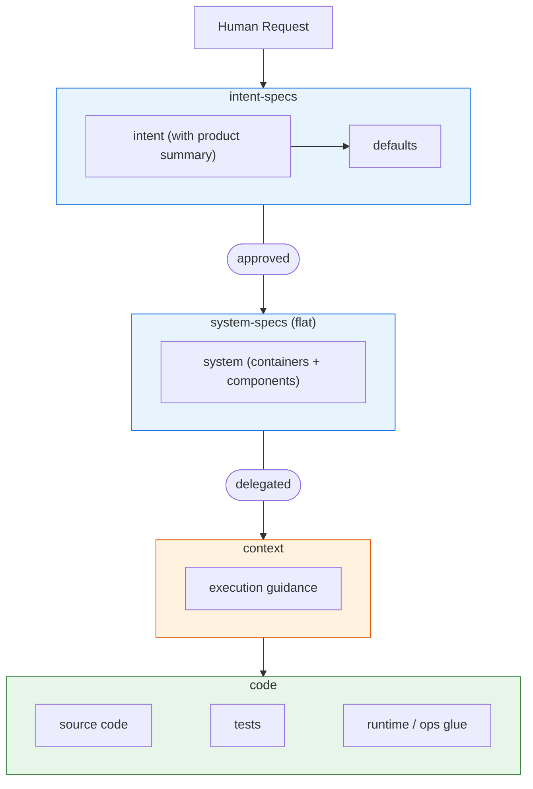
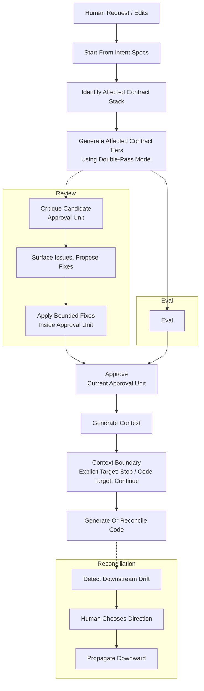
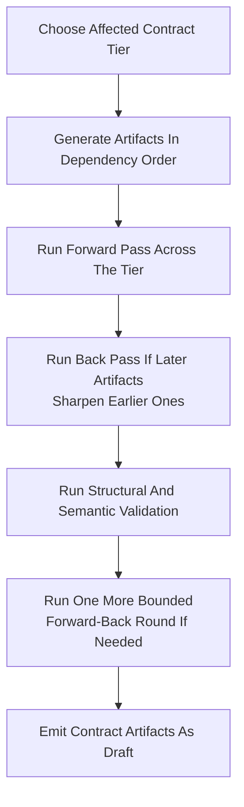
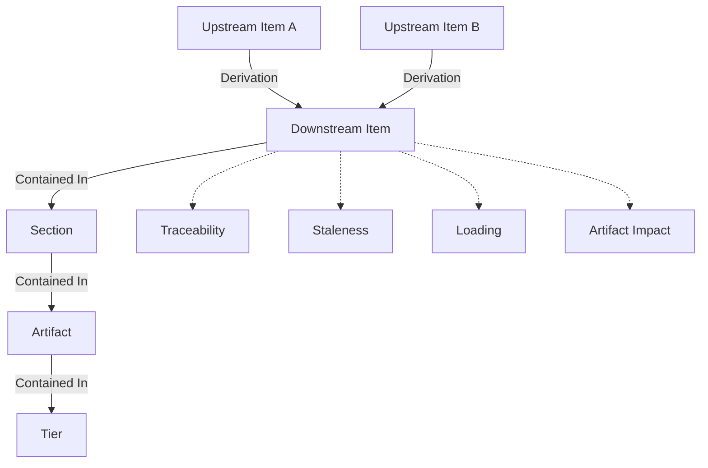
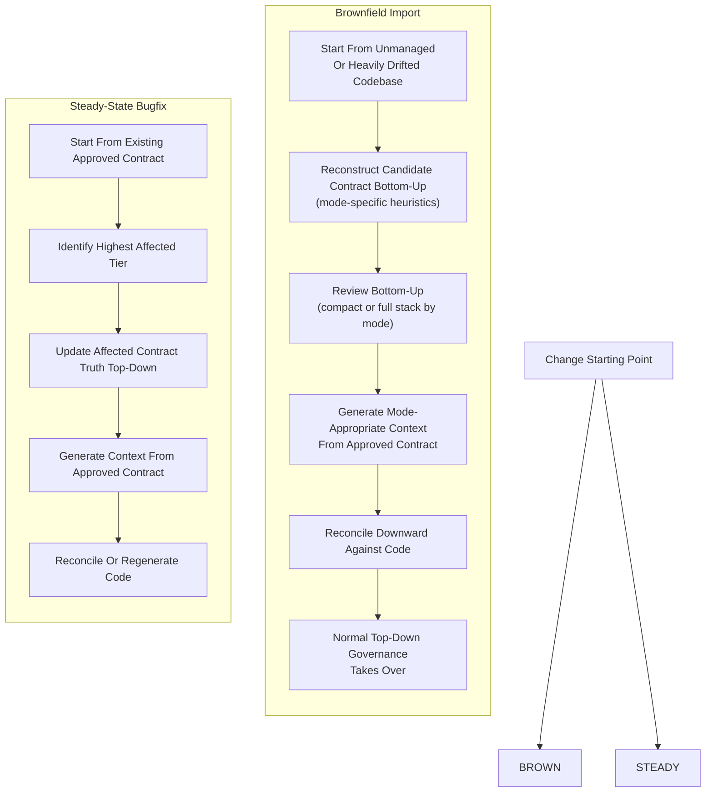

# VibeLoom Methodology

VibeLoom is a contract-driven methodology for long-lived vibe coding. It is built for codebases that must survive more than one generation step, more than one contributor, and more than one architectural revision without losing semantic coherence. It uses a **contract** - a tiered set of specifications validated for consistency and coherence - to code-generate an application.

This file is the source of truth for the methodology and artifact structure. Concrete templates, exact file names, CLI surface, and runtime behavior belong to implementation and must conform to this document.

---

## The Problem

AI code generation produces local momentum but fails to preserve consistency and coherence long-term. As a project grows, it suffers from:

- **Semantic drift** — concepts and invariants shift subtly with every prompt
- **Invisible governance** — intent lives only in chat history with no durable review surface
- **Context fragmentation** — large codebases exceed one agent's context, making ownership guesswork
- **Reconciliation failure** — manual edits and drift have no principled path back to specifications

---

## The Solution

VibeLoom generates a multi-tiered contract of structured specifications and treats it as both the durable source of truth and the eval system. Agents do the heavy lifting of generating, reviewing, and validating the entire contract/context/code stack for internal consistency and coherence. Humans keep approval authority.

---

## Principles

The core principles of VibeLoom methodology are:

1. **The system is defined as a contract stack, not a set of stale one-off specs**
2. **The contract stack doubles as eval stack.**
3. **Agents are responsible for generation and validation, gated by humans.**
4. **Scoped context enables agent scaling.**

---

## When To Use VibeLoom

VibeLoom is strongest where prompt-only generation stops being reliable. Use it when:

- The codebase must survive more than one generation step, more than one contributor, or more than one architectural revision
- Multiple bounded contexts, non-trivial workflows, or meaningful technical boundaries are present
- Multiple agents or humans may work in parallel and need consistent context
- Semantic coherence matters more than raw generation speed

VibeLoom adds ceremony. For a weekend prototype, single-file utility, or throwaway script, prompt-only generation is likely faster and sufficient. For anything that will be maintained, extended, or shared, VibeLoom pays for itself through reduced drift and explicit traceability.

---

## Overview
Here is an overview of developing a system using VibeLoom:
- Human defines a **contract** for the system. Contract is generated interactively through a human-edits <-> agent-generation loop.
- To make the contract both consistent and coherent, the human validates specs through **review** (a critique loop over the current candidate approval unit against approved upstream truth) and **eval** (more formal structural and semantic validation). Specs are checked against other artifacts inside the current approval unit and against approved upstream truth.
- Every run starts with **intent-specs** by iteratively shaping a high-level description of the system (`intent`) and the repo-wide defaults (`defaults`) that will govern the rest of the generation process.
- The run then proceeds downward through **product-specs** and **system-specs** as needed. The depth and granularity of the contract stack depends on the mode.
- Generation and validation of the **contract** use one of four modes that control contract depth, approval units, delegated progression, and context-boundary behavior:
  - `vibe` uses a compact two-tier contract (`intent` with product summary, `defaults`, and a flat `system` doc). After intent-specs are human-approved, system-specs auto-advance unless blocked or flagged. When the project outgrows vibe, a one-way upgrade to pm/dev/expert generates the full contract stack.
  - `pm` uses the full contract stack and treats each affected contract tier as its own approval unit; `product-specs` are the normal human stop and `system-specs` auto-advance by default unless blocked or flagged
  - `dev` uses the full contract stack and treats each affected contract tier as its own approval unit; `system-specs` are the normal human stop and `product-specs` auto-advance by default unless blocked or flagged
  - `expert` uses the full contract stack and treats each affected contract tier as its own approval unit and stops for explicit human approval at every contract tier
- Review and structural/semantic eval may loop inside the current candidate approval unit before approval is recorded.
- The public skill command surface is mode-specific:
  - full modes (`pm`, `dev`, `expert`) expose one uniform public surface: `generate <target>`, `review`, `eval`, `reconcile`, `approve`, `status`, `configure`, `help`
  - `vibe` exposes a simplified public surface by design: `approve`, `generate code`, `reconcile code`, `review`, `eval`, `status`, `configure`, `help`
  - in `vibe`, `review` and `eval` are zero-argument compact governance checks over the compact contract and current code; targeted tier commands are not exposed publicly
- **context** is generated from the approved contract to help agents work effectively. Each worker agent receives execution guidance as its primary operational briefing alongside the governing contract slice as authoritative reference. In `vibe`, context is limited to execution guidance (`CLAUDE.md`, `AGENTS.md`). In `pm`, `dev`, and `expert`, context also includes decision records (`pdr`, `adr`), behavioral scenarios (`bdd`), and similar artifacts. Context artifacts appear in two ways:
  - **Automatic:** execution guidance is generated for all affected scopes after contract approval. In `pm`, `dev`, and `expert`, decision records are generated when contract evolution introduces product or architecture decisions, and behavioral scenarios are generated when system-specs produce behavior items.
  - **On-demand (full modes):** any context artifact can also be explicitly regenerated via `generate context` (e.g., regenerating `bdd` scenarios after upstream contract changes).
- Context artifacts do not carry lifecycle metadata; they are assumed correct by default. In full modes, when context is the explicit target (`generate context`), generation stops after context. In `vibe`, context is generated implicitly during `generate code` or compact import.
- If context generation is poor, the recommended fix is to edit upstream **contract** and regenerate context. Direct human edits to **context** are an exceptional fallback, not the primary workflow.
- After the **context** is ready, the swarm of agents can generate the **code** — meaning the system itself that can be built and executed. The skill acts as the **orchestrator**: it reads the contract and context graph, determines which scopes are affected, and spawns **scoped worker agents** for code generation. Each worker receives its execution guidance plus the governing contract slice for its scope. Workers operate independently within their scope boundaries; the orchestrator assembles results and validates cross-scope consistency. Workers never load the methodology or skill — they work from generated guidance and authoritative contract.

## The Contract Stack

### Overview

VibeLoom governs application development through a contract stack. The stack comes in two variants depending on mode:

- **Compact stack** (`vibe`): `intent-specs` → `system-specs` → `context` → `code`. No `product-specs` tier. The intent artifact includes a product summary that seeds future product-specs on upgrade.
- **Full stack** (`pm`, `dev`, `expert`): `intent-specs` → `product-specs` → `system-specs` → `context` → `code`. All tiers present with full artifact granularity.

The application artifacts play the following roles:
- **contract**: approval-gated, normative semantic truth. These artifacts - whether human-authored or generated - belong to approval-gated tiers, are generated tier-by-tier as batches, and are approved through the current approval unit defined by mode.
- **context**: normative execution truth for agents. These artifacts are required primarily for code generation agents. They do not carry approval-state metadata and do not require human approval, although humans may review or edit them in exceptional cases.
- **code**: the executable result. Humans are not expected to edit it directly.

In this document:
- **approval-gated** means downstream work may not rely on a tier until its required approval checkpoint completes, whether by explicit human approval or delegated mode rules.
- **normative** means it is a source of truth that downstream generation, execution, review, or eval in its scope must follow.
- **executable** means it can be run or checked directly.
- **approval unit** means the set of draft contract artifacts reviewed, evaled, and approved together at one checkpoint. In all modes, the approval unit is the current affected contract tier. Modes differ in which approval units are explicit human stops versus delegated auto-advance checkpoints.

The contract stack separates semantic truth, execution truth, and executable result.

#### Full Contract Stack (`pm`, `dev`, `expert`)


#### Compact Contract Stack (`vibe`)



### Generation Tiers

The artifact stack groups into generation tiers. These tiers are the primary orchestration model for users and agents.

#### Full Tiers (`pm`, `dev`, `expert`)

| Tier          | Content                                                                         | Artifacts                                                                    |
| ------------- | ------------------------------------------------------------------------------- | ---------------------------------------------------------------------------- |
| intent-specs  | Capture user intent and normalize repo-wide defaults                            | `intent`, `defaults`                                                         |
| product-specs | Formally traceable product and domain contracts produced from approved intent   | `prd`, `usm`, `dm`                                                           |
| system-specs  | Technical contracts produced from approved product and domain semantics         | `system`, `containers`, per-container `container`, per-component `component` |
| context       | Distill execution guidance, decision records, and long-term agent memory        | execution guidance artifacts, `pdr`, `bdd`, `adr`, and similar |
| code          | This tier consists of executable implementation and verification artifacts      | source code, tests, runtime / ops glue                                       |

#### Compact Tiers (`vibe`)

| Tier          | Content                                                                         | Artifacts                                   |
| ------------- | ------------------------------------------------------------------------------- | ------------------------------------------- |
| intent-specs  | Capture user intent, product summary, and repo-wide defaults                    | `intent` (with product summary), `defaults` |
| system-specs  | Flat technical contract: system context, containers, components, interfaces     | `system` (single flat document)             |
| context       | Root-level execution guidance only                                              | execution guidance artifacts                |
| code          | Executable implementation and verification artifacts                            | source code, tests, runtime / ops glue      |

Tiers are a generation abstraction. Modes determine approval units and contract depth. In `vibe`, there is no product-specs tier; the intent's product summary provides enough context for system-specs generation. Fine-grained derivation should be represented in a context graph, and traceability, staleness, and loading should be inferred from that graph.
Governance binds to the tier semantics, not to a fixed list of specs inside the tier. A tier may gain or lose specs over time without changing the review, eval, and approval model.

---

### Contract Specs

A governed application owns the following contract specs:

The tier descriptions below define artifact structure and intent. Concrete document templates, field schemas, and formatting conventions belong to implementation.

#### Full Contract Specs (`pm`, `dev`, `expert`)

| Spec         | Tier          | Role                                                                                                                                      | Primary audience    |
| ------------ | ------------- | ----------------------------------------------------------------------------------------------------------------------------------------- | ------------------- |
| `intent`     | intent-specs  | Vision-like prose description of the system; may include both product and implementation wishes                                           | PMs                 |
| `defaults`   | intent-specs  | Minimal repo-wide constitution: binding global rules, technology baseline, and quality guardrails | Tech leads + agents |
| `prd`        | product-specs | Functional requirements and non-functional requirements                                                                                   | PMs + Tech leads    |
| `usm`        | product-specs | Epic/story/workflow structure and acceptance framing                                                                                      | PMs + UX designers  |
| `dm`         | product-specs | Domain model: bounded contexts, aggregates, invariants, ubiquitous language                                                               | PMs + Tech leads    |
| `system`     | system-specs  | System context, external actors/systems, high-level trust and NFR boundaries                                                              | Tech leads          |
| `containers` | system-specs  | Global runtime/deployment topology, container inventory, communication paths, hosting/runtime choices                                     | Tech leads          |
| `container`  | system-specs  | per-container: local runtime boundary, resident bounded contexts, authoritative component inventory, local constraints                    | Tech leads          |
| `component`  | system-specs  | per-component: full contract for one owned technical boundary                                                                             | Tech leads          |

#### Compact Contract Specs (`vibe`)

| Spec       | Tier         | Role                                                                                                              | Primary audience    |
| ---------- | ------------ | ----------------------------------------------------------------------------------------------------------------- | ------------------- |
| `intent`   | intent-specs | Vision, capabilities, wishes, constraints, plus a product summary seeding future product-specs                    | PMs                 |
| `defaults` | intent-specs | Minimal repo-wide constitution: binding global rules, technology baseline, and quality guardrails                  | Tech leads + agents |
| `system`   | system-specs | Flat system specification: system context, external actors, containers, components, interfaces, behaviors          | Tech leads          |

### Context Artifacts

Context artifacts are generated from contract specs and are the default execution surface for agents, but they never outrank contract specs semantically.

| Artifact | Tier | Role | Primary audience | Available in |
| --- | --- | --- | --- | --- |
| execution guidance artifacts | context | Scoped execution guidance distilled from contract specs | Agents | all modes |
| `pdr` | context | Product decision record that preserves product-level decision history without becoming contract truth | PMs + agents | `pm`, `dev`, `expert` |
| `adr` | context | Architecture decision record that preserves technical decision history without becoming contract truth | Tech leads + agents | `pm`, `dev`, `expert` |
| `bdd` | context | Generated non-executable behavioral scenarios used by humans and agents during implementation | PMs + tech leads + agents | `pm`, `dev`, `expert` |

All semantic truth lives in contract specs. Context artifacts carry execution truth for agents and may be regenerated or, in exceptional cases, human-edited, but if a context artifact conflicts with a contract spec, the contract spec wins semantically. Context artifacts do not normally have approval-state metadata and are assumed correct by default. When context is the explicit target (`generate context`), generation stops after context in all full modes. When the target is `generate code`, context is generated implicitly and the run continues into code. Code is the executable result, although validation may run upward from code against every upstream tier.

---

### `intent-specs` tier
Captures user intent and normalizes repo-wide defaults.

| Spec | Contract entities | Key rules |
| --- | --- | --- |
| `intent` | capabilities, wishes | Prose-first; may include both product and implementation wishes. Preferences become `defaults` only when repo-wide and always-on. In `vibe`, also includes a product summary section that seeds future product-specs. |
| `defaults` | constraints | Minimal repo-wide constitution. Only always-on, globally binding constraints. Downstream tiers treat `defaults` as binding. |

---

### `product-specs` tier
Turns approved intent into formally traceable product and domain contracts. This tier exists only in `pm`, `dev`, and `expert` modes. In `vibe`, product concerns are captured as narrative prose in the intent's product summary section.

| Spec | Contract entities | Derives from | Key rules |
| --- | --- | --- | --- |
| `prd` | functional requirements, non-functional requirements | capabilities, wishes | Every functional requirement and NFR traces to at least one capability or wish. |
| `usm` | epics, flows, stories, acceptance criteria, milestones | functional requirements | Every story traces to at least one functional requirement. Every epic has at least one flow; every flow has at least one story. Acceptance framing stays behavior-focused. |
| `dm` | ubiquitous language terms, bounded contexts, aggregates, entities, value objects, invariants | functional requirements, non-functional requirements | `dm` is the semantic source for technical boundary derivation. Components come from domain semantics, not folder shape. |

---

### `system-specs` tier
Translates approved product and domain semantics into technical contracts.

In `pm`, `dev`, and `expert`, system-specs use the full artifact set:

| Spec | Contract entities | Derives from | Key rules |
| --- | --- | --- | --- |
| `system` | external actors, trust boundaries, system-wide NFR boundaries | bounded contexts, non-functional requirements | Defines system purpose, external actors, trust boundaries, system-wide NFRs. Deployment topology does not live here. |
| `containers` | containers, communication paths | bounded contexts, system context | Global runtime topology. Every container appears in the topology. Communication paths reference valid container endpoints. |
| `container` | (references parent container, lists component inventory) | containers | Authoritative component inventory for one runtime boundary. Components are discovered here, not inferred from folders. |
| `component` | components, interfaces, behaviors, dependencies | bounded contexts, containers | Smallest owned technical boundary. Each component belongs to exactly one bounded context and one container. |

In `vibe`, system-specs use a single flat `system` document that covers system context, external actors, container inventory, communication paths, component inventory, interfaces, and behaviors. There are no per-container or per-component files on disk. Trust boundaries, NFR boundaries, and detailed deployment choices are omitted — they appear after upgrade to pm/dev/expert.

**Technical boundary rules** (apply in all modes):
- Bounded context defines semantic home
- Component defines owned technical change boundary
- Container defines runtime and deployment home
- A bounded context must not span multiple containers
- Components from the same bounded context must be co-located in the same container

---

### `context` tier
Agent-facing operational truth generated from approved contract. Context artifacts do not carry lifecycle metadata and are assumed correct by default.

In `vibe`, context is limited to root-level execution guidance. In `pm`, `dev`, and `expert`, the full context tier is available:

| Artifact | Purpose | Key entities | Available in |
| --- | --- | --- | --- |
| execution guidance | Scoped guidance for repo, container, or component work | (prose guidance, no addressable items) | all modes (root only in `vibe`) |
| `pdr` | Product decision history | product decision records | `pm`, `dev`, `expert` |
| `adr` | Architecture decision history | architecture decision records | `pm`, `dev`, `expert` |
| `bdd` | Generated non-executable behavioral scenarios | behavior files, Gherkin scenarios | `pm`, `dev`, `expert` |

- Context is generated from contract. If context conflicts with contract, contract wins.
- Humans may review or eval context against upstream contract.
- The normal fix path for poor context is to amend contract and regenerate.
- Gherkin belongs to context until it becomes executable test code.

---

### `code` tier
Executable implementation and verification artifacts.

| Artifact | Description |
| --- | --- |
| `source code` | Implements approved behavior and technical structure. |
| `tests` | Provide executable verification of behavior, contracts, and regressions. |
| `runtime / ops glue` | Handles configuration, packaging, deployment, and operational wiring. |

#### `source code`
`source code` implements approved behavior and technical structure.

#### `tests`
`tests` provide executable verification of behavior, regressions, and contract compliance.

- unit tests, integration tests, and executable BDD tests belong here
- if runnable tests are generated from a `bdd` scenario, they become part of the executable test suite

#### `runtime / ops glue`
`runtime / ops glue` handles configuration, packaging, deployment, migrations, and operational wiring.

- Code is executable, not approval-gated.
- Code is produced from contract, usually through context.
- Validation may run upward from code against all upstream tiers.

---

## Workflow

VibeLoom workflow governs how change moves from human request to approved contract, generated context, and executable code.

At a conceptual level, the workflow is:

1. Start from `intent-specs` and identify the affected contract stack for the current run.
2. Generate the affected contract tiers as batches from approved upstream truth.
3. In all modes, each affected contract tier is its own approval unit.
4. In `pm` and `dev`, delegated approval units auto-advance when safe; `expert` always stops for explicit approval.
5. In `vibe`, `intent-specs` is the only explicit human stop. After approved intent, `system-specs` is generated and delegated by default unless blocked or flagged.
5. Generate context from approved contract.
6. When the target is `generate code`, context is generated implicitly and the run continues. When the target is `generate context`, generation stops after context.
7. Generate or reconcile code from approved contract and context.

Modes control contract depth, approval units, delegated progression, and pause topology. They do not change the contract/context/code ontology.



### Modes

Modes are workflow settings that control contract depth, approval units, delegated progression, and context-boundary behavior.

| Mode | Contract depth | Approval unit | Normal human contract stop | Delegated auto-advance by default | Normal forward surface | Typical use |
| --- | --- | --- | --- | --- | --- | --- |
| `pm` | full (3 tiers) | each affected contract tier | `product-specs` | `system-specs` | `generate product-specs`, `generate code` | PM driving requirements, workflows, acceptance intent |
| `dev` | full (3 tiers) | each affected contract tier | `system-specs` | `product-specs` | `generate system-specs`, `generate code` | Dev driving technical boundaries, dependencies, executable impact |
| `expert` | full (3 tiers) | each affected contract tier | every contract tier | none | full targeted operation surface | Lead owning the full contract stack end-to-end |
| `vibe` | compact (2 tiers) | each affected contract tier | intent-specs only | system-specs | `generate code` | Early-stage projects, simple systems, rapid prototyping |

Intent-specs are always explicit human approval stops in every mode; the table shows additional human stops beyond intent only for `pm`, `dev`, and `expert`.

`vibe` uses a compact two-tier contract and is the fastest path from intent to code. It is intentionally minimal — no product-specs tier, no per-container or per-component files, context limited to execution guidance. The public skill surface is intentionally restricted to `approve`, `generate code`, `reconcile code`, `review`, `eval`, `status`, `configure`, and `help`. In `vibe`, `review` and `eval` are zero-argument compact governance checks over the compact contract and current code; targeted tier commands are not exposed publicly. The normal vibe workflow is: `init --mode vibe` → approve intent → `generate code`. Use vibe for early-stage projects, simple systems, or rapid prototyping. When the system outgrows vibe, upgrade to `pm`, `dev`, or `expert` (one-way) to generate the full contract stack.

Default to `vibe` when the system is clearly simple or still exploratory: one semantic bounded context, limited business logic, and modest technical complexity. Typical examples include a desktop utility, small internal tool, or simple SMB website. Default to `pm` when the system has multiple bounded contexts, non-trivial workflows, or meaningful technical boundaries. Use `dev` when the current human is driving architecture rather than product. Use `expert` when full human oversight of every tier is needed.

Regardless of mode, `intent-specs` are always explicitly human-owned and every run still begins from `intent-specs`. In full modes, `generate intent-specs` uses the user's current `intent.md` content as authoritative semantic input, reshapes it for structural consistency, and regenerates `defaults` to stay aligned. In `vibe`, the same intent-normalization step runs implicitly during bootstrap and before approving draft intent. The user's semantic intent is never overridden. Intent-specs always require explicit human approval — they are never delegated.

Modes may change default prompts, context emphasis, stop behavior, or suggested operations, but they do not change the contract/context/code ontology. `pm`, `dev`, and `expert` are progressively more explicit, not semantically different from each other. `vibe` uses a different contract depth but the same ontological roles (contract = truth, context = execution aid, code = executable).

#### Upgrading From Vibe Mode

The transition from `vibe` to `pm`, `dev`, or `expert` is one-way. Once upgraded, the repo cannot return to vibe mode.

When the user upgrades:

1. The skill snapshots vibe artifacts (`intent.md`, `defaults.md`, `system.md`) to `.vibeloom/vibe-snapshot/` as a read-only reference.
2. The skill generates the full contract stack from the compact artifacts:
   - Vibe `intent` (product summary) → regular `intent` (narrowed to vision + capabilities + wishes + constraints) + `prd` + `usm` + `dm`
   - Vibe `system` (flat) → regular `system` + `containers` + per-container `container` + per-component `component`
   - `defaults` stays as-is.
3. All new artifacts are marked `draft`. Normal approval flow for the target mode takes over.
4. Source code is rearranged to match the new container/component directory structure.

The upgrade is designed to be a natural transition: the product summary prose in vibe's intent seeds the generation of structured product-specs, and the flat system doc provides enough structure to generate the full system-specs hierarchy.

The skill should proactively suggest upgrade when it detects signals that the project has outgrown vibe: multiple bounded contexts, complex domain logic, multiple containers with non-trivial communication, or growing behavioral complexity.

#### Mode × Command Matrix (Normal Flow)

| Step | `vibe` | `pm` | `dev` | `expert` |
| --- | --- | --- | --- | --- |
| Bootstrap | `init` | `init` | `init` | `init` |
| Shape intent | edit `intent.md` directly; normalization runs during bootstrap/approval | `generate intent-specs` (if defaults need regen) | same | same |
| Approve intent | `approve` | `approve` | `approve` | `approve` |
| Forward to product | — | `generate product-specs` | (automatic) | `generate product-specs` |
| Approve product | — | `approve` | (auto or escalated) | `approve` |
| Forward to system | (automatic) | (automatic) | `generate system-specs` | `generate system-specs` |
| Approve system | (automatic) | (auto or escalated) | `approve` | `approve` |
| Forward to code | `generate code` | `generate code` | `generate code` | `generate code` |

`(automatic)` = handled by the forward `generate` command via smart orchestration / delegation. `(auto or escalated)` = normally delegated, but escalates to explicit approval if breaking change detected. `—` = tier does not exist in this mode.

#### Delegated auto-advance and breaking-change escalation

In `vibe`, `pm`, and `dev`, delegated auto-advance is allowed only when:

- structural eval passes
- no **breaking semantic change** is detected against approved truth
- no flagged issue requires human judgment

If a delegated approval unit is blocked or flagged, explicit human review and approval become required before the run can complete.

**Rule: any mutation to an existing approved item is breaking. Only adding new items consistent with approved truth is non-breaking.**

| Signal | Classification | Detection |
| --- | --- | --- |
| Any field changed on an existing approved item | Breaking | Structural: diff against last approved version |
| Item deleted | Breaking | Structural: item ID absent in draft |
| `derives_from` edges changed (added or removed) | Breaking | Structural: diff on `derives_from` array |
| Item moved to different scope/container/component | Breaking | Structural: scope fields changed |
| Bounded context split or merged | Breaking | Structural: BC count changed or component BC fields reassigned |
| Interface semantics changed | Breaking | Semantic: agent compares IF description against approved version |
| Invariant weakened or strengthened | Breaking | Semantic: agent compares INV rule text against approved version |
| **New item added** consistent with approved truth | Non-breaking | Semantic: agent confirms no conflict with any approved item |

### Lifecycle And Approval

Contract artifacts have two lifecycle states:

- `draft` — generated or regenerated, awaiting review and approval
- `approved` — human or delegated approval recorded

Staleness is not an artifact state. It is a computed property of the context graph, inferred by comparing each downstream artifact's derivation basis against the latest approved upstream versions. Staleness detection surfaces stale artifacts; reconciliation resolves it by regenerating affected artifacts (which return to `draft`). Supersession is implicit in version history.

Only contract artifacts are approved. Context does not carry lifecycle metadata, and code is judged against approved upstream truth rather than approved in the same way.

`intent-specs` are always explicitly human-owned. Contract approval units follow mode (see Modes above). Delegated approval is mode-driven provenance — it does not change the lifecycle model, remove explicit human ownership of `intent-specs`, or override the breaking-change escalation rule.
All modes use per-tier approval units. `vibe` differs only in public UX: intent is the sole explicit human stop, while `system-specs` auto-advances by default after approved intent.

---

## Generation

Generation is the contract-driven engine of the methodology. It works in two dimensions:

- **down** through the tiers
- **across** the artifacts inside one affected tier

### Tier Order

Every run starts from `intent-specs` and proceeds downward. Each tier is produced from approved upstream truth:

#### Full Tier Order (`pm`, `dev`, `expert`)

| Tier | Primary upstream basis | Output |
| --- | --- | --- |
| `intent-specs` | human request, edits, and prior repo intent | `intent`, `defaults` |
| `product-specs` | approved `intent-specs` | `prd`, `usm`, `dm` |
| `system-specs` | approved `product-specs` | `system`, `containers`, `container`, `component` |
| `context` | approved contract stack | execution guidance artifacts, decision records, BDD scenarios, and other execution artifacts |
| `code` | approved contract plus relevant context | executable implementation and tests |

#### Compact Tier Order (`vibe`)

| Tier | Primary upstream basis | Output |
| --- | --- | --- |
| `intent-specs` | human request, edits, and prior repo intent | `intent` (with product summary), `defaults` |
| `system-specs` | approved `intent-specs` (including product summary) | `system` (flat) |
| `context` | approved contract | root-level execution guidance |
| `code` | approved contract plus execution guidance | executable implementation and tests |

### Within-Tier Generation

Each affected tier is generated as a batch using a bounded double-pass cycle. `expert` pauses after every affected contract tier. `pm` and `dev` pause at the human-owned approval unit and auto-advance delegated approval units when safe. `vibe` auto-advances system-specs by default after intent-specs are approved.



### Intent As Persistent Context

`intent` persists as generation context across every lower tier, not only when producing `product-specs`.

This is deliberate: user wishes and constraints may survive all the way into system design and code, even when they were not fully normalized into later specs. In `vibe`, the product summary section of intent is especially important as the primary product-level input for system-specs generation.

### Scope Of Regeneration

Within a tier, only artifacts whose derivation basis includes changed upstream items are regenerated. When the double-pass back-pass identifies cross-artifact effects within the tier, those additional artifacts enter the regeneration set. Artifacts with unchanged upstream bases are not regenerated.

### Generation And Staleness

When approved upstream truth changes, dependent downstream artifacts become stale as computed by the context graph. Generation is therefore not only a bootstrap mechanism; it is also the way the stack is kept coherent over time. Staleness is never written into artifact frontmatter — it is inferred from version comparisons in the graph and surfaced through staleness detection.

---

## Review, Eval, And Reconciliation

These are four distinct conceptual activities that pair symmetrically:

| Interactive (human-guided, iterative) | Formal (automated, deterministic) | Scope |
| --- | --- | --- |
| `review` — critique current approval unit, surface issues, propose fixes | `eval` — structural and semantic validation | current approval unit |
| `reconcile` — detect downstream drift, surface conflicts, propose fix directions | `generate` — produce artifacts via double-pass model | downstream artifacts |

- `review` critiques and frames the current candidate approval unit against approved upstream truth
- `eval` checks structure and semantics
- `reconcile` detects downstream drift, surfaces conflicts, proposes fix directions, and iterates with the human before invoking generation
- `generate` produces artifacts from approved upstream truth

Review and structural/semantic eval use the current candidate approval unit, even though the underlying graph remains fine-grained: per affected tier in every mode. In `vibe`, the public skill surface wraps that tier model in simplified zero-argument review/eval commands that report compact-contract and code-drift findings. Reconciliation uses the same tier model to detect and resolve drift, then invokes generation to produce refreshed artifacts.

Review, eval, reconciliation, and generation are shown together in the Workflow diagram above.

### Review

Review is an interactive loop for the current candidate approval unit, checking upward against approved upstream truth. It works like planning mode in familiar coding agents — iterative, human-guided, with explicit exit points.

Each review cycle:

1. Run eval (forward + back pass) on the current approval unit against approved upstream truth.
2. Surface findings — structural (blocking) and semantic (non-blocking) — with specific item references.
3. Propose fixes for each finding.
4. Apply fixes within the approval unit (bounded style) or surface findings only (advisory style).

At the end of each cycle, the user chooses one of three options:

- **Loop** — run another detect → propose → fix → eval cycle.
- **Eval only** — user made an out-of-band edit, re-run eval to check resolution without proposing new fixes.
- **Approve** — user judges remaining findings acceptable, approve and proceed.

Review does not propagate changes downward; that belongs to reconciliation. Review may not silently change semantically meaningful upstream truth. When meaning changes, the human chooses the direction and later approves the updated tier.

### Eval

Eval always runs a forward pass then a back pass across the current approval unit. The back pass checks whether later artifacts in the tier constrain earlier ones — for example, when `dm` produces a bounded context that should constrain how `usm` stories are grouped, or when a `component` produces a behavior that refines the container's component inventory. If the back pass surfaces findings, they are reported alongside the forward-pass findings.

**Structural checks** (blocking) — the approval unit cannot advance until all pass:

| Check | Pass criterion | Fail criterion |
| --- | --- | --- |
| Lifecycle consistency | Draft/approved states consistent across the approval unit | Mismatched states |
| Reference integrity | All `derives_from` point to existing items | Dangling references |
| Required fields | Every artifact has all required frontmatter fields per template | Missing fields |
| Declared relationships | Items owned by correct artifacts, scopes, tiers | Misplaced items |
| Stack integrity | Tiers in correct dependency order | Out-of-order dependencies |
| Coverage | Every upstream item in the derivation basis has at least one downstream item whose `derives_from` includes it | Orphaned upstream IDs — report them |
| Contradiction | No downstream item asserts a constraint, behavior, or boundary that conflicts with any item in its `derives_from` set | Downstream narrows, widens, or reverses upstream meaning — report both IDs and conflicting statements |
| Componentization fit | Every component maps to exactly one bounded context; every bounded context is fully contained in exactly one container | Component references multiple BCs, or BC's items appear in components belonging to different containers — report misplaced items |
| Context sufficiency | Every component with non-empty `owned_paths` has execution guidance; every container with at least one component has container-level guidance | Code-owning component or populated container lacks execution guidance — report the scope |

**Semantic checks** (non-blocking) — require agent judgment, inform review decisions:

- Does the downstream artifact faithfully represent the *intent* of its upstream basis, not just reference it?
- Are naming conventions consistent with the ubiquitous language in the domain model?
- Are there implicit dependencies not captured in `derives_from`?
- Are there capability gaps — things the intent describes that no downstream artifact addresses, even though no formal derivation edge is missing?

Eval runs automatically as part of `generate` and `approve`. Explicit invocation (`eval`) is for targeted checks outside the normal flow.

### Reconciliation

Reconciliation is the interactive counterpart to generation, just as review is the interactive counterpart to eval. It follows the same interactive loop pattern as review but in the opposite direction — checking downward from approved upstream changes.

`generate code` is the normal forward command — it handles all upstream generation and delegation needed to produce code. `reconcile` is the interactive path when you want to detect, review, and resolve drift before regenerating. In practice, `generate code` is the 90% path; `reconcile` is the surgical review path.

Reconciliation is asymmetric: approved upstream contract defines intended meaning. Downstream drift triggers proposals, not silent rewriting of approved truth.

Each reconciliation cycle:

1. Detect downstream drift from approved upstream changes. Surface conflicts with specific item references.
2. Propose fix directions for each conflict:
   - Amend upstream truth, then regenerate and reconcile downstream.
   - Preserve upstream truth, then correct downstream context or code.
   - A human-specified alternative direction.
3. Human selects direction for each conflict.
4. Apply fixes and run eval to validate.

At the end of each cycle, the user chooses one of three options:

- **Loop** — run another detect → propose → fix → eval cycle on remaining drift.
- **Eval only** — user made an out-of-band edit, re-run eval to check resolution.
- **Approve** — user judges remaining drift acceptable, approve and proceed.

---

## Operations

VibeLoom defines eight methodology-level operations. Implementations may expose them through different commands or interfaces, but the logical operations stay the same.

| Operation | Direction | Meaning |
| --- | --- | --- |
| `init` | top-down | Bootstrap an ungoverned repo, set the initial mode, and produce the first draft `intent-specs` |
| `generate` | top-down | Generate one affected tier from approved upstream truth using the forward-pass / back-pass model |
| `review` | current + up | Critique the current candidate approval unit against approved upstream truth and optionally apply bounded fixes within that approval unit |
| `eval` | up | Run structural and semantic evaluation for the current approval unit |
| `reconcile` | down | Detect downstream drift, surface conflicts, propose fix directions, iterate with human, then invoke generation on affected artifacts |
| `approve` | gate | Move a reviewed contract approval unit from `draft` to `approved` and record approval provenance |
| `status` | read-only | Show lifecycle state, graph health, stale propagation, and coverage gaps |
| `import` | bottom-up | Bootstrap an ungoverned repo from existing code, set the initial mode, and reconstruct candidate contract from an unmanaged or heavily drifted codebase |

Exact parameters, flags, file formats, and CLI surfaces belong to implementation, not to methodology.

`init` and `import` are bootstrap-only operations. They are valid only as the first successful command in an ungoverned repo. Both accept an initial mode parameter; if omitted, the default is `pm`.

---

## Context Graph

VibeLoom relies on an explicit context graph rather than on implicit chat memory.

The graph connects addressable items defined inside contract, context, and code artifacts so humans and agents can answer:

- what is produced from what
- what becomes stale if something changes
- what must be loaded for a given task
- how downstream work can be traced back to upstream truth

The context graph combines item derivation with containment and derives traceability, staleness, loading, and artifact impact.



The only item-to-item relationship in the graph is the primary relation `derivation`.

### Derivation

Each downstream item records the set of upstream inputs it is produced from:

```text
downstream_item <- [input1, input2, ... inputn]
```

This allows one downstream section or entity to depend on multiple semantic inputs without forcing the methodology into artificial `1:n` or `n:n` terminology.

For root intent capture, `n` may be `0`. For downstream items, `n` is usually one or more.

### Containment And Ownership

Items are owned by the artifact in which they are defined.

Conceptually:

```text
item -> section -> artifact -> tier
```

Ownership therefore comes from containment, not from a separate item-to-item graph relation.

### Derived Views

Several useful views are inferred from derivation plus containment:

- **traceability:** walk derivation upward or downward to explain where an item came from and what it influences
- **staleness:** if an upstream item changes, flag all reachable downstream items and their containing artifacts as stale in the graph (not in artifact frontmatter)
- **loading:** load the smallest artifact or scope that contains the required downstream item and its upstream inputs
- **artifact impact:** summarize item-level derivations upward into affected sections, artifacts, and tiers

### Affected Set

The **affected set** for a change is computed by walking derivation edges downward from every changed item in the context graph and collecting all reachable items plus their containing sections, artifacts, and tiers. An artifact is "affected" if it contains at least one reachable item. A tier is "affected" if it contains at least one affected artifact. A scope is "affected" if it contains at least one affected artifact.

This graph walk is the sole definition of "affected contract stack," "affected tiers," and "affected scopes" used throughout the methodology.

### Context Loading

Context loading is graph traversal, not guesswork.

The conceptual rules are:

- always start from the smallest scope that still preserves the required truth
- load governing contract before relying on context artifacts
- use context artifacts to accelerate execution, never to override contract
- escalate upward when it is unclear whether a change stays within one component, bounded context, or container
- keep generation and review aware of persistent intent when that intent still constrains the change

### Agent Load Sets

The context graph determines what each worker agent loads. The orchestrator (skill) computes the load set per scope and passes it to the worker. Workers receive both execution guidance (navigation and operational briefing) and the governing contract slice (authoritative reference).

| Worker scope | Execution guidance | Contract slice | Always included |
| --- | --- | --- | --- |
| component | component guidance + container guidance | component spec, container spec | `defaults` |
| container | container guidance + root guidance | container spec, system + containers spec | `defaults` |
| root | root guidance | system, containers | `defaults` |

In `vibe` mode, all workers load root guidance + flat `system.md` + `defaults`.

The orchestrator loads the skill, status, and context graph. Workers never load the skill or methodology — they work from the artifacts the orchestrator provides. The overhead per worker is approximately 6,000–12,000 tokens of generated guidance and contract, which is 2–5% of a 256K context window.

### Why The Graph Matters

The context graph is what makes VibeLoom scalable for swarms of agents and long-lived repos.

It supports:

- minimal safe context loading
- agent load-set computation
- impact analysis
- stale detection
- eval grounding
- ownership clarity through containment
- parallel work allocation

---

## Defaults vs Execution Guidance

- `defaults` is **contract** — always-on, globally binding repo-wide constraints
- `execution guidance` is **context** — scope-specific operational guidance generated from approved truth

If they conflict, contract wins.

---

## Brownfield Import vs. Steady-State Bugfix

VibeLoom treats these as different conceptual paths.

- **Brownfield import** is the bootstrap path for unmanaged or heavily drifted repos. It reconstructs candidate contract from existing code and marks uncertainty explicitly for human review.
- **Steady-state bugfix** is the governed path for repos already under VibeLoom. It starts from repro, expected behavior, the violated or missing contract, and regression coverage.

Once a repo is governed, routine defects should be resolved against approved contract truth rather than by re-inferring semantics from code on every fix. `init` and `import` are not valid again once bootstrap has succeeded.

Brownfield import reconstructs contract bottom-up; steady-state bugfix updates approved truth top-down.

### Import Reconstruction Heuristics

Import infers contract artifacts bottom-up from code using mode-specific heuristics:

- `import --mode vibe`
  1. **Directory structure + config** → candidate compact system, component inventory, and defaults seeds.
  2. **Package boundaries** → compact semantic groupings inside the flat system doc.
  3. **Public APIs + tests** → interfaces and behaviors for the flat compact system.
  4. **Infer compact intent-specs from the reconstructed flat system** — capabilities, wishes, constraints, and product-summary prose.
  5. **Emit compact artifacts as draft** with confidence annotations (high / medium / low) on each reconstructed item.
- `import --mode pm|dev|expert`
  1. **Directory structure + config** → candidate containers, components, defaults seeds.
  2. **Package boundaries** → bounded contexts.
  3. **Public APIs** → interfaces.
  4. **Test files** → behaviors.
  5. **Infer product-specs from system-specs** — requirements, stories, domain model derived from the reconstructed system layer.
  6. **Infer intent-specs from product-specs** — capabilities, wishes, constraints derived from the reconstructed product layer.
  7. **Emit all artifacts as draft** with confidence annotations (high / medium / low) on each reconstructed item.

### Import Review Flow (Bottom-Up)

Import is the only workflow where review proceeds bottom-up. Code is the source of truth during import, so the tier closest to code is reviewed first:

- `import --mode vibe`
  1. Review compact `system-specs` against actual code. Approve or escalate.
  2. Review `intent-specs` against approved compact system-specs. Approve.
  3. Generate root execution guidance from the fully approved compact contract.
  4. Reconcile downward against code for remaining drift.
- `import --mode pm|dev|expert`
  1. Review system-specs against actual code (closest to source of truth). Approve.
  2. Review product-specs against approved system-specs. Approve.
  3. Review intent-specs against approved product-specs. Approve.
  4. Generate context from the fully approved contract stack.
  5. Reconcile downward — check contract against code for remaining drift.

Once all tiers are approved and reconciliation is resolved, normal top-down governance takes over for all future changes.



---

## Summary

VibeLoom is strongest where prompt-only generation stops being reliable.

It works by:

- turning intent into a durable contract stack — compact in vibe, full in pm/dev/expert
- generating that stack tier-by-tier with mode-appropriate approval and delegation
- using context as agent-facing execution truth without letting it outrank contract
- reconciling downstream artifacts when approved truth changes
- relying on an explicit context graph instead of chat-memory guesswork
- providing a natural upgrade path from minimal governance (vibe) to full governance (pm/dev/expert)

The methodology is intentionally stricter than ad hoc AI coding because safe speed requires explicit boundaries, explicit authority, explicit generation flow, and explicit context management.
