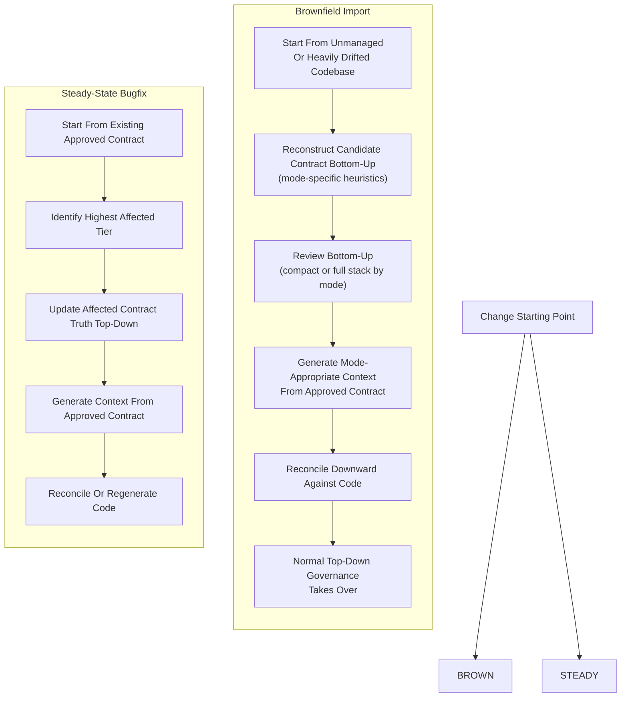
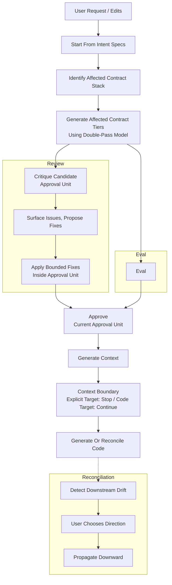

# VibeLoom Methodology

VibeLoom is a contract-driven methodology for long-lived AI-assisted coding. It is built for codebases that must survive more than one generation step, more than one contributor, and more than one architectural revision without losing semantic coherence. It uses a **contract** - a tiered set of specifications validated for consistency and coherence - to code-generate an application.

This file is the source of truth for the methodology and artifact structure. Concrete templates, exact file names, CLI surface, and runtime behavior belong to implementation and must conform to this document.

---

## The Problem

AI coding agents generate local momentum but fail to preserve consistency and coherence long-term. As a project grows, it suffers from:

- **Semantic drift** — concepts and invariants shift subtly with every prompt
- **Invisible governance** — intent lives only in chat history with no durable review surface
- **Context fragmentation** — large codebases exceed one agent's context, making ownership guesswork
- **Reconciliation failure** — manual edits and drift have no principled path back to specifications

---

## The Solution

VibeLoom generates a multi-tiered contract of structured specifications and treats it as both the durable source of truth and the eval system. Agents do the heavy lifting of generating, reviewing, and validating the entire contract/context/code stack for internal consistency and coherence. Users keep approval authority — directly for tiers the mode exposes, and through delegation rules they chose when selecting a mode.

---

## Principles

The core principles of VibeLoom methodology are:

1. **The system is defined as a contract stack, not a set of stale one-off specs**
2. **The contract stack doubles as the eval stack**
3. **Agents are responsible for generation and validation, gated by the user**
4. **Scoped context enables agent scaling**

---

## When To Use VibeLoom

VibeLoom is strongest where prompt-only generation stops being reliable. Use it when:

- The codebase must survive more than one generation step, more than one contributor, or more than one architectural revision
- Multiple bounded contexts, non-trivial workflows, or meaningful technical boundaries are present
- Multiple agents or users may work in parallel and need consistent context
- Semantic coherence matters more than raw generation speed

VibeLoom adds ceremony. For a weekend prototype, single-file utility, or throwaway script, prompt-only generation is likely faster and sufficient. For anything that will be maintained, extended, or shared, VibeLoom pays for itself through reduced drift and explicit traceability.

---

## Overview

VibeLoom has a three-layer architecture: **contract → context → code**

- **`contract`** — user-approved definitive semantic truth. The user and the agent collaboratively build a tiered - `intent-specs`, `product-specs`, `system-specs` - specification stack. The user seeds the intent. Then, at each tier, the agent - if requested, with HITL (human-in-the-loop) - generates, validates, and refines the specs through `generate`/`reconcile` and `eval`/`review` loops. Each tier derives from the one above and is checked for consistency and coherence against it. When both sides are satisfied, the user approves.

- **`context`** — definitive execution config for agents as well as read-only change records. These artifacts do not require user approval, although users may review or edit them in certain cases. From the approved contract, the agent generates execution config - for orchestrating the team of worker agents to generate code within their own scopes. Context is derived, not hand-written. If it's wrong, the fix is upstream in the contract.

- **`code`** — the executable result. Users are not expected to edit the `code` directly. The orchestrator agent reads the contract and the context, identifies affected scopes, and dispatches the team/swarm of scoped worker agents. Each worker agent receives only the slice of context (execution config) and the slice of the contract pertinent to its scope. Worker agents generate code independently. The orchestrator agent validates cross-scope consistency and coherence.

In short:
- `contract` is co-authored and approved by a user
- `context` is generated as an execution config for code-generating team/swarm of agents plus a change record
- `code` is the code for the system generated by the agents.

## Modes
There are several modes of operation, full details will be described later.

### Definition
In all modes, the general principle remains:
- `contract` is co-authored and approved by a user
- `context` is generated as an execution config for code-generating team/swarm of agents plus a change record
- `code` is the code for the system generated by the agents.

- `pm`, `dev`, `expert` are "full" modes of operations. They all maintain the full set of specs/artifacts. They mainly differ in validation and approval rules.
    - In `expert` mode, the user co-authors and approves each contract tier - intent-specs, product-specs, system-specs.
    - In `pm` mode, in addition to co-authoring and approving `intent-specs`, the user co-authors and approves `product-specs`. `system-specs` is generated, validated and approved automatically, w/o HITL - emphasizing the PM expertise.
    - In `dev` mode, in addition to co-authoring and approving `intent-specs`, the user co-authors and approves `system-specs`. `product-specs` is generated, validated and approved automatically, w/o HITL - emphasizing the dev expertise.
- `vibe` mode is a realization of the need for reduced ceremony for simple applications and applications that are just being started. `vibe` mode features a "collapsed" contract stack that is only comprised of `intent`, `defaults` and `system`. `intent` serves as an all-inclusive summary "product" spec, whereas `system` serves as an all-inclusive summary "technical" spec. `vibe` mode is a compromise - it maintains a UX surface almost as minimal as pure vibe coding, yet it also maintains an internal scaffold/structure that enables some degree of semantic validation for consistency and coherence across tiers and layers.

## Contract Specs

A governed application owns the following tiered contract specs:

### `intent-specs` tier
Captures user intent and normalizes repo-wide defaults.

| Spec | Purpose | Generated from | Rules |
| ---- | ------- | -------------- | ----- |
| `intent` | Mostly prose description of the system; may include both product and implementation constraints | — | Prose-first description of the application to be generated; may include both product and implementation constraints. Preferences become `defaults` only when repo-wide and always-on. In `vibe`, also includes a product summary section that seeds future product-specs. |
| `defaults` | Minimal repo-wide constitution: binding global rules, technology baseline, and quality guardrails | `intent` | Minimal repo-wide constitution. Only always-on, globally binding constraints. Downstream tiers treat `defaults` as binding. |

#### `intent` entities

| Entity | Semantic Role |
| ------ | ------------- |
| capability | Observable user-facing outcome |
| constraint | Hard requirement or binding preference |

#### `defaults` entities

| Entity | Semantic Role |
| ------ | ------------- |
| default | Always-on globally binding repo-wide constraint normalized from intent |

### `product-specs` tier
Turns approved intent into formally traceable product and domain contracts. This tier exists only in `pm`, `dev`, and `expert` modes. In `vibe`, product concerns are captured as narrative prose in the intent's product summary section.

| Spec | Purpose | Generated from | Rules |
| ---- | ------- | -------------- | ----- |
| `prd` | Product requirements: objectives, key results, metrics, and functional/non-functional requirements | `intent` | Every functional requirement traces to at least one objective or capability. Every objective traces to at least one capability or constraint. |
| `usm` | Epic/story/workflow structure and acceptance framing | `intent` + `prd` | Every story traces to at least one functional requirement. Every epic has at least one flow; every flow has at least one story. Acceptance framing stays behavior-focused. |
| `dm` | Domain model: bounded contexts, aggregates, invariants, ubiquitous language | `intent` + `prd` + `usm` | `dm` is the semantic source for technical boundary derivation. Components come from domain semantics, not folder shape. |

#### `prd` entities

| Entity | Semantic Role |
| ------ | ------------- |
| objective | Business goal the system serves |
| key result | Measurable outcome for an objective |
| metric | Quantitative measure for a key result |
| functional requirement | Testable behavior the system must exhibit |
| non-functional requirement | Quality, performance, or security boundary |

Scope notes, assumptions, risks, and open questions may appear in `prd` as prose, but they are not first-class graph entities unless the methodology later promotes them.

#### `usm` entities

| Entity | Semantic Role |
| ------ | ------------- |
| epic | Coarse delivery grouping |
| flow | User journey or workflow |
| story | Smallest deliverable behavior unit |
| acceptance criterion | Observable pass/fail condition |
| milestone | Delivery checkpoint grouping stories |

#### `dm` entities

| Entity | Semantic Role |
| ------ | ------------- |
| ubiquitous language term | Shared vocabulary entry |
| bounded context | Semantic boundary for domain logic |
| aggregate | Invariant-owning state cluster |
| entity | Identity-bearing domain object |
| value object | Immutable attribute cluster |
| invariant | Business rule that must always hold |
| relationship | Cross-aggregate integration point |

### `system-specs` tier

| Spec | Purpose | Generated from | Rules |
| ---- | ------- | -------------- | ----- |
| `system` | System context, external actors/systems, high-level trust and NFR boundaries | `product-specs` | Defines system purpose, external actors, trust boundaries, system-wide NFRs. Deployment topology does not live here. |
| `containers` | Global runtime/deployment topology, container inventory, communication paths, hosting/runtime choices | `product-specs` + `system` | Global runtime topology. Every container appears in the topology. Communication paths reference valid container endpoints. |
| `container` | Per-container: local runtime boundary, resident bounded contexts, authoritative component inventory, local constraints | `product-specs` + `system` + `containers` | Authoritative component inventory for one runtime boundary. Components are discovered here, not inferred from folders. |
| `component` | Per-component: full contract for one owned technical boundary | `product-specs` + `system` + `containers` + `container` | Smallest owned technical boundary. Each component belongs to exactly one bounded context and one container. |

#### `system` entities

| Entity | Semantic Role |
| ------ | ------------- |
| external actor/system | Outside entity the system interacts with |
| trust boundary | Security or permission line |
| system-wide NFR boundary | Global quality constraint |

#### `containers` entities

| Entity | Semantic Role |
| ------ | ------------- |
| container | Runtime/deployment unit |
| communication path | Inter-container data flow |
| cross-container constraint | Multi-container rule |

#### `container` entities

| Entity | Semantic Role |
| ------ | ------------- |
| component | Smallest owned technical boundary |

Container specs also define local dependency edges and local constraints that describe intra-container structure (see Boundary Principle).

#### `component`

Component is the terminal node in the derivation graph. Component specs define interfaces, dependencies, behaviors, and notes as structured content (see Boundary Principle).

### Metadata
Each artifact has at least the following metadata (the rest will be detailed in other documents):
- `timestamp` - the date/time of the last change
- `status` - could be either `draft` or `approved`.
  - `draft` means needs to be reviewed and ultimately approved - either by the user or by the agent, but it needs approval.
  - `approved` means that the spec has been approved as a source of truth and generation/validation can proceed.

### rules
- Bounded context defines semantic home
- Component defines owned technical change boundary
- Container defines runtime and deployment home
- A bounded context must not span multiple containers
- Components from the same bounded context must be co-located in the same container

### `vibe` mode
In the `vibe` mode, the contract stack is simplified/reduced to the minimal meaningful form. It is only comprised of `intent`, `defaults` and `system`.
- `intent` serves as an all-inclusive "intent+product" spec. It consists of what usually constitutes the `intent` plus a succinct structured semantic summary of what would normally be in `prd` + `usm` + `dm`. Entity types: `capability` and `constraint` only — product-level detail is prose, not structured entities.
- `defaults` remains the same. Entity types: `default`.
- `system` serves as an all-inclusive summary "technical" spec — a succinct structured semantic summary of what would normally be in `system` + `containers` + a set of per-container `container` + a set of per-component `component`. Entity types: `container` and `component` only.

## Context Artifacts

Context artifacts are generated from contract specs and are the default execution surface for agents, but they never outrank contract specs semantically.

### `context` tier
Agent-facing operational truth generated from approved contract. Context artifacts do not carry lifecycle metadata and are assumed correct by default.

| Artifact | Purpose |
| -------- | ------- |
| `config` | Scoped configuration for repo, container, or component work. Follows the format of CLAUDE.md/AGENTS.md and semantically similar agent configuration instructions. Carries no addressable entities and does not participate in the derivation graph. |
| `bdd` | Non-executable behavioral scenarios generated from contract. Could be used by users and agents to generate executable behavioral tests. |
| `pdr` | Read-only product decision record that preserves product-level decision history without becoming contract truth. |
| `adr` | Read-only architecture decision record that preserves technical decision history without becoming contract truth. |

#### `bdd` entities

| Entity | Semantic Role |
| ------ | ------------- |
| behavior file | Scenario collection for one behavior |
| scenario | Individual Gherkin scenario |

#### `pdr` entities

| Entity | Semantic Role |
| ------ | ------------- |
| product decision record | Product-level decision (append-only) |

#### `adr` entities

| Entity | Semantic Role |
| ------ | ------------- |
| architecture decision record | Technical decision (append-only) |

### rules
- Context is generated from contract. If context conflicts with contract, contract wins.
- Users may review or eval context against upstream contract.
- The normal fix path for poor context is to amend contract and regenerate.
- Gherkin belongs to context until it becomes executable test code.

### `vibe` mode
In the `vibe` mode
- `bdd` is not generated because there is no `usm` and therefore no detailed breakdown into epics/use cases and stories - the typical units of BDD validation
- `pdr` remains the same in spirit, but in fact is a record of change for `intent`
- `adr` remains the same in spirit, but in fact is a record of change for `system`

---

## Code Artifacts

### `code` tier
Executable implementation and verification artifacts.

| Artifact | Description |
| -------- | ----------- |
| `source` | Source code for the application, structured into /\<container\>/\<component\> folders as defined by `system-specs` |
| `tests` | Provides executable verification of behavior, regressions, and contract compliance. Unit tests, integration tests, and executable BDD tests (in the future) belong here. Tests should reside in a /test subfolder in each container and each component folder |
| `runtime` | Configuration, packaging, deployment, migrations, and operational wiring |

### rules
- Code is executable, not approval-gated.
- Code is generated from contract, with the use of context.
- Validation may run upward from code against all upstream tiers. Validation may run at the level of a component, a container, or the entire application.

---

## Context Graph

VibeLoom relies on an explicit context graph rather than on implicit chat memory. The graph connects addressable entities defined inside contract and context artifacts. Code may still be analyzed heuristically by the coding agent, but it does not yet participate in the explicit graph because concrete code-level entity carriers are not specified.

The graph exists to answer:

- what is generated from what
- what becomes stale if something changes
- how downstream work can be traced back to upstream truth

The only entity-to-entity relationship in the graph is **derivation**.

Each downstream entity records the set of upstream entities it is derived from.
For root intent capture, that set may be empty.
For downstream entities, it is one or more.

### Derivation DAG

The derivation DAG defines the complete set of typed forward-derivation edges between graph entity types.

A derivation reference that does not follow one of these edges is a structural eval failure.

Each row reads:
"an instance of the entity may derive from instances of the listed upstream entity types."

| Entity | Derives from |
| ------ | ------------ |
| capability | — |
| constraint | — |
| default | constraint |
| objective | capability, constraint |
| key result | objective |
| metric | key result |
| functional requirement | objective, capability |
| non-functional requirement | objective, capability, constraint |
| epic | functional requirement |
| flow | functional requirement |
| story | functional requirement |
| acceptance criterion | functional requirement, non-functional requirement, story |
| milestone | story, epic |
| ubiquitous language term | capability, functional requirement, story |
| bounded context | functional requirement, story |
| aggregate | story, bounded context |
| entity | story, bounded context |
| value object | acceptance criterion, story |
| invariant | functional requirement, acceptance criterion, bounded context |
| relationship | aggregate, entity |
| external actor/system | functional requirement, non-functional requirement, capability |
| trust boundary | non-functional requirement |
| system-wide NFR boundary | non-functional requirement |
| container | bounded context, non-functional requirement, system-wide NFR boundary |
| communication path | container, relationship |
| cross-container constraint | non-functional requirement, system-wide NFR boundary, invariant |
| component | aggregate, entity, bounded context, container |
| behavior file | acceptance criterion, component, story |
| scenario | acceptance criterion, invariant, component |
| product decision record | any changed product-side entity |
| architecture decision record | any changed technical-side entity |

The table above defines typed forward-derivation edges only.

The following are graph meta-rules rather than forward typed edges:
- `default` becomes universally binding once derived
- `product decision record` and `architecture decision record` record changed entities but do not participate in the forward derivation chain

`default` is a normalized repo-wide constraint derived from constraint clauses in `intent`.
Once created, it is universally binding and may be referenced by any downstream entity without requiring an additional typed edge in the table.

Product decision records and architecture decision records are append-only ledgers. Their per-record derivation references whichever entity triggered the decision. They do not participate in the forward derivation chain.

The diagram shows the spec-level derivation flow.
The prescriptive edge table above is the source of truth; the diagram is a visual aid.

### Core Graph Rules

- The derivation graph is a DAG.
- `capability` and `constraint` are the only root entity types.
- Every non-root entity instance must derive from one or more upstream entities allowed by the derivation table.
- Formal semantic traceability stops at `component`.
- `interface`, `behavior`, `dependency`, and other component-internal structure are not independent derivation-graph nodes.
- Every `component` belongs to exactly one `container`.
- Every `component` belongs to exactly one `bounded context`.
- Every `component` must derive from at least one upstream semantic entity that explains why it exists.
- `context` is derived from approved contract and never outranks it semantically.
- `code` is validated against approved contract and derived context, but is not part of the explicit derivation graph.

### Ownership Mapping

Each entity is defined in exactly one artifact.
Each artifact belongs to exactly one tier and one scope.

Affected artifacts, tiers, and scopes are computed from the affected entity set by ownership lookup.

### Boundary Principle

The derivation graph stops at `component`, the methodology's smallest owned technical boundary.

Entities defined within component and container specs, such as interfaces, behaviors, dependencies, local edges, and local constraints, are part of structured spec content but are not independent nodes in the derivation graph.

This prevents false-positive staleness churn from implementation-level changes within a boundary.

### Code-Level Tracing

- Component specs define owned paths, which form the bridge from the derivation graph to the filesystem. Code is analyzed heuristically but does not carry graph-addressable entities.
- In a future version, code-level carriers linked to their owning component may participate in staleness detection and impact analysis. That is tooling work, not methodology work.

### Vibe Mode

In `vibe` mode, the explicit derivation graph is not materialized.

Validation is heuristic rather than graph-backed:
- the agent checks compact `system` against `intent` capabilities and constraints
- the agent may inspect current code as additional heuristic evidence

Sections below that rely on graph traversal or graph-grounded eval apply to full modes only unless stated otherwise.

### Affected Set

In full modes, the affected set for a change is computed by walking derivation edges downward from every changed entity in the graph and collecting all reachable entities.

Affected artifacts, tiers, and scopes are then computed from that entity set by ownership lookup.

In `vibe`, there is no explicit graph traversal. The affected scope is inferred heuristically from changed `intent` clauses, the current compact `system`, and current code when relevant.

This is the sole definition of:
- affected entities
- affected artifacts
- affected tiers
- affected scopes
- affected contract stack

### Eval Anchor

In full modes, the entity definitions and the derivation table together form the formal eval anchor:

1. **Structural completeness** — every non-root entity instance must have non-empty derivation references.
2. **Edge validity** — every derivation reference must follow an allowed edge in the derivation table.
3. **Coverage** — every upstream entity instance should appear in at least one downstream entity's derivation references unless it is intentionally terminal.
4. **Staleness** — the graph is walked forward from changed entities to compute the affected set.
5. **Contradiction** — no downstream entity may assert something that conflicts with its upstream basis.

Completeness and edge validity are fully deterministic.
Coverage and contradiction still require agent judgment, but that judgment is anchored to explicit graph structure rather than open-ended prompting.

In `vibe`, eval is anchored to the `capability` and `constraint` clauses in `intent`, the compact `system` spec, and current code when needed. It is heuristic rather than graph-backed.

### Why The Graph Matters

The context graph is what makes VibeLoom scalable for swarms of agents and long-lived repos.

It supports:

- minimal safe context loading
- agent load-set computation
- impact analysis
- stale detection
- eval grounding
- ownership clarity
- parallel work allocation

---

## Generation

Generation is the contract-driven engine of the methodology. It works in two dimensions:

- **down** through the tiers
- **across** the artifacts inside one affected tier

### Tier Order

Every run starts from `intent-specs` and proceeds downward. Each tier is generated from approved upstream truth:

#### Full Tier Order (`pm`, `dev`, `expert`)

| Tier | Primary upstream basis | Output |
| --- | --- | --- |
| `intent-specs` | user request, edits, and prior repo intent | `intent`, `defaults` |
| `product-specs` | approved `intent-specs` | `prd`, `usm`, `dm` |
| `system-specs` | approved `product-specs` | `system`, `containers`, `container`, `component` |
| `context` | approved contract stack | execution config artifacts, decision records, BDD scenarios, and other execution artifacts |
| `code` | approved contract plus relevant context | executable implementation and tests |

#### Compact Tier Order (`vibe`)

| Tier | Primary upstream basis | Output |
| --- | --- | --- |
| `intent-specs` | user request, edits, and prior repo intent | `intent` (with product summary), `defaults` |
| `system-specs` | approved `intent-specs` (including product summary) | `system` (flat) |
| `context` | approved contract | root-level execution config |
| `code` | approved contract plus execution config | executable implementation and tests |

### Within-Tier Generation

Each affected tier is generated as a batch using a single forward-back pass. `expert` pauses after every affected contract tier. `pm` and `dev` pause at the user-owned approval unit and auto-advance delegated approval units when safe. `vibe` auto-advances system-specs by default after intent-specs are approved.

### Intent As Persistent Context

`intent` persists as generation context across every lower tier, not only when producing `product-specs`.

This is deliberate: user requirements and constraints may survive all the way into system design and code, even when they were not fully normalized into later specs. In `vibe`, the product summary section of intent is especially important as the primary product-level input for system-specs generation.

### Scope Of Regeneration

Within a tier, only artifacts whose derivation basis includes changed upstream items are regenerated. When the back-pass identifies cross-artifact effects within the tier, those additional artifacts enter the regeneration set. Artifacts with unchanged upstream bases are not regenerated.

### Generation And Staleness

When approved upstream truth changes, dependent downstream artifacts become stale as computed by the context graph. Generation is therefore not only a bootstrap mechanism; it is also the way the stack is kept coherent over time. Staleness is never written into artifact frontmatter — it is inferred from version comparisons in the graph and surfaced through staleness detection.

---

## Review, Eval, And Reconciliation

These are four distinct conceptual activities that pair symmetrically:

| Interactive (user-guided, iterative) | Formal (automated, deterministic) | Scope |
| --- | --- | --- |
| `review` — critique current approval unit, surface issues, propose fixes | `eval` — structural and semantic validation | current approval unit |
| `reconcile` — detect downstream drift, surface conflicts, propose fix directions | `generate` — generate artifacts via forward-back pass model | downstream artifacts |

- `review` critiques and frames the current candidate approval unit against approved upstream truth
- `eval` checks structure and semantics
- `reconcile` detects downstream drift, surfaces conflicts, proposes fix directions, and iterates with the user before invoking generation
- `generate` generates artifacts from approved upstream truth

Review and structural/semantic eval use the current candidate approval unit, even though the underlying graph remains fine-grained: per affected tier in every mode. In `vibe`, the public skill surface narrows this to `review intent-specs` and `eval intent-specs`, both using downstream compact system and current code as heuristic evidence. `review intent-specs` keeps the normal interactive review loop and may propose or apply bounded fixes within the current draft `intent-specs` approval unit only. `eval intent-specs` is the read-only counterpart. These checks rely on agent reasoning over repo files under a small-codebase assumption, using signals such as filesystem layout, exported interfaces, route or command names, tests, key strings, and owned-path comparisons. They are not graph-backed code-item validation, they never directly edit compact `system-specs` or code, and unresolved findings may lead to further intent revision, reconciliation, or upgrade. Reconciliation uses the same tier model to detect and resolve drift, then invokes generation to generate refreshed artifacts.

Review, eval, reconciliation, and generation are shown together in the Workflow diagram above.

### Review

Review is an interactive loop for the current candidate approval unit, checking upward against approved upstream truth. It works like planning mode in familiar coding agents — iterative, user-guided, with explicit exit points.

Each review cycle:

1. Run eval (forward + back pass) on the current approval unit against approved upstream truth.
2. Surface findings — structural (blocking) and semantic (non-blocking) — with specific item references.
3. Propose fixes for each finding.
4. Apply fixes within the approval unit (bounded style) or surface findings only (advisory style).

At the end of each cycle, the user chooses one of three options:

- **Loop** — run another detect → propose → fix → eval cycle.
- **Eval only** — user made an out-of-band edit, re-run eval to check resolution without proposing new fixes.
- **Approve** — user judges remaining findings acceptable, approve and proceed.

Review does not propagate changes downward; that belongs to reconciliation. Review may not silently change semantically meaningful upstream truth. When meaning changes, the user chooses the direction and later approves the updated tier.

In `vibe`, bounded review fixes are limited to `intent` and `defaults`; downstream compact `system-specs` and code are never edited directly by review.

### Eval

Eval always runs a forward pass then a back pass across the current approval unit. The back pass checks whether later artifacts in the tier constrain earlier ones — for example, when `dm` generates a bounded context that should constrain how `usm` stories are grouped, or when a `component` generates a behavior that refines the container's component inventory. If the back pass surfaces findings, they are reported alongside the forward-pass findings.

**Structural checks** (blocking) — the approval unit cannot advance until all pass:

| Check | Pass criterion | Fail criterion |
| --- | --- | --- |
| Lifecycle consistency | Draft/approved states consistent across the approval unit | Mismatched states |
| Reference integrity | All `derives_from` point to existing items | Dangling references |
| Required fields | Every artifact has all required frontmatter fields per template | Missing fields |
| Declared relationships | Items owned by correct artifacts, scopes, tiers | Misplaced items |
| Stack integrity | Tiers in correct dependency order | Out-of-order dependencies |
| Coverage | Every upstream item in the derivation basis has at least one downstream item whose `derives_from` includes it | Orphaned upstream IDs — report them |
| Contradiction | No downstream item asserts a constraint, behavior, or boundary that conflicts with any item in its `derives_from` set | Downstream narrows, widens, or reverses upstream meaning — report both IDs and conflicting statements |
| Componentization fit *(full modes only)* | Every component maps to exactly one bounded context; every bounded context is fully contained in exactly one container | Component references multiple BCs, or BC's items appear in components belonging to different containers — report misplaced items |
| Context sufficiency *(full modes only)* | Every component with non-empty `owned_paths` has execution config; every container with at least one component has container-level config | Code-owning component or populated container lacks execution config — report the scope |

**Semantic checks** (non-blocking) — require agent judgment, inform review decisions:

- Does the downstream artifact faithfully represent the *intent* of its upstream basis, not just reference it?
- Are naming conventions consistent with the ubiquitous language in the domain model?
- Are there implicit dependencies not captured in `derives_from`?
- Are there capability gaps — things the intent describes that no downstream artifact addresses, even though no formal derivation edge is missing?

Eval runs automatically as part of `generate` and `approve`. Explicit invocation (`eval`) is for targeted checks outside the normal flow.

### Reconciliation

Reconciliation is the interactive counterpart to generation, just as review is the interactive counterpart to eval. It follows the same interactive loop pattern as review but in the opposite direction — checking downward from approved upstream changes.

`generate code` is the normal forward command — it handles all upstream generation and delegation needed to generate code. `reconcile` is the interactive path when you want to detect, review, and resolve drift before regenerating. In practice, `generate code` is the 90% path; `reconcile` is the surgical review path.

Reconciliation is asymmetric: approved upstream contract defines intended meaning. Downstream drift triggers proposals, not silent rewriting of approved truth.

In `vibe`, `reconcile code` remains the standard downstream repair path. If `intent-specs` is draft when reconciliation begins, the skill may normalize the draft intent for structural consistency but must stop for `approve intent-specs` before propagating changes into compact system-specs or code. When reconciling in vibe, the skill auto-regenerates compact system-specs from approved intent as the first step, then reconciles code against the refreshed system. If auto-regen generates breaking changes in system-specs, surface them prominently and recommend `review intent-specs`.

Each reconciliation cycle:

1. Detect downstream drift from approved upstream changes. Surface conflicts with specific item references.
2. Propose fix directions for each conflict:
   - Amend upstream truth, then regenerate and reconcile downstream.
   - Preserve upstream truth, then correct downstream context or code.
   - A user-specified alternative direction.
3. User selects direction for each conflict.
4. Apply fixes and run eval to validate.

At the end of each cycle, the user chooses one of three options:

- **Loop** — run another detect → propose → fix → eval cycle on remaining drift.
- **Eval only** — user made an out-of-band edit, re-run eval to check resolution.
- **Approve** — user judges remaining drift acceptable, approve and proceed.

---

## Operations

VibeLoom defines eight methodology-level operations. Implementations may expose them through different commands or interfaces, but the logical operations stay the same.

| Operation | Direction | Meaning |
| --- | --- | --- |
| `init` | top-down | Bootstrap an ungoverned repo, set the initial mode, and generates the first draft `intent-specs` |
| `generate` | top-down | Generate one affected tier from approved upstream truth using the forward-pass / back-pass model |
| `review` | current + up | Critique the current candidate approval unit against approved upstream truth and optionally apply bounded fixes within that approval unit |
| `eval` | up | Run structural and semantic evaluation for the current approval unit |
| `reconcile` | down | Detect downstream drift, surface conflicts, propose fix directions, iterate with user, then invoke generation on affected artifacts |
| `approve` | gate | Move a reviewed contract approval unit from `draft` to `approved` and record approval provenance |
| `status` | read-only | Show lifecycle state, graph health, stale propagation, and coverage gaps |
| `import` | bottom-up | Bootstrap an ungoverned repo from existing code, set the initial mode, and reconstruct candidate contract from an unmanaged or heavily drifted codebase |

Exact parameters, flags, file formats, and CLI surfaces belong to implementation, not to methodology.

`init` and `import` are bootstrap-only operations. They are valid only as the first successful command in an ungoverned repo. Both require an explicit initial mode parameter.

---

## Defaults vs Execution Config

- `defaults` is **contract** — always-on, globally binding repo-wide constraints
- `config` is **context** — scope-specific execution config generated from approved truth

If they conflict, contract wins.

---

## Brownfield Import vs. Steady-State Bugfix

VibeLoom treats these as different conceptual paths.

- **Brownfield import** is the bootstrap path for unmanaged or heavily drifted repos. It reconstructs candidate contract from existing code and marks uncertainty explicitly for user review.
- **Steady-state bugfix** is the governed path for repos already under VibeLoom. It starts from repro, expected behavior, the violated or missing contract, and regression coverage.

Once a repo is governed, routine defects should be resolved against approved contract truth rather than by re-inferring semantics from code on every fix. `init` and `import` are not valid again once bootstrap has succeeded.

Brownfield import reconstructs contract bottom-up; steady-state bugfix updates approved truth top-down.

### Import Reconstruction Heuristics

Import infers contract artifacts bottom-up from code using mode-specific heuristics:

- `import --mode vibe`
  1. **Directory structure + config** → candidate compact system, component inventory, and defaults seeds.
  2. **Package boundaries** → compact semantic groupings inside the flat system doc.
  3. **Public APIs + tests** → interfaces and behaviors for the flat compact system.
  4. **Infer compact intent-specs from the reconstructed flat system** — capabilities, requirements, constraints, and product-summary prose.
  5. **Emit compact artifacts as draft**.
- `import --mode pm|dev|expert`
  1. **Directory structure + config** → candidate containers, components, defaults seeds.
  2. **Package boundaries** → bounded contexts.
  3. **Public APIs** → interfaces.
  4. **Test files** → behaviors.
  5. **Infer product-specs from system-specs** — requirements, stories, domain model derived from the reconstructed system layer.
  6. **Infer intent-specs from product-specs** — capabilities, requirements, constraints derived from the reconstructed product layer.
  7. **Emit all artifacts as draft**.

### Import Review Flow (Bottom-Up)

Import is the only workflow where reconstruction proceeds bottom-up. In full modes, user review also proceeds bottom-up because code is the source of truth. In `vibe`, reconstruction is still bottom-up, but the explicit user review surface remains `intent-specs`.

- `import --mode vibe`
  1. Reconstruct compact `system-specs` from code and infer compact `intent-specs` from that reconstruction.
  2. Review `intent-specs` against the inferred compact system-specs and actual code. Approve.
  3. Auto-advance compact `system-specs` if safe; if compact system findings remain unresolved, surface them through `review intent-specs` / `eval intent-specs` and suggest upgrade when appropriate.
  4. Generate root execution config from the fully approved compact contract.
  5. Reconcile downward against code for remaining drift.
- `import --mode pm|dev|expert`
  1. Review system-specs against actual code (closest to source of truth). Approve.
  2. Review product-specs against approved system-specs. Approve.
  3. Review intent-specs against approved product-specs. Approve.
  4. Generate context from the fully approved contract stack.
  5. Reconcile downward — check contract against code for remaining drift.

Once all tiers are approved and reconciliation is resolved, normal top-down governance takes over for all future changes.

---

## Workflow

VibeLoom workflow defines how the system is generated from user intent to approved contract, generated context, and executable code.

### Overview
This is how the VibeLoom-guided agent operates at the conceptual level.

The "top-down" workflow for a new project is:
1. The user and the agent **collaborate** on generating the `contract` specs, using `generate`/`reconcile` and `eval`/`review` flows to iteratively bring the `contract` to the consistent and coherent state.
2. Based on the `contract`, the agent generates `context`. Strictly speaking, parts of `context` may be generated while generating `contract` but ultimately the `context` is generated after the `contract` is complete.
3. Using `context` as a detailed execution orchestration/config, the agent spawns a team/swarm of agents to generate the code. Because of the hierarchical system/container/component structure, each component can be generated/reconciled by its ow agent, thus allowing to run a team/swarm of agents working on an application

The "bottom-up" workflow for importing an existing project is
1. Based on the source code, the agent reconstructs the `contract`
2. Based on both `contract` and source code, the agent generates `context`

Note that the order is not strictly reverse because it's not possible to generate a high-quality `context` with just the info from the source code. `contract` is needed, too.

### Rules
- All semantic truth lives in contract specs.
- Context artifacts carry execution truth for agents and may be regenerated or, in exceptional cases, user-edited, but if a context artifact conflicts with a contract spec, the contract spec wins semantically.
- Context artifacts are assumed correct by default.
- When context is the explicit target (`generate context`), generation stops after context.
- When the target is `generate code`, context is generated implicitly and the run continues into code.
- Code is the executable result, although validation may run upward from code against every upstream tier.

### `vibe` mode
In the `vibe` mode, the reconstructed `contract` would be generated in its reduced form as defined for the `vibe` mode

Now, let's go into tier-level details of generation.

### Generating a new project

#### intent-specs
1. User seeds the agent with either
    - a V0 version of `intent`
    - by being interactively interviewed (like an agent would do in a "planning mode") by the agent about the future system - what kind of system, does it do, are there any requirements or constraints, etc.
2. Based on the user-provided seed, the agent generates `intent-spces`
3. Agent runs `eval intent-specs` and reports the results to the user
4. If the user is not satisfied with the eval results, they are expected to get all `intent-specs` into mutually consistent and coherent state so that `eval intent-specs` passes, The user can do it by
    - manually editing the files out-of-band
    - using `review intent-specs` interactive UX to fix the issues one by one

Conceptually, the same flow is repeated for `product-specs` and `system-specs` tiers, namely
#### product-specs
1. Based on `intent-specs`, the agent generates `product-specs`
    - based on `intent-specs`, the agent generates `prd`
    - based on `intent-specs` + `prd`, the agent generates `usm`
    - based on `intent-specs` + `prd` + `usm`, the agent generates `dm`
2. Agent runs `eval product-specs` and reports the results to the user
3. If the user is not satisfied with the eval results, they are expected to get all `product-specs` into mutually consistent and coherent state so that `eval product-specs` passes, The user can do it by
    - manually editing the files out-of-band
    - using `review product-specs` interactive UX to fix the issues one by one

#### system-specs
1. Based on `product-specs`, the agent generates `system-specs`
    - based on `product-specs`, the agent generates `prd`
    - based on `product-specs` + `prd`, the agent generates `usm`
    - based on `product-specs` + `prd` + `usm`, the agent generates `dm`
2. Agent runs `eval system-specs` and reports the results to the user
3. If the user is not satisfied with the eval results, they are expected to get all `system-specs` into mutually consistent and coherent state so that `eval system-specs` passes, The user can do it by
    - manually editing the files out-of-band
    - using `review system-specs` interactive UX to fix the issues one by one

#### context
1. After the `contract` (all specs) is approved

#### code

#### `vibe` mode

### Importing an existing project

### Developing a project

#### Mode × Command Matrix (Normal Flow)

| Step | `vibe` | `pm` | `dev` | `expert` |
| --- | --- | --- | --- | --- |
| Bootstrap | `init --mode vibe` | `init --mode pm` | `init --mode dev` | `init --mode expert` |
| Shape intent | edit `intent.md` directly; normalization runs during bootstrap/approval | `generate intent-specs` (if defaults need regen) | same | same |
| Approve intent | `approve intent-specs` | `approve` | `approve` | `approve` |
| Forward to product | — | `generate product-specs` | (automatic) | `generate product-specs` |
| Approve product | — | `approve` | (auto or escalated) | `approve` |
| Forward to system | (automatic) | (automatic) | `generate system-specs` | `generate system-specs` |
| Approve system | (automatic) | (auto or escalated) | `approve` | `approve` |
| Forward to code | `generate code` | `generate code` | `generate code` | `generate code` |

`(automatic)` = handled by the forward `generate` command via smart orchestration / delegation. `(auto or escalated)` = normally delegated, but escalates to explicit approval if breaking change detected. `—` = tier does not exist in this mode.

#### Delegated auto-advance and breaking-change escalation

In `pm` and `dev`, delegated auto-advance is allowed only when:

- structural eval passes
- no **breaking semantic change** is detected against approved truth
- no flagged issue requires human judgment

If a delegated approval unit is blocked or flagged in `pm` or `dev`, explicit user review and approval of that tier become required before the run can complete.

In `vibe`, compact `system-specs` uses the same safety tests, but blocked or flagged results do not halt the run. The skill continues generating code from the best-effort system-specs, surfaces findings prominently, and recommends `review intent-specs` or upgrade. Compact `system-specs` never becomes its own public user stop.

**Rule: any mutation to an existing approved item is breaking. Only adding new items consistent with approved truth is non-breaking.**

| Signal | Classification | Detection |
| --- | --- | --- |
| Any field changed on an existing approved item | Breaking | Structural: diff against last approved version |
| Item deleted | Breaking | Structural: item ID absent in draft |
| `derives_from` edges changed (added or removed) | Breaking | Structural: diff on `derives_from` array |
| Item moved to different scope/container/component | Breaking | Structural: scope fields changed |
| Bounded context split or merged | Breaking | Structural: BC count changed or component BC fields reassigned |
| Interface semantics changed | Breaking | Semantic: agent compares IF description against approved version |
| Invariant weakened or strengthened | Breaking | Semantic: agent compares INV rule text against approved version |
| **New item added** consistent with approved truth | Non-breaking | Semantic: agent confirms no conflict with any approved item |

### Lifecycle And Approval

Contract artifacts have two lifecycle states:

- `draft` — generated or regenerated, awaiting review and approval
- `approved` — user or delegated approval recorded

Staleness is not an artifact state. It is a computed property of the context graph, inferred by comparing each downstream artifact's derivation basis against the latest approved upstream versions. Staleness detection surfaces stale artifacts; reconciliation resolves it by regenerating affected artifacts (which return to `draft`). Supersession is implicit in version history.

Only contract artifacts are approved. Context does not carry lifecycle metadata, and code is judged against approved upstream truth rather than approved in the same way.

`intent-specs` are always explicitly user-owned. Contract approval units follow mode (see Modes above). Delegated approval is mode-driven provenance — it does not change the lifecycle model, remove explicit user ownership of `intent-specs`, or override the breaking-change escalation rule.
All modes use per-tier approval units. `vibe` differs only in public UX: intent is the sole explicit user stop, while `system-specs` auto-advances by default after approved intent.

### One-time upgrade From Vibe Mode
 If/when the application outgrows the vibe, the user can upgrade to full ceremony by changing c o nfiguration to one of the "full" modes.

 The transition from `vibe` to `pm`, `dev`, or `expert` is one-way. Once upgraded, the repo cannot return to vibe mode.

When the user upgrades:
1. The agent generates the full contract stack from the compact artifacts:
   - Vibe `intent` (product summary) → regular `intent` (narrowed to vision + capabilities + requirements + constraints) + `prd` + `usm` + `dm`
   - Vibe `system` (flat) → regular `system` + `containers` + per-container `container` + per-component `component`
   - `defaults` stays as-is.
2. All new artifacts are marked `draft`. Normal approval flow for the target mode takes over.
3. The skill may attempt to rearrange source code to match the new container/component directory structure, but only after explicit user confirmation. Rearrangement is heuristic and best-effort; if ambiguous or unsafe, the skill skips code moves and directs the user into `reconcile code` or manual follow-up. If the user declines rearrangement when prompted, skip code moves entirely and suggest `reconcile code` or manual follow-up.

The upgrade is designed to be a natural transition: the product summary prose in vibe's intent seeds the generation of structured product-specs, and the flat system doc provides enough structure to generate the full system-specs hierarchy.

The skill should proactively suggest upgrade when it detects signals that the project has outgrown vibe: multiple bounded contexts, complex domain logic, multiple containers with non-trivial communication, or growing behavioral complexity.

---

## Summary

VibeLoom is strongest where prompt-only generation stops being reliable.

It works by:

- turning intent into a durable contract stack — compact in vibe, full in pm/dev/expert
- generating that stack tier-by-tier with mode-appropriate approval and delegation
- using context as agent-facing execution truth without letting it outrank contract
- reconciling downstream artifacts when approved truth changes
- relying on an explicit context graph instead of chat-memory guesswork
- providing a natural upgrade path from minimal governance (vibe) to full governance (pm/dev/expert)

The methodology is intentionally stricter than ad hoc AI coding because safe speed requires explicit boundaries, explicit authority, explicit generation flow, and explicit context management.
